* [`类加载](#%E7%B1%BB%E5%8A%A0%E8%BD%BD)
  * [类的加载\\连接\\初始化](#%E7%B1%BB%E7%9A%84%E5%8A%A0%E8%BD%BD%E8%BF%9E%E6%8E%A5%E5%88%9D%E5%A7%8B%E5%8C%96)
  * [类的加载](#%E7%B1%BB%E7%9A%84%E5%8A%A0%E8%BD%BD)
  * [类的验证](#%E7%B1%BB%E7%9A%84%E9%AA%8C%E8%AF%81)
  * [类的准备](#%E7%B1%BB%E7%9A%84%E5%87%86%E5%A4%87)
  * [类的初始化](#%E7%B1%BB%E7%9A%84%E5%88%9D%E5%A7%8B%E5%8C%96)
  * [类的初始化时机](#%E7%B1%BB%E7%9A%84%E5%88%9D%E5%A7%8B%E5%8C%96%E6%97%B6%E6%9C%BA)
  * [类加载器](#%E7%B1%BB%E5%8A%A0%E8%BD%BD%E5%99%A8)
  * [获取类的Class对象](#%E8%8E%B7%E5%8F%96%E7%B1%BB%E7%9A%84class%E5%AF%B9%E8%B1%A1)
  * [java\.lang\.ClassLoader](#javalangclassloader)
    * [java\.lang\.ClassLoader\#findClass](#javalangclassloaderfindclass)
    * [java\.lang\.ClassLoader\#defineClass(java\.lang\.String, byte[], int, int)](#javalangclassloaderdefineclassjavalangstring-byte-int-int)
    * [java\.lang\.ClassLoader\#loadClass(java\.lang\.String , boolean resolve)](#javalangclassloaderloadclassjavalangstring--boolean-resolve)
    * [java\.lang\.ClassLoader\#getSystemClassLoader](#javalangclassloadergetsystemclassloader)
  * [sun\.misc\.Launcher](#sunmisclauncher)
  * [java\.lang\.Class\#forName(java\.lang\.String, boolean, java\.lang\.ClassLoader)](#javalangclassfornamejavalangstring-boolean-javalangclassloader)
  * [命名空间](#%E5%91%BD%E5%90%8D%E7%A9%BA%E9%97%B4)
  * [双亲委派模型好处](#%E5%8F%8C%E4%BA%B2%E5%A7%94%E6%B4%BE%E6%A8%A1%E5%9E%8B%E5%A5%BD%E5%A4%84)
  * [ContextClassLoader](#contextclassloader)
  * [java\.util\.ServiceLoader](#javautilserviceloader)
  * [类的卸载](#%E7%B1%BB%E7%9A%84%E5%8D%B8%E8%BD%BD)

## 类加载

java代码中,类型的加载\连接\初始化过程都是在程序运行期间完成的.

在如下几种情况下,jvm将结束生命周期

   - 执行了`System.exit()`方法
   - 程序正常执行结束
   - 程序在执行过程中遇到了异常或错误而终止
   - 由于操作系统出现错误而导致jvm进程终止

### 类的加载\连接\初始化

1. 加载:**查找并加载类的二进制数据**

   ​		**将类的.class文件中的二进制数据读入到内存,将其放在运行时数据区的方法区中,然后在内存中创建一个`java.lang.Class`对象用来封装类在方法区内的数据结构.**(规范并未说明class对象位于哪里,hotspot虚拟机将其放在了方法区中)

   加载.class文件的方式

	- 从本地系统直接加载
	- 通过网络下载.class文件
	- 从zip,jar等归档文件中加载.class文件
	- **将java源文件动态编译为.calss文件(如jsp文件被编译为servlet文件再由虚拟机加载)**

2. 连接

   - 验证:**确保被加载的类的正确性**

   - 准备:**为类的静态变量分配内存,并将其初始化为默认值**

   - 解析:**类中的符号引用转换为直接引用**

3. 初始化:**为类的静态变量赋予正确的初始值**

4. 使用

5. 卸载

java程序对类的使用分为两种使用

- 主动使用
  - 创建类的实例
  - 访问某个类或接口的静态变量,或者对该静态变量赋值
  - 调用类的静态方法
  - 反射
  - 初始化一个类的子类
  - java虚拟机启动时被标明为启动类(包含main方法的类)的类
  - jdk1.7开始的动态语言支持(`java.lang.invoke.MethodHandle`实例的解析结果`REF_getStatic,REF_putStatic,REF_invokeStatic`句柄对应的类没有初始化,则初始化)
- 被动使用
  - 除了上面7种情况,其他使用java类的方式都被看作是对类的被动使用,都不会导致类的初始化.

所有的jvm必须实现在每个类或接口被java程序"首次主动使用"时才初始化它们.

> 代码实例 cn.andios.jvm.classloader.MyTest1

```java
/**
 *  -XX:+ TraceClassLoading:用于追踪类的加载信息并打印出来
 *
 *  -XX:+<option>表示开启option
 *  -XX:-<option>表示关闭option
 *  -xx:<option>=<value>表示将option选项值设置为value
 */
public class MyTest1 {
    public static void main(String[] args) {
        System.out.println(MyChild1.str);
//        result:
//          MyParent1 static block
//          hello world
//        reason:
//          对于静态字段来说,只有直接定义了该字段的类才会被初始化,这里只是主动使用MyParent1,并没有主动使用MyChild1,
//        虽说是通过子类的名字来引用str,但str是父类定义的.所以不会初始化MyChild1

        //System.out.println(MyChild1.str2);
//        result:
//          MyParent1 static block
//          MyChild1 static block
//          hello
//        reason:
//          str2在子类中定义,相当于对子类的主动使用,所以会先初始化父类,再初始化子类

    }
}

class MyParent1{
    public static String str = "hello world";
    static {
        System.out.println("MyParent1 static block");
    }
}

class MyChild1 extends MyParent1{
    public static  String str2 = "hello";
    static {
        System.out.println("MyChild1 static block");
    }
}
```

> ```
> -XX:+ TraceClassLoading:用于追踪类的加载信息并打印出来
> ```

通过`-XX:+ TraceClassLoading`参数追踪执行`System.out.println(MyChild1.str);`时类加载情况:

```v
...
[Loaded cn.andios.jvm.classloader.MyTest1 from file:/home/lushuidian/gitfiles/jvm/jvm/target/classes/]
...
[Loaded cn.andios.jvm.classloader.MyParent1 from file:/home/lushuidian/gitfiles/jvm/jvm/target/classes/]
[Loaded cn.andios.jvm.classloader.MyChild1 from file:/home/lushuidian/gitfiles/jvm/jvm/target/classes/]
MyParent1 static block
hello world
...
```

可以看到它会先加载`MyTest1`,再加载`MyParent1`,最后加载`MyChild1`

> 代码实例 cn.andios.jvm.classloader.MyTest2

```java
package cn.andios.jvm.classloader;
/**
 * 常量在编译阶段会存入到调用这个常量的方法所在的类的常量池中,
 * 本质上,调用类并没有直接引用到定义常量的类,因此并不会触发定义常量的类初始化
 *
 * 注意:这里指的是将常量存入到MyTest2的常量池中,之后MyTest2与MyParent2就没有
 *      任何关系了,甚至,可以将MyParent2的.class文件删除
 *
 *  助记符(javap -c  xxx.class反编译命令后的结果)
 *      ldc:表示将int,float或者是String类型的常量值从常量池中推送至栈顶
 *      bipush:表示将单字节(-128-127)的常量值推送到栈顶
 *      sipush:表示将一个短整型常量值(-32768-32767)推送至栈顶
 *      iconst_1:表示将int类型1推送到栈顶(iconst_m1-iconst_5分别表示将int类型-1到5推送到栈顶,超过5就是bipush,低于-1就是bipush)
 */
public class MyTest2 {
    public static void main(String[] args) {
//        System.out.println(MyParent2.str);
//        result:
//          MyParent2 static block
//          hello world
//        System.out.println(MyParent2.str2);
//        result:
//          hello
//        reason:
//          常量在编译阶段会存入到调用这个常量的方法所在的类的常量池中,本质上,调用类并没有直接引用到定义常量的类,因此并不会触发定义常量的类初始化
//        即str2在编译阶段会存入到MyTest2的常量池中,MyTest2并没有直接引用到MyParent2这个类,所以MyParent2类不会被初始化
//

        System.out.println(MyParent2.s1);
        System.out.println(MyParent2.s2);
        System.out.println(MyParent2.s3);
    }
}

class MyParent2{
//    public static String str = "hello world";
//    public static final String str2 = "hello ";
    public static final short s1 = 127;
    public static final short s2 = 128;
    public static final short s3 = 1;
    static {
        System.out.println("MyParent2 static block");
    }
}
```

上述代码运行后,可通过`javap -c `反编译命令查看如下:

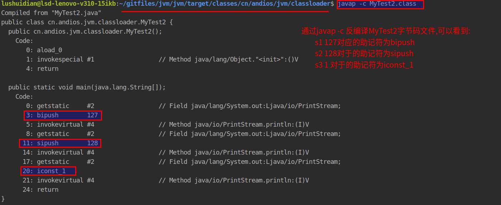


如果将s1,s2,s3,str注释掉,只保留str2,编译运行后反编译得到

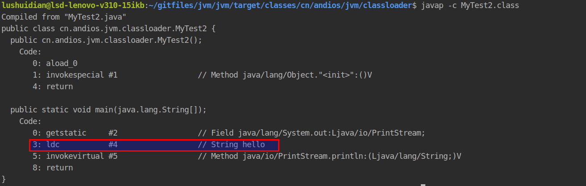

这里助记符`ldc`表示将int,float或者是String类型的常量值从常量池中推送至栈顶,str2是由final修饰的字符串常量.


如果将s1,s2,s3,str2注释掉,只保留str,编译运行后反编译得到

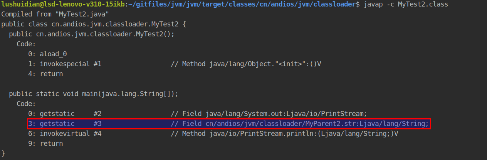

这个的str不再是常量,所以由助记符`getstatic`来表示.


> 代码实例 cn.andios.jvm.classloader.MyTest3

```java

/**
 * 当一个常量的值并非编译期间可以确定的,那么其值就不会被放到调用类的常量池中,
 * 这时在运行程序时,会导致主动使用这个常量所在的类,显然会导致这个类被初始化
 */
public class MyTest3 {
    public static void main(String[] args) {
        System.out.println(MyParent3.str);
//        result:
//          MyParent3 static static block
//          f3c1e34d-01fd-4450-95e8-a682ea983ce9
//        reason:
//          str的值在编译期不能确定,所以不会放到MyTest3的常量池中,
//          运行程序时,就会导致MyParent3的初始化
    }
}

class MyParent3{
    public static final String str = UUID.randomUUID().toString();
    static {
        System.out.println("MyParent3 static static block");
    }
}
```


> 代码实例 cn.andios.jvm.classloader.MyTest4

```java
/**
 * 对于数组实例来说,其类型是由jvm在运行期动态生成的,
 * 动态生成的类型,其父类型就是Object
 *
 * 对于数组来说,javadoc经常将构成数组的元素成为component,实际上就是将数组降低一个维度后的类型
 *
 * 通过 javap-c xxx.class 反编译,可以看到两个助记符
 *      anewarray:表示创建一个引用类型(类\接口\数组)的数组,并将其值压入栈顶
 *      newarray:表示创建一个指定的原始类型(int\float\char)的数组,并将其值压入栈顶
 */
public class MyTest4 {
    public static void main(String[] args) {
        //MyParent4 myParent4 = new MyParent4();
//        result:
//          MyParent4  static block
//        reason:
//          表示对类MyParent4的主动使用

        MyParent4 [] myParents1 = new MyParent4[5];
//        result:
//          (没有输出)
//        reason:
//          不表示对MyParent4的主动使用,
        System.out.println(myParents1.getClass());//class [Lcn.andios.jvm.classloader.MyParent4;
        System.out.println(myParents1.getClass().getSuperclass());//class java.lang.Object

        MyParent4 [][] myParents2 = new MyParent4[5][5];
//        result:
//          (没有输出)
//        reason:
//          不表示对MyParent4的主动使用,
        System.out.println(myParents2.getClass());//class [[Lcn.andios.jvm.classloader.MyParent4;
        System.out.println(myParents2.getClass().getSuperclass());//class java.lang.Object

        int [] arr = new int[5];
        System.out.println(arr.getClass());//class [I
        System.out.println(arr.getClass().getSuperclass());//class java.lang.Object
    }
}
class MyParent4{
    static {
        System.out.println("MyParent4  static block");
    }
}
```


>代码实例 cn.andios.jvm.classloader.MyTest5

```java
/**
 * 当一个接口在初始化时,并不要求其父接口都完成了初始化
 *      (接口中变量都由final修饰,都是常量,但类中的变量不一定都由final修饰,如果没有被final
 *      修饰,就不会被纳入到常量池中,那么这个类被初始化时就会导致它的父类被初始化.)
 * 只有在真正使用到父接口的时候(如引用接口中所定义的常量时),才会初始化
 */
public class MyTest5 {
    public static void main(String[] args) {
        /**
         * a,b
         *
         * result:6
         * 编译后,删掉MyParent5.class,再运行,正常打印
         */
        System.out.println(MyChild5.b);

        /**
         * a,c
         *
         * result:一个随机值
         * 编译后,删除MyParent5.class,再运行,报错
         * reason:c的值是在运行期动态生成的
         */
        System.out.println(MyChild5.c);

        /**
         * d,e
         * result:2
         * case1:编译后,删除MyParent5.class,再运行,正常打印
         * case2:将MyParent5,MyChild5改为class,其他不变,编译后,
         *      删除MyParent5.class,再运行,报错
         * reason:对于接口来说,d,e都是常量(都由final修饰),会被纳入到常量池,
         *      初始化时不会导致父类被初始化;
         *         改为class后,不是常量,不会被纳入到常量池,被使用时就会导致父类初始化,
         *         所以删除MyParent.class后再运行就报错
         *
         */
        System.out.println(MyChild5.e);
    }
}

interface MyParent5{
    int a = 1;
    
    int d = new Random().nextInt(3);
}

interface MyChild5 extends MyParent5{
    int b = 2;
    int c = new Random().nextInt(2);

    int e = 2;
}
```


> 代码实例 cn.andios.jvm.classloader.MyTest6

```java
public class MyTest6 {

    public static void main(String[] args) {
        Singleton singleton = Singleton.getInstance();
        /**
         * result:
         *      counter1:1
         *      counter2:1
         *      counter3:1
         *
         *      main-counter1:1
         *      main-counter2:1
         *      main-counter3:0
         *  这里main方法中调用Singleton的静态方法getInstance(),
         *  是对Singleton的主动使用,所以Singleton类会被初始化,在初始化之前会经过
         *  准备阶段,为变量赋默认值,counter1,counter2,counter3默认值都是0,singleton
         *  默认值是null
         *
         *  紧接着调用getInstance会导致这个类被初始化(从上到下),为各个变量赋初值,
         *  counter1没有赋值就为0,counter2赋初值为0,singleton变量的赋值就会执行构造方法,
         *  构造方法中,counter1,counter2会使用初始化之后的值,counter3会使用准备阶段之后的值,都是0,
         *  所以++之后都为1,所以打印结果都是1
         *  接着往下执行,完成对counter3的初始化,将counter3赋为0,所以main中打印counter3为0.而不是1
         *
         */
        System.out.println("main-counter1:"+ Singleton.counter1);
        System.out.println("main-counter2:"+ Singleton.counter2);
        System.out.println("main-counter3:"+ Singleton.counter3);

    }


}
class  Singleton{
    public static int counter1;

    public static int counter2 = 0;

    private static Singleton singleton = new Singleton();

    private Singleton(){
        counter1 ++;
        counter2 ++;
        counter3 ++;
        System.out.println("counter1:"+counter1);
        System.out.println("counter2:"+counter2);
        System.out.println("counter3:"+counter3);
    }
    public static int counter3 = 0;

    public static  Singleton getInstance(){
        return  singleton;
    }
}
```

### 类的加载

- 类的加载的最终产品是位于内存中的Class对象

- Class对象封装了类在方法区内的数据结构,并且向java程序员提供了访问方法区内的数据结构的接口.

- 有两种类型的类加载器

  - java虚拟机自带的加载器
    - `bootstrap classloader`
    - `extension classloader`
    - `app classloader`
  - 用户自定义的类加载器
    - `java.lang.ClassLoader`的子类
    - 用户可以定制类的加载方式

- 类加载器并不需要等到某个类被"首次主动使用"时再加载它.

  比如在"代码实例 cn.andios.jvm.classloader.MyTest1"中,用`-XX:+ TraceClassLoading`参数追踪执行`System.out.println(MyChild1.str);`类加载情况时,明明只初始化`MyParent1`,但`MyChild1`也被加载了.
  
- JVM规范允许类加载器在预料某个类将要被使用时就预先加载它，如果在预先加载的过程中遇到了.class文件缺失或存在错误，类加载器必须在**程序首次主动使用**该类时才报告错误。

- 如果这个类一直没有被程序主动使用，那么类加载器就不会报告错误。

### 类的验证

- 类被加载后，就进入到连接阶段。连接就是将已经读入到内存中的类的二进制数据合并到虚拟机的运行时环境中去。

### 类的准备


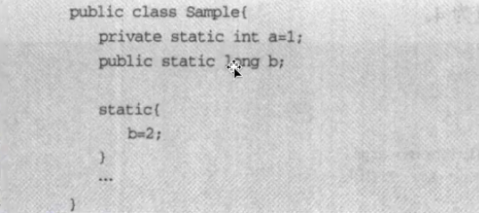

### 类的初始化

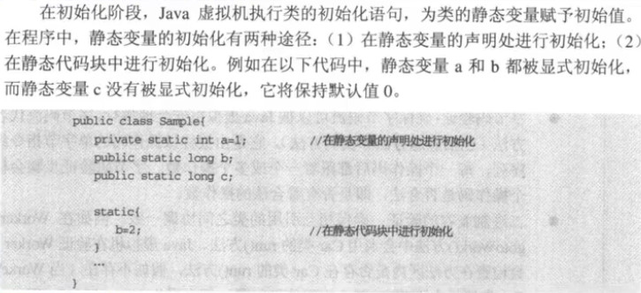

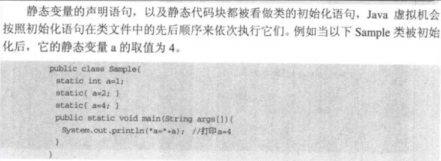

- 类的初始化步骤
  1. 假如这个类还没有被加载或连接，那就先进行加载和连接
  2. 假如类存在直接父类，并且这个父类还没有被初始化，就先初始化直接父类
  3. 假如类中存在初始化语句，就依次执行这些初始化语句

### 类的初始化时机

- 七种主动使用

1. 创建类的实例
2. 访问某个类或接口的静态变量，或者对该静态变量赋值
3. 调用类的静态方法
4. 反射(如`Class.forName("com.test.Test")`)
5. 初始化一个类的子类
6. jvm启动时被标明为启动类的类
7. jdk1.7开始提供的动态语言支持：`java.lang.invoke.MethodHandle`实例的解析结果`REF_getStatic,REF_putStatic,REF_invokeStatic`句柄对应的类没有初始化，则初始化。

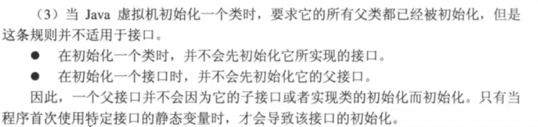


`cn.andios.jvm.classloader.MyTest5_3`总结：

> 对于接口，接口中的变量都由final修饰，**当变量值在编译期可以确定时**(这里测试案例是在main方法中调用接口的变量)，程序编译后变量的值会放到main方法所在类的常量池中，main方法所在类并没有直接引用这个接口，所以**不会加载或初始化接口或其父接口,当变量值需要在运行器才能确定时，父接口和接口本身都要被加载，但只初始化接口本身**


> 对于类，变量不一定有final修饰，**当变量值在编译期就能确定且由final修饰时，不会加载或初始化类本身或其父类/接口，如果不能在编译期确定或没有被final修饰，就会导致类本身和父类/父接口被加载并且导致类本身被初始化，如果是继承父类，还会导致父类被初始化，如果是实现接口，不会导致接口被初始化**


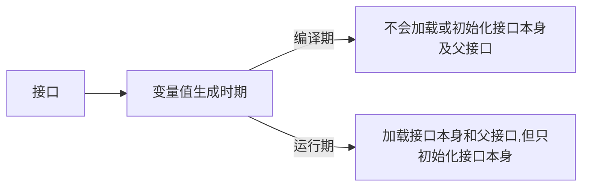

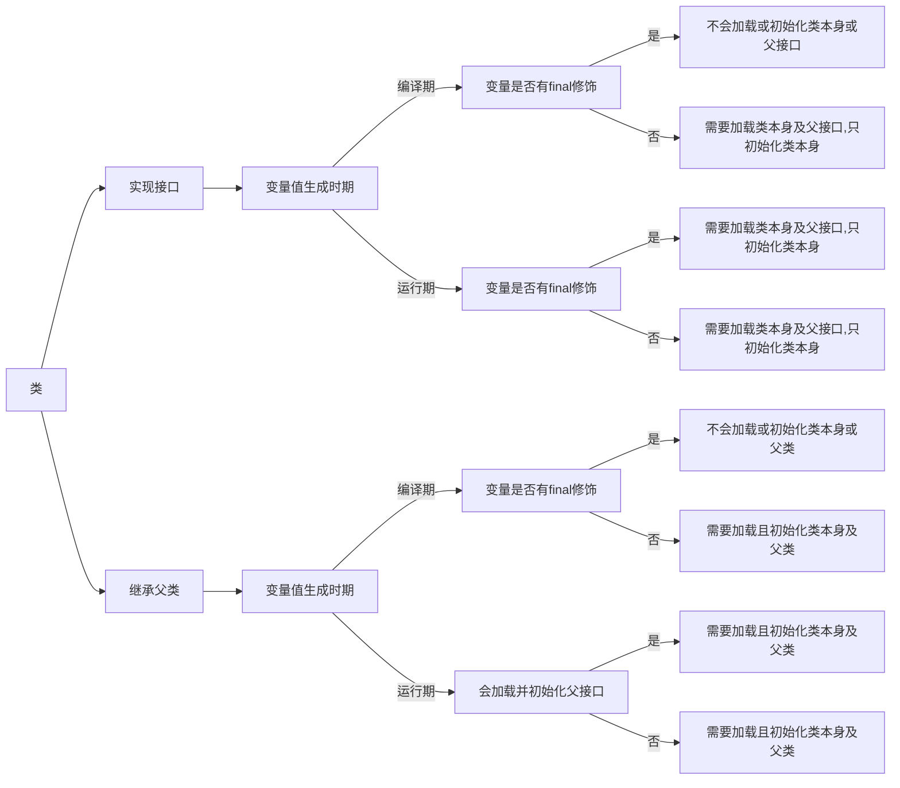


> 代码实例 cn.andios.jvm.classloader.MyTest5_3

```java
public class MyTest5_3 {
    public static void main(String[] args) {
        /**
         * case:接口继承接口，变量值在编译期生成
         *
         * 加载：  MyTest5_3
         *
         * 编译后删除MyParent5_3_Interface，MyChild5_3_Interface_1两个class文件依旧可以运行
         *
         * reason：a的值在编译期确定，直接放到了MyTest5_3的常量池中，
         *      所以MyChild5_3_Interface_1不需要被加载，
         *      MyParent5_3_Interface更不需要被加载
         */
        //System.out.println(MyChild5_3_Interface_1.a);


        /**
         * case:接口继承接口，变量值在运行期生成
         *
         * 加载：MyTest5_3  MyParent5_3_Interface  
         *      MyChild5_3_Interface_2   MyParent5_3_Interface$1
         */
        //System.out.println(MyChild5_3_Interface_2.a);


        /**
         * case:类实现接口，变量值在编译期生成 ,有final
         *
         * 加载：MyTest5_3
         */
        //System.out.println(MyChild5_3_Class_Impl_1.a);

        /**
         * case:类实现接口，变量值在运行期生成，有final
         *
         * 加载：MyTest5_3    MyParent5_3_Interface    
         *      MyChild5_3_Class_Impl_2   MyParent5_3_Interface$1
         */
        //System.out.println(MyChild5_3_Class_Impl_2.a);

        /**
         * case:类实现接口，变量值在编译期生成，无final
         *
         * 加载：MyTest5_3    MyParent5_3_Interface    
         *      MyChild5_3_Class_Impl_3    MyParent5_3_Interface$1
         */
        //System.out.println(MyChild5_3_Class_Impl_3.a);


        /**
         * case:类实现接口，变量值在运行期生成，无final
         *
         * 加载：MyTest5_3  MyParent5_3_Interface  
         *      MyChild5_3_Class_Impl_4  MyParent5_3_Interface$1
         */
        //System.out.println(MyChild5_3_Class_Impl_4.a);

        /**
         * case:类继承父类，变量值在编译期生成，有final
         *
         * 加载：MyTest5_3
         */
        //System.out.println(MyChild5_3_Class_Extends_1.a);

        /**
         * case:类继承父类，变量值在运行期生成，有final
         *
         * 加载：MyTest5_3   MyParent5_3_Class   
         *      MyChild5_3_Class_Extends_2  MyParent5_3_Class$1
         */
        //System.out.println(MyChild5_3_Class_Extends_2.a);

        /**
         * case:类继承父类，变量值在编译期生成，无final
         *
         * 加载：MyTest5_3    MyParent5_3_Class   
         *      MyChild5_3_Class_Extends_3   MyParent5_3_Class$1
         */
        //System.out.println(MyChild5_3_Class_Extends_3.a);


        /**
         * case:类继承父类，变量值在运行期生成，无final
         * 加载：MyTest5_3  MyParent5_3_Class  
         *      MyChild5_3_Class_Extends_4  MyParent5_3_Class$1
         */
        System.out.println(MyChild5_3_Class_Extends_4.a);
    }
}
/**
 * 判断是否初始化：代码块是否执行
 * 判断是否被加载：-XX:+TraceClassLoading
 */
interface MyParent5_3_Interface{
    public static Thread thread = new Thread(){
        {
            System.out.println("MyParent5_3_Interface invoked...");
        }
    };
}
/**
 * 判断是否初始化：代码块是否执行
 * 判断是否被加载：-XX:+TraceClassLoading
 */
class MyParent5_3_Class{
    public static Thread thread = new Thread(){
        {
            System.out.println("MyParent5_3_Class invoked...");
        }
    };
}
/** 接口继承接口，变量值在编译期生成 */
interface MyChild5_3_Interface_1 extends MyParent5_3_Interface{
    int a = 5;
}
/** 接口继承接口，变量值在运行期生成 */
interface MyChild5_3_Interface_2 extends MyParent5_3_Interface{
    int a = new Random().nextInt(1);
}

/** 类实现接口，变量值在编译期生成 ,有final*/
class MyChild5_3_Class_Impl_1 implements MyParent5_3_Interface{
    public static final int a = 5;
}
/** 类实现接口，变量值在运行期生成，有final*/
class MyChild5_3_Class_Impl_2 implements MyParent5_3_Interface{
    public static final int a = new Random().nextInt(1);
}
/** 类实现接口，变量值在编译期生成，无final */
class MyChild5_3_Class_Impl_3 implements MyParent5_3_Interface{
    public static  int a = 5;
}
/** 类实现接口，变量值在运行期生成，无final*/
class MyChild5_3_Class_Impl_4 implements MyParent5_3_Interface{
    public static  int a = new Random().nextInt(1);
}

/** 类继承父类，变量值在编译期生成，有final */
class MyChild5_3_Class_Extends_1 extends MyParent5_3_Class{
    public static final int a = 5;
}
/** 类继承父类，变量值在运行期生成，有final */
class MyChild5_3_Class_Extends_2 extends MyParent5_3_Class{
    public static final int a = new Random().nextInt(1);
}
/** 类继承父类，变量值在编译期生成，无final */
class MyChild5_3_Class_Extends_3 extends MyParent5_3_Class{
    public static  int a = 5;
}
/** 类继承父类，变量值在运行期生成，无final */
class MyChild5_3_Class_Extends_4 extends MyParent5_3_Class{
    public static  int a = new Random().nextInt(1);
}
```


- 只有当程序访问的静态变量或静态方法在确实在当前类或当前接口中定义时，才可以认为是对类或接口的主动使用
- 调用ClassLoader类的loadClass方法加载一个类，并不是对类的主动使用，不会导致类的初始化

### 类加载器

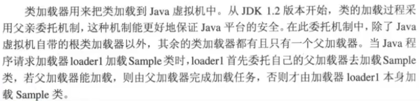

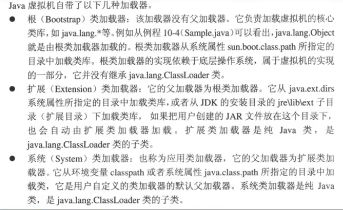

- 除了以上虚拟机自带的加载器外，用户还可以定制自己的类加载器。java提供了抽象类`java.lang.ClassLoader`,所有用户自定义的类加载器都应该继承`ClassLoader`类。
- `Bootstrap ClassLoader`
  - **c++实现，加载`$JAVA_JOME/jre/lib/rt.jar`**
- `Extension ClassLoader`
  - **java实现，加载`$JAVA_HOME/jre/lib/ext`下的jar或者加载`java.ext.dirs`指定的目录中的jar**
- `App ClassLoader`
  - **java实现，加载`classpath`或`java.class.path`指定的目录中的jar**
- 内建于jvm中的启动类加载器会加载`java.lang.ClassLoader`及其他的java平台类，当jvm启动时，一块特殊的机器码会运行，它会加载扩展类加载器与系统类加载器，这块特殊的机器码叫做启动类加载器。
- 启动类加载器并不是java类，其他类加载器都是java类。启动类加载器是特定于平台的机器指令，它负责开启整个加载过程，总归要有一个组件来加载第一个java类加载器，从而让整个加载过程能够顺利进行下去，加载第一个纯java类加载器就是启动类加载器的职责。
- 启动类加载器还会负责加载提供`JRE`正常运行所需要的基本组件，这包括`java.util`和`java.lang`包等等。

> 代码实例 cn.andios.jvm.classloader.MyTest19_1

```java
public class MyTest19_1 {
    public static void main(String[] args) {
        /**
         *  打印三个层级的类加载器加载的类有哪些
         *  其中，
         *      C:\Program Files\Java\jdk1.8.0_171\jre\classes目录
         *      为sun.boot.class.path加载所包含的目录
         *
         *      C:\Users\LSD\Desktop\jvm\jvm\jvm\target\classes;
         *      即本项目的字节码文件目录为java.class.path加载所包
         *      含的目录
         *      因此，在MyTest19_2中，
         *          1.如果我们把MyTest1.class拷到
         *      C:\Program Files\Java\jdk1.8.0_171\jre\classes目录
         *      下，那么加载MyTest1的不再是AppClassLoader，而是
         *      Bootstrap ClassLoader,打印时为null
         *          2.如果不移动MyTest1.class，则由AppClassLoader加载
         *          3.如果把MyTest1.class复制到G盘，并把类路径下的MyTest1.class删掉，
         *      则由我们自定义的MyTest16类加载器加载
         */
        //Bootstrap ClassLoader
        System.out.println(System.getProperty("sun.boot.class.path"));

        //Extension ClassLoader
        System.out.println(System.getProperty("java.ext.dirs"));

        //App ClassLoader
        System.out.println(System.getProperty("java.class.path"));
    }
}
```

> 代码实例 cn.andios.jvm.classloader.MyTest19_2

```java

public class MyTest19_2 {
    public static void main(String[] args) throws Exception {
        //
        MyTest16 loader1 = new MyTest16("loader1");
        loader1.setPath("G:\\");

        Class<?> clazz = loader1.loadClass("cn.andios.jvm.classloader.MyTest1");

        System.out.println("clazz："+clazz.hashCode());
        System.out.println("clazz loader："+clazz.getClassLoader());
    }
}
```

>  代码实例 cn.andios.jvm.classloader.MyTest20

```java

public class MyTest20 {
    public static void main(String[] args) {
        AESKeyGenerator aesKeyGenerator = new AESKeyGenerator();
        /**
         * result:
         *      sun.misc.Launcher$ExtClassLoader@7ea987ac
         *      sun.misc.Launcher$AppClassLoader@18b4aac2
         *
         *  AESKeyGenerator这个类默认是由扩展类加载器加载的
         *
         *  如果在当前项目的类路径下(即target/classes下)执行：
         *  java -Djava.ext.dirs=./ cn.andios.jvm.classloader.MyTest20
         *  就会报错：
         *  java.lang.ClassNotFoundException: com.sun.crypto.provider.AESKeyGenerator
         *  这个命令意思是：改变扩展类加载器加载的目录，改到当前目录，
         *  而此时当前目录中并没有AESKeyGenerator.class，所以这里会
         *  加载失败
         *
         */
        System.out.println(aesKeyGenerator.getClass().getClassLoader());
        System.out.println(MyTest20.class.getClassLoader());
    }
}
```

> 代码实例 cn.andios.jvm.classloader.MyTest23

```java
public class MyTest23 {
    static{
        System.out.println("MyTest23 initialized");
    }

    public static void main(String[] args) {
        /**
         * result:
         *      MyTest23 initialized
         *      sun.misc.Launcher$AppClassLoader@73d16e93
         *      sun.misc.Launcher$AppClassLoader@73d16e93
         *
         *  MyTest23.class类在类路径下，所以由AppClassLoader加载
         * 如果在当前目录的target下执行：
         *  java -Djava.ext.dirs=./ cn.andios.jvm.classloader.MyTest23
         *  即把扩展类加载的目录指定到当前的类路径，结果还是
         *  和上面一样，
         *  原因：扩展类加载的.class文件需以jar包形式存在，
         *      这里类路径下的.class文件并不是以jar包形式存在
         *  在target的classes目录下执行：
         *  jar cvf test.jar cn/andios/jvm/classloader/MyTest1.class
         *  即将MyTest1.class打成test.jar放在classes目录下，与cn目录平级
         *  此时再执行：
         *  java -Djava.ext.dirs=./ cn.andios.jvm.classloader.MyTest23
         *  result：
         *      MyTest23 initialized
         *      sun.misc.Launcher$AppClassLoader@2a139a55
         *      sun.misc.Launcher$ExtClassLoader@3d4eac69
         *   可以发现，MyTest1.class由扩展类加载器去加载了
         */
        System.out.println(MyTest23.class.getClassLoader());
        System.out.println(MyTest1.class.getClassLoader());
    }
}

```


### 获取类的Class对象

> 代码实例 cn.andios.jvm.classloader.MyTest7

```java
public class MyTest7 {
    public static void main(String[] args) throws ClassNotFoundException {
        //获取一个类的Class对象的4种方法
        Class clazz = null;

        /**
         *  result:
         *      test static block
         *      clazz:class cn.andios.jvm.classloader.Test
         *  reason：
         *      通过 Class.forName 会导致类的初始化
         */
//        clazz = Class.forName("cn.andios.jvm.classloader.Test");
//        System.out.println("clazz:"+clazz);

        /**
         *  result:
         *      clazz:class cn.andios.jvm.classloader.Test
         *  reason:
         *      通过 类.class 不会导致类的初始化
         */
        clazz = cn.andios.jvm.classloader.Test.class;
        System.out.println("clazz:"+clazz);

        /**
         *  result:
         *      clazz:class cn.andios.jvm.classloader.Test
         *  reason:
         *      通过  ClassLoader.getSystemClassLoader().loadClass 不会导致类的初始化
         */
//        clazz = ClassLoader.getSystemClassLoader().loadClass("cn.andios.jvm.classloader.Test");
//        System.out.println("clazz:"+clazz);

        /**
         *  result:
         *      test static block
         *      clazz:class cn.andios.jvm.classloader.Test
         *  reason：
         *      通过 对象.getClass() 会导致类的初始化
         */
//        clazz = new Test().getClass();
//        System.out.println("clazz:"+clazz);
    }
}
class Test{
    static {
        System.out.println("test static block");
    }
}

```

### java.lang.ClassLoader

> javadoc：
>
> 一个类加载器是一个负责加载类的对象，类`ClassLoader`是一个抽象类。给定一个类的二进制名称(二进制名称：任何作为一个String参数提供给`ClassLoader`类里面的方法的类名必须是由`The Java Language Specification`定义的二进制名称)，那么一个类加载器就会尝试去定位或生成构成类定义的数据。一种典型的策略是将名字转为一个文件名字，然后从文件系统中读取这个名字对应的文件。
>
> 每一个Class对象都包含一个定义这个类的ClassLoader的引用。        
>
> **数组类的Class对象不是由类加载器创建，而是由jvm在运行时根据需要自动创建的，`Class.getClassLoader()`返回的数组类的类加载器与其元素的类加载器相同，如果元素类型是原生类型，那么这个数组类是没有类加载器的。**

> 代码实例 cn.andios.jvm.classloader.MyTest15

```java
public class MyTest15 {
    public static void main(String[] args) {
        String []  str = new String[]{"aa","bb"};
        /**
         * result：
         *      class [Ljava.lang.String;
         *      null
         * 这里null表示由启动类加载
         */
        System.out.println(str.getClass());
        System.out.println(str.getClass().getClassLoader());

        Integer [] arr = new Integer[]{1,2};
        /**
         * result:
         *      class [Ljava.lang.Integer;
         *      null
         * 这里null并不是表示启动类加载，而是确实没有类加载器，因为它是原生类型
         */
        System.out.println(arr.getClass());
        System.out.println(arr.getClass().getClassLoader());

        MyTest15 [] test = new MyTest15[]{new MyTest15(),new MyTest15()};
        /**
         * result:
         *      class [Lcn.andios.jvm.classloader.MyTest15;
         *      sun.misc.Launcher$AppClassLoader@18b4aac2
         */
        System.out.println(test.getClass());
        System.out.println(test.getClass().getClassLoader());
    }
}
```

> 应用实现`ClassLoader`的子类是为了扩展jvm动态加载类的方式。
>
> 类加载器通常被安全管理器用来指示安全域。
>
> CLassLoader类使用一种委托模型去寻找类和资源，ClassLoader的每一个实例都有与之关联的父类加载器.当被要求去寻找一个类或资源的时候，ClassLoader的实例会在它自己寻找类或资源之前将资源或类的寻找委托给它的父类加载器，虚拟机内建的类加载器成为"bootstrap class loader"，它本身是没有双亲的，但是它可以作为一个类加载器实例的双亲。
> 
> 支持并发加载类的类加载器比如"paraller capable"类加载器被要求在类初始化期间通过调用`java.lang.ClassLoader#registerAsParallelCapable`注册它们自己，ClassLoader这个类默认就被注册为paraller capable.然而，如果它的子类如果是paraller capable，那么它的子类也是需要注册的。
>
> 在委托模型不是很严格的层次化的环境下，类加载器需要是paraller capable的，否则类加载会导致死锁，因为加载器的锁在类加载的过程中是一直被持有的。
> 
> 通常情况下，jvm以一种与平台相关的方式从本地文件系统中加载类。比如说，在unix系统中，jvm是从`CLASSPATH`环境变量指定的目录中加载类的。
>
> 然而，有些类并不是来源于文件，比如来源于网络，或者由应用构建出来(比如动态代理)，这种情况下`java.lang.ClassLoader#defineClass(java.lang.String, byte[], int, int)`方法会将一个字节数组转换成一个类的实例，这个新定义的类的实例可以通过`java.lang.Class#newInstance`来创建.
>
> 由一个类加载器创建的对象的方法或构造器还可能引用其他的类。为了确定引用到的类是什么，jvm还会调用最初创建这个类的类加载器的`java.lang.ClassLoader#loadClass(java.lang.String)`方法。
>    
> 比如一个应用可以创建一个网络类加载器从一个服务器上下载文件，如下：
> ```java
> ClassLoader loader = new NetworkClassLoader(host,port);
> Object main = loader.loadClass("Main", true).newInstance();
> ```
> 网络类加载器的子类必须定义
> `java.lang.ClassLoader#findClass`方法从网络中加载类数据。一旦它下载好了构成了类字节码文件的字节后，它应该用`java.lang.ClassLoader#defineClass(java.lang.String, byte[], int, int)`方法创建实例，如下：
> ``` java
> class NetworkClassLoader extends ClassLoader {
>     String host;
>     int port;
>     public Class findClass(String name) {
>         byte[] b = loadClassData(name);
>         return defineClass(name, b, 0, b.length);
>     }
>     private byte[] loadClassData(String name) {
>         // load the class data from the connection
>        ···
> }
> ```

#### java.lang.ClassLoader#findClass

> javadoc：
> 
> 找到有指定的二进制名字的字节码文件，这个方法应该被遵循委托模型的类加载器的实现类重写，这个方法在检查完请求加载的类的父类加载器后会被`java.lang.ClassLoader#loadClass(java.lang.String)`调用。默认实现会抛出`ClassNotFoundException`异常

#### java.lang.ClassLoader#defineClass(java.lang.String, byte[], int, int)
> javadoc：
>
> 讲一个字节数组转为Class类的实例，在这个Class被使用之前，必须要被解析.
>
> 这个方法会分配一个默认的`ProtectionDomain`给新创建的类，`ProtectionDomain`是为了确保返回来的class的信息都是正确的，默认的`ProtectionDomain`在第一次调用`java.lang.ClassLoader#defineClass(java.lang.String, byte[], int, int)`时被创建，在随后的调用中会一直复用。
>
> 要为一个类指定特定的`ProtectionDomain`，可以使用`java.lang.ClassLoader#defineClass(java.lang.String, byte[], int, int, java.security.ProtectionDomain)`方法将`ProtectionDomain`作为参数

#### java.lang.ClassLoader#loadClass(java.lang.String , boolean resolve)

> javadoc：
>
> 加载拥有指定二进制名字的类，这个方法搜索类的方式与`java.lang.ClassLoader#loadClass(java.lang.String, boolean)`方法一样，这个方法默认的实现会按照如下的顺序去寻找类：
>
> 1. 调用`java.lang.ClassLoader#findLoadedClass`检查类是否已经被加载。
> 2. 调用父类加载器的`java.lang.ClassLoader#loadClass(java.lang.String)`方法，如果父加载器是null，就是使用jvm内建的类加载器(即`bootstrap classloader`)替代。
> 3. 调用`java.lang.ClassLoader#findClass`寻找类
>
> 如果使用上述步骤找到了类，并且resolve这个flag为true，那么这个方法将会对结果类对象调用`java.lang.ClassLoader#resolveClass`方法，ClassLoader类的子类鼓励去重写`java.lang.ClassLoader#findClass`方法而不是使用这个方法。
>
> 除非被重写，否则这个方法在整个类加载的过程中会同步`java.lang.ClassLoader#getClassLoadingLock`方法的结果。

> 代码实例 cn.andios.jvm.classloader.MyTest16  自定义类加载器

```java
public class MyTest16 extends ClassLoader{
    private String classLoaderName;
    /** 文件扩展名 */
    private final String fileExtension = ".class";
    /** 文件路径 */
    private String path;

    /**
     * 默认父加载器为SystemClassLoader的构造方法
     * @param classLoaderName
     */
    public MyTest16(String classLoaderName){
        super();
        this.classLoaderName = classLoaderName;
    }

    /**
     * 父加载器为指定的parent的构造方法
     * @param parent
     * @param classLoaderName
     */
    public MyTest16(ClassLoader parent,String classLoaderName){
        super(parent);
    }

    public void setPath(String path) {
        this.path = path;
    }

    /**
     * 重写父类的findClass方法
     * @param className
     * @return
     * @throws ClassNotFoundException
     */
    @Override
    protected Class<?> findClass(String className) throws ClassNotFoundException {
        //如果这句话打印了，表明这个方法调用了，即使用了这个自定义的类加载器，而不是jdk的类加载器
        System.out.println("load "+className+" findClass invoked & classLoaderName："+this.classLoaderName);
        //调用loadClassData方法加载类信息
        byte[] data = loadClassData(className);
        return this.defineClass(className,data,0,data.length);
    }

    /**
     * 加载类的信息以byte []形式返回
     * @param name
     * @return
     */
    private byte[] loadClassData(String name){
        //声明三个对象
        InputStream is = null;
        byte [] data = null;
        ByteArrayOutputStream baos = null;
        //包名转为路径名
        name = name.replace(".","\\");
        try {
            //字节流读取指定的字节码文件
            is = new FileInputStream(new File(this.path+name+this.fileExtension));
            baos = new ByteArrayOutputStream();
            int ch = 0;
            while ((ch = is.read())!= -1){
                baos.write(ch);
            }
            //将读取到的字节流转为字节数组
            assert baos != null;
            data = baos.toByteArray();
        } catch (IOException e) {
            e.printStackTrace();
        }finally {
            try {
                assert is != null;
                is.close();
                assert baos != null;
                baos.close();
            } catch (IOException e) {
                e.printStackTrace();
            }
        }
        //返回byte []
        return  data;
    }

    public static void main(String[] args) throws Exception {
        //创建一个自定义类加载器，名称是loader1,它的父类加载器是AppClassLoader
        MyTest16 loader1 = new MyTest16("loader1");
        //设置路径
        //loader1.setPath("C:\\Users\\LSD\\Desktop\\jvm\\jvm\\jvm\\target\\classes\\");
        loader1.setPath("G:\\");

        Class<?> clazz1 = loader1.loadClass("cn.andios.jvm.classloader.MyTest1");
        System.out.println("clazz1:"+clazz1.hashCode());


        System.out.println("============================");


        //创建一个自定义类加载器，名称是loader2,它的父类加载器是AppClassLoader
        MyTest16 loader2 = new MyTest16("loader2");
        //设置路径
        //loader2.setPath("C:\\Users\\LSD\\Desktop\\jvm\\jvm\\jvm\\target\\classes\\");
        loader2.setPath("G:\\");

        Class<?> clazz2 = loader2.loadClass("cn.andios.jvm.classloader.MyTest1");
        System.out.println("clazz2:"+clazz2.hashCode());


        System.out.println("****************************");


        //创建一个自定义类加载器，名称是loader3,它的父类加载器是指定的loader1
        //loader1和loader3都是MyTest16的实例，但是loader1可以成为loader3的父加载器，
        //源于类加载器之间不是继承关系，而是一种包含关系
        MyTest16 loader3 = new MyTest16(loader1,"loader3");
        //设置路径
        //loader3.setPath("C:\\Users\\LSD\\Desktop\\jvm\\jvm\\jvm\\target\\classes\\");
        loader3.setPath("G:\\");

        Class<?> clazz3 = loader3.loadClass("cn.andios.jvm.classloader.MyTest1");
        System.out.println("clazz3:"+clazz3.hashCode());
        /**
         * result:
         *  把target下MyTest1.class文件拷贝一份到G盘如上目录，
         *  如果类路径中存在MyTest1.class文件，即项目的target下存在
         *  cn.andios.jvm.classloader.MyTest1.class文件，那么不管
         *  loader1.setPath用的C盘文件还是G盘文件，MyTest1这个类都由
         *  jdk的AppClassLoader来加载，一次运行的结果：
         *     clazz1:1163157884
         *      ============================
         *      clazz2:1163157884
         *      *********************************
         *      clazz3:1163157884
         *   3个Class的hashcode()一样，说明加载的类一样
         *
         *   因为当classpath下存在MyTest1.class文件时，loader1的父加载器AppClassLoader
         *   试图从classpath下加载这个文件成功了，所以轮不到我们自定义的类加载器来加载，
         *   当loader2的父加载器(也是这个AppClassLoader)尝试加载时，发现之前加载过了，
         *   所以直接拿过来，不会再加载，loader3的父加载器是loader1，loader1的父加载器又是
         *   AppClassLoader,所以这3个hashCode()值一样，是同一个对象.
         *
         *  如果把target下MyTest1.class文件删掉，loader1.setPath使用的C盘路径，
         *  就会报错(因为确实没有这个文件，文件被删掉了),如果loader1.setPath
         *  使用的G盘路径，一次运行结果：
         *      load cn.andios.jvm.classloader.MyTest1 findClass invoked & classLoaderName：loader1
         *      clazz1:356573597
         *      ============================
         *      load cn.andios.jvm.classloader.MyTest1 findClass invoked & classLoaderName：loader2
         *      clazz2:2133927002
         *      *********************************
         *      clazz3:356573597
         *   当loader1的父加载器AppClassLoader尝试从classpath下加载时，发现文件不存在，
         *   无法加载，所以由我们自定义的loader1加载，loader2同理，所以由loader1和loader2
         *   分别加载得到的clazz1和clazz2不是同一个对象，对于loader3，它的父类加载器是loader1，
         *   所以它会委托给父类加载器loader1去加载，所以得到的对象的hashCode()与loader1加载的一样
         */

    }
}

```

#### java.lang.ClassLoader#getSystemClassLoader

> javadoc：
>
> 返回用于委托的系统类加载器，是新的`ClassLoader`实例的默认委托双亲，通常也是用于启动应用的类加载器。
>
> 在运行期启动序列中很早就被调用，它会创建系统类加载器并且设置创建出来的系统类加载器为调用线程的上下文类加载器。
>
> 默认的系统类加载器是一个与这个类实现相关的实例
>
> 如果在这个方法第一次被调用时系统属性`java.system.class.loader`定义了，那么这个属性的值就作为系统类加载器的名字。这个类(这个属性值对应的类)会使用默认的系统类加载器(默认的系统类加载器即`AppClassLoader`)来加载并且这个类要定义一个`public`的构造器接收一个ClassLoader类型的参数用来作为代理父类，默认的系统类加载器会作为参数传入这个构造器创建一个实例(即以`AppClassLoader`为代理父类创建`java.system.class.loader`属性值的实例)，返回的类加载器(即创建的`java.system.class.loader`属性值的实例)就被定义为系统类加载器。

> 代码实例 cn.andios.jvm.classloader.MyTest24 

```java
/**
 * 在运行期，一个java类是由该类的完全限定名(binary name)和用于加载该类的定义类加载器(defining classloader)所共同决定的
 * 如果同样名字(相同限定名)的类是由两个不同的类加载器所加载，那么这些了就是不同的，即使.class文件完全一样，并且从同一位置加载亦如此
 */
public class MyTest24 {
    public static void main(String[] args) {
        /**
         * result:
         *      ...
         * 如果在target的classes目录下执行：
         * java cn/andios/jvm/classloader/MyTest24
         * 可以发现执行结果与上面的result不同
         *  reason:
         *      idea会自己往classpath里面追加一些内容
         * 如果在target的classes下执行:
         * java -Dsun.boot.class.path=./ cn.andios/jvm.classloader.MyTest24
         * 即把启动类加载器的加载目录改到当前目录，
         * result：
         *      Error occurred during initialization of VM
         *      java/lang/NoClassDefFoundError: java/lang/Object
         * 因为Object类是父类，加载时肯定会先加载Object,但此目录下并没有Object
         */
        //Bootstrap ClassLoader
        System.out.println(System.getProperty("sun.boot.class.path"));

        //Extension ClassLoader
        System.out.println(System.getProperty("java.ext.dirs"));

        //App ClassLoader
        System.out.println(System.getProperty("java.class.path"));

        /**
         * 如果在idea中运行，result:
         *      sun.misc.Launcher$AppClassLoader@18b4aac2
         * 因为没有指定 java.system.class.loader
         * 如果在target下的classes目录执行：
         *      java -Djava.system.class.loader=cn.andios.jvm.classloader.MyTest16  cn.andios.jvm.classloader.MyTest24
         * 即指定java.system.class.loader(注意：MyTest16中要定义公共的接收ClassLoader对象为唯一参数的构造器)，那么result：
         *      cn.andios.jvm.classloader.MyTest16@6d06d69c
         *
         */
        System.out.println(ClassLoader.getSystemClassLoader());
    }
}
```

> java.lang.ClassLoader#getSystemClassLoader源码分析

```java
    // 系统类加载器
    private static ClassLoader scl;

    // 如果设置了系统类加载器这个属性就为true
    private static boolean sclSet;

	public static ClassLoader getSystemClassLoader() {
        initSystemClassLoader();
        if (scl == null) {
            return null;
        }
        SecurityManager sm = System.getSecurityManager();
        if (sm != null) {
            checkClassLoaderPermission(scl, Reflection.getCallerClass());
        }
        return scl;
    }

    private static synchronized void initSystemClassLoader() {
        //如果系统类类加载器没有被设置
        if (!sclSet) {
            if (scl != null)
                //如果系统类加载器没有被设置，但系统类加载器又不为空，互相矛盾，直接抛异常
                throw new IllegalStateException("recursive invocation");
            //sun.misc.Launcher.getLauncher()会得到一个sun.misc.Launcher实例，
            //这个Launcher实例的构造方法见下面的代码
            sun.misc.Launcher l = sun.misc.Launcher.getLauncher();
            if (l != null) {
                Throwable oops = null;
                //这里从中launcher得到的是AppClassLoader，赋给系统类加载器
                scl = l.getClassLoader();
                try {
                    //SystemClassLoaderAction是ClassLoader类中的非public类，见下面的分析
                    scl = AccessController.doPrivileged(
                        new SystemClassLoaderAction(scl));
                //异常处理 
                } catch (PrivilegedActionException pae) {
                    oops = pae.getCause();
                    if (oops instanceof InvocationTargetException) {
                        oops = oops.getCause();
                    }
                }
                if (oops != null) {
                    if (oops instanceof Error) {
                        throw (Error) oops;
                    } else {
                        // wrap the exception
                        throw new Error(oops);
                    }
                }
            }
            //表示系统类加载器设置完毕
            sclSet = true;
        }
    }
/** 
 * ClassLoader中的非public类，判断用户是否自定义设置系统类加载器
 * 如果没有指定，就用原来的，即AppClassLoader
 * 如果指定了，就用用户指定的
 */
class SystemClassLoaderAction
    implements PrivilegedExceptionAction<ClassLoader> {
    private ClassLoader parent;

    SystemClassLoaderAction(ClassLoader parent) {
        this.parent = parent;
    }

    public ClassLoader run() throws Exception {
        //获取系统属性java.system.class.loader
        String cls = System.getProperty("java.system.class.loader");
        //如果为空，说明没有设置，那么系统类加载器就是parent，在initSystemClassLoader方法中传入			//SystemClassLoaderAction构造器中的parent是scl，即AppClassLoader
        if (cls == null) {
            return parent;
        }
		//如果已经设置，即用户已经自定义，就用用户指定的
        Constructor<?> ctor = Class.forName(cls, true, parent)
            .getDeclaredConstructor(new Class<?>[] { ClassLoader.class });
        ClassLoader sys = (ClassLoader) ctor.newInstance(
            new Object[] { parent });
        //设置线程上下文类加载器
        Thread.currentThread().setContextClassLoader(sys);
        return sys;
    }
}
```

### sun.misc.Launcher

```java
/** 构造器 */    
public Launcher() {
	//创建扩展类加载器
    Launcher.ExtClassLoader var1;
    try {
        //调用getExtClassLoader()方法赋值扩展类加载器，如果不能赋值，直接抛异常
        //getExtClassLoader()方法大概步骤：
        //1.根据java.ext.dirs系统属性指定的目录，获取目录下的file组成File数组
        //2.读取每个file new出扩展类加载器
        var1 = Launcher.ExtClassLoader.getExtClassLoader();
    } catch (IOException var10) {
        throw new InternalError("Could not create extension class loader", var10);
    }

    try {
        //以扩展类加载器为参数创建AppClassLoader
        //getExtClassLoader()方法大概步骤：
        //1.从系统属性java.class.path指定的目录中构造File类型数组
        //2.根据File文件路径构造URL[],再结合扩展类加载器一起两个参数new出AppClassLoader
        this.loader = Launcher.AppClassLoader.getAppClassLoader(var1);
    } catch (IOException var9) {
        throw new InternalError("Could not create application class loader", var9);
    }
	//为当前的执行线程设置上下文类加载器：AppClassLoader
    Thread.currentThread().setContextClassLoader(this.loader);
    //是否指定了安全管理器属性值
    String var2 = System.getProperty("java.security.manager");
    if (var2 != null) {
        SecurityManager var3 = null;
        if (!"".equals(var2) && !"default".equals(var2)) {
            try {
                //调用反射创建安全管理器实例
                var3 = (SecurityManager)this.loader.loadClass(var2).newInstance();
            } catch (IllegalAccessException var5) {
                ;
            } catch (InstantiationException var6) {
                ;
            } catch (ClassNotFoundException var7) {
                ;
            } catch (ClassCastException var8) {
                ;
            }
        } else {
            //new 安全管理器实例
            var3 = new SecurityManager();
        }

        if (var3 == null) {
            throw new InternalError("Could not create SecurityManager: " + var2);
        }
		//设置系统的安全管理器
        System.setSecurityManager(var3);
    }

}
```

### java.lang.Class#forName(java.lang.String, boolean, java.lang.ClassLoader)

> javadoc：
>
> 用给定的类加载器返回一个与给定字符串名字相关联的接口或类的Class对象。给定接口或类的完全限定名，这个类加载器会尝试定位、加载、链接这个接口或类。给定的类加载器用来加载类或接口，如果类加载器参数为null，那么就用启动类加载器来加载。这个类只有在`initialize`参数为`true`并且之前没有被初始化的情况下才会被初始化。
>
> 如果参数name是一个原生的类型或void，它会尝试在未命名的包中定位用户定义的类。因此这个方法不能用来获取原生类型或者void类型的Class对象。
>
> 如果name是一个数组类型，那么数组的元素类型的类会被加载但不会被初始化。
>
> 比如：
>
> `Class.forName("Foo")`
>
> 等价于
>
> `Class.forName("Foo", true, this.getClass().getClassLoader())`
> 这个方法会抛出与加载、链接或初始化相关的错误，如在`Java Language Specification` 的12.2, 12.3,12.4章节中指定的。
>
> 这个方法并不会检查所请求的类对它的调用者来说是否是可以访问的。

```java
    public static Class<?> forName(String name, boolean initialize,
                                   ClassLoader loader)
        throws ClassNotFoundException
    {
        Class<?> caller = null;
        SecurityManager sm = System.getSecurityManager();
        if (sm != null) {
            //获取到调用forName这个方法的类的Class对象
            caller = Reflection.getCallerClass();
            if (sun.misc.VM.isSystemDomainLoader(loader)) {
            	//获取到调用forName这个方法的类的Class对象的类加载器
                ClassLoader ccl = ClassLoader.getClassLoader(caller);
                if (!sun.misc.VM.isSystemDomainLoader(ccl)) {
                    sm.checkPermission(
                        SecurityConstants.GET_CLASSLOADER_PERMISSION);
                }
            }
        }
        //forName0是native方法
        return forName0(name, initialize, loader, caller);
    }
```


### 命名空间

- 每个类加载器都有自己的命名空间，**命名空间由该加载器及所有父加载器所加载的类组成**
- 在同一个命名空间中，不会出现类的完整名字(包括类的包名)相同的两个类
- 在不同的命名空间中，有可能会出现类的完整名字(包括类的包名)相同的两个类
- 子类加载器所加载的类可以访问父类加载器所加载的类
- 父类加载器所加载的类不能访问子类加载器所加载的类

> 代码实例 cn.andios.jvm.classloader.MyCat

```java
public class MyCat {
    public MyCat(){
        System.out.println("MyCat is loaded by:"+this.getClass().getClassLoader());
        //System.out.println("form MyCat:"+MySample.class);
    }
}
```

> 代码实例 cn.andios.jvm.classloader.MySample

```java
public class MySample {
    public MySample(){
        System.out.println("MySample is loaded by:"+ this.getClass().getClassLoader());
        new MyCat();
        System.out.println("form MySample:"+MyCat.class);
    }
}
```

> 代码实例 cn.andios.jvm.classloader.MyTest18_1

```java
public class MyTest18_1 {
    public static void main(String[] args) throws Exception {
        MyTest16 loader1 = new MyTest16("loader1");
        //这里target下的MySample.class文件没有删，所以使用的jvm的类加载器
        Class<?> clazz = loader1.loadClass("cn.andios.jvm.classloader.MySample");
        System.out.println("class:"+ clazz.hashCode());

        //如果注释这一行，那么并不会对MySample实例化，即MySample构造方法不会被调用，
        //因此不会实例化MyCat对象，即没有对MyCat进行主动使用，这里就不会加载MyCat
        Object obj = clazz.newInstance();
    }
}

```

> 代码实例 cn.andios.jvm.classloader.MyTest18_2

```java
public class MyTest18_2 {
    public static void main(String[] args) throws Exception {
        MyTest16 loader1 = new MyTest16("loader1");
        //拷贝target下面的MySample.class和MyCat.class到G盘如下目录
        //删掉target下面的MySample.class和MyCat.class
        //指定loader的path为G盘
        //所以这里加载MySample和MyCat是用的我们自定义的类加载器MyTest16

        //如果只删掉target下面的MyCat.class文件，不删除MySample.class，执行时
        //MySample被AppClassLoader正常加载，但MyCat会报错ClassNotFoundException

        //如果只删掉target下面的MySample.class，保留MyCat.class文件，执行时
        //MySample会由自定义类加载器MyTest16加载，MyCat由AppClassLoader加载
        //这种情况下，
        //      如果MyCat中有对MySample的引用(如MyCat构造器中打印MySample.class，
        //  此时MySample中没有打印MyCat.class，只有new MyCat() )
        //  就会报错MySample ClassNotFoundException,原因：MyCat由AppClassLoader加载，
        //  MySample由MyTest16加载，AppClassLoader是MyTest16的父类，所以由
        //  AppClassLoader所加载的类当中就看不到子类MyTest16所加载的类.
        //      如果MySample中有对MyCat的引用(如MySample构造器中打印MyCat.class)
        //  执行时并不会报错，MySample中会正常打印MyCat.class.即在子类加载器加载的类中
        //  访问父类加载器加载的类

        /**
         * 以上总结：
         *      子类加载器所加载的类可以访问父类加载器所加载的类
         *      父类加载器所加载的类不能访问子类加载器所加载的类
         */
        loader1.setPath("G:\\");
        Class<?> clazz = loader1.loadClass("cn.andios.jvm.classloader.MySample");
        System.out.println("class:"+ clazz.hashCode());

        //如果注释这一行，那么并不会对MySample实例化，即MySample构造方法不会被调用，
        //因此不会实例化MyCat对象，即没有对MyCat进行主动使用，这里就不会加载MyCat
        Object obj = clazz.newInstance();
    }
}
```


> 代码实例 cn.andios.jvm.classloader.MyTest21

```java
public class MyTest21 {
    public static void main(String[] args) throws Exception {
        MyTest16 loader1 = new MyTest16("loader1");
        MyTest16 loader2 = new MyTest16("loader2");

        Class<?> clazz1 = loader1.loadClass("cn.andios.jvm.classloader.MyPerson");
        Class<?> clazz2 = loader2.loadClass("cn.andios.jvm.classloader.MyPerson");

        //不删除target下的MyPerson.class文件下，即不删除类路径下的MyPerson.class文件
        //此时clazz1由AppClassLoader加载，clazz2直接使用AppClassLoader
        //第一次加载MyPerson.class的结果，所以为true
        System.out.println(clazz1 == clazz2);

        Object obj1 = clazz1.newInstance();
        Object obj2 = clazz2.newInstance();

        Method method = clazz1.getMethod("setMyPerson", Object.class);
        //即：obj1.setMyPerson(obj2)
        //这里不会报错
        method.invoke(obj1,obj2);
    }
}
```

>  代码实例 cn.andios.jvm.classloader.MyTest22

```java
public class MyTest22 {
    public static void main(String[] args) throws Exception {
        /**
         * 定义类加载器：真正加载字节码的类加载器
         * 初始化类加载器：其他类加载器称为初始类加载器
         */

        MyTest16 loader1 = new MyTest16("loader1");
        MyTest16 loader2 = new MyTest16("loader2");

        //拷贝target下的MyPerson.class文件到G盘(移出类路径)，并删除
        //target下的MyPerson.class
        loader1.setPath("G:\\");
        loader2.setPath("G:\\");

        Class<?> clazz1 = loader1.loadClass("cn.andios.jvm.classloader.MyPerson");
        Class<?> clazz2 = loader2.loadClass("cn.andios.jvm.classloader.MyPerson");

        //此时clazz1由loader1加载，clazz2由loader2加载，所以结果为false
        System.out.println(clazz1 == clazz2);

        Object obj1 = clazz1.newInstance();
        Object obj2 = clazz2.newInstance();

        Method method = clazz1.getMethod("setMyPerson", Object.class);
        //即：obj1.setMyPerson(obj2)
        /**
         * result：
         *      java.lang.ClassCastException:
         *      cn.andios.jvm.classloader.MyPerson
         *      cannot be cast to
         *      cn.andios.jvm.classloader.MyPerson
         *
         *  loader1和loader2属于两个不同的命名空间，没有直接或间接的父子关系，
         *  所以它们加载的类clazz1和clazz2互相不可见
         *  所以这里会报错
         */
        method.invoke(obj1,obj2);
    }
}
```

### 双亲委派模型好处

1. **可以确保java核心库的类型安全，能够提供软件系统的安全性，在此机制下，用户自定义的类加载器不可能加载应该由父类加载器加载的可靠类，从而防止不可靠甚至恶意代码替代父类加载器加载的可靠代码**。比如所有的java应用都至少会引用`java.lang.Object`，也就是说在运行期，`java.lang.Object`这个类在运行期会被加载到jvm中，如果这个加载过程由java应用自己的类加载器所完成的，那么很可能会在jvm中存在多个版本的`java.lang.Object`类，

   > 代码实例 cn.andios.jvm.classloader.MyTest22

   而且这些类之间还是不兼容的，相互不可见的(正是命名空间发挥着作用)。借助双亲委派机制，java核心类库中的类加载工作都是由启动类加载器来统一完成，从而确保了java应用所使用的都是同一版本的java核心类库。

2. 可以确保java核心类库所提供的类不会被自定义的类所替代。

3. 不同的类加载器可以为相同名称(binary name)的类创建额外的命名空间。相同名称的类可以并存在jvm中，只需要用不同的类加载器来加载它们即可。

   > 代码实例 cn.andios.jvm.classloader.MyTest22

   不同类加载起所加载的类之间是不兼容的，这就相当于在jvm内部创建了一个又一个相互隔离的java类空间，这类技术在很多框架中都得到了实际应用。

### 打破双亲委派模型

1. 如果要符合双亲委派规范，则重写`findClass`方法(用户自定义类加载逻辑)；要破坏的话，重写`loadClass`方法(双亲委派的具体逻辑实现)。
2. 线程上下文类加载器。
   - `SPI`是一种服务发现机制，为某个接口寻找服务实现的机制。比如我们用`jdbc`连接`mysql`，`SPI`机制通过`ServiceLoade`r类加载位于jar包中的`META-INF/services/java.sql.Driver`文件，文件内容`(com.mysql.jdbc.Driver)`即为实现类的全限定名。
   - 执行`DriverManager.getConnection(...)`方法时会调用`ServiceLoader.load(...)`，`ServiceLoader`是位于`rt.jar`下，所以**`ServiceLoader`由启动类加载器来加载**，调用`ServiceLoader.load(...)`后经过一系列其他调用在`ServiceLoader.nextService`中通过`Class.forName()`来加载`java.sql.Driver`接口的实现类`com.mysql.jdbc.Driver`，那么问题来了，**`Class.forName()`加载用的是调用者的`Classloader`，即`ServiceLoader`的`ClassLoader`，即启动类加载器，而接口实现类是在`classpath`下的`jar`里，启动类加载器无法加载，所以最开始调用`ServiceLoader.load(...)`方法时，获取了当前线程类加载器，而在`sun.misc.Launcher`类中，线程上下文类加载器被设置成系统类加载器。获取当前线程类加载器再通过`ServiceLoader`构造器创建了新的`ServiceLoader`，后续`Class.forName()`调用的是这个当前线程类加载器，即系统类加载器，由系统类加载器加载接口实现类。**
   - **很明显，线程上下文类加载器让父级类加载器能通过调用子级类加载器来加载类，这打破了双亲委派模型的原则**

### ContextClassLoader

- 当前类加载器(`Current ClassLoader`)：加载当前类的类加载器

- 每个类都会使用自己的类加载器(即加载自身的类加载器)去加载其他类(指这个类所依赖的其它的类)即如果ClassX引用了ClassY,那么ClassX的类加载器就会尝试加载ClassY,前提是ClassY尚未被加载。此时ClassX的类加载器就是当前类加载器

- 线程上下文类加载器(`ThreadContextClassLoader`)是从jdk1.2开始引入的，Thread类中的`getContextClassLoader`与`setContextClassLoader`分别用来获取和设置线程上下文类加载器，如果没有设置，线程将继承其父线程的上下文类加载器

- java应用运行时初始线程的上下文类加载器是系统类加载器，在线程中运行的代码可以通过该类加载器来加载类与资源

- 线程上下文类加载器的重要性：
  - **父`ClassLoader`可以使用当前线程`Thread.currentThread().getContextClassLoader()`所得到的`ClassLoader`所加载的类，这就改变了父`ClassLoader`不能使用子`ClassLoader`或是其他没有直接父子关系的`ClassLoader`所加载的类的情况，即改变了双亲委托模型。**线程上下文类加载器就是当前线程的Current ClassLoader。
  - 在双亲委托模型下，类加载是由下至上的，即下层的类加载器会委托上层进行加载，但对于`SPI(Service Provider Interface)`来说，有些接口是java核心库提供的，而java核心库由启动类加载器来加载，这些接口的实现又来自不同的厂商，java启动类加载器不会加载其他来源的jar包，这样传统的双亲委托模型就无法满足SPI的要求。而通过给当前线程设置上下文类加载器，就可以由设置的类加载器来实现对接口或实现类的加载。
  - 例如`JDBC`中，`JDBC`规范由jdk中的`java.sql.Connection`接口、`java.sql.Statement`接口等定义，这些类位于`rt.jar`，由启动类加载，但具体的`msql`实现或`oracle`实现是放在`classpath`下让应用类加载器加载，子加载器加载的类可以访问父加载器加载的类，但父加载器加载的类无法识别子加载器加载的类。这时候就需要用线程上下文类加载器了。

-  线程上下文类加载器一般使用模式：（获取-使用-还原）

  ```java
  ClassLoader classLoader = Thread.currentThread().getContextClassLoader();
  try{
      Thread.currentThread().setContextClassLoader(targetTccl);
      //myMethod里面则调用了Thread.currentThread().getContextClassLoader(),获取当前线程上下文做某些事情
      myMethod();
  }finally{
      Thread.currentThread.setContextClassLoader(classLoader);
  }
  ```

- 如果一个类由类加载器A加载，那么这个类的依赖类也由相同的类加载器加载(如果这个依赖类之前没有被加载过的话)，`ContextClassLoader`的作用就是为了破坏java的类加载委托机制。

- 当高层提供了统一的接口让低层去实现，同时又要在高层加载(或实例化)低层的类时，就必须要通过线程上下文类加载器来帮助高层的ClassLoader找到并加载该类。

> 代码实例 cn.andios.jvm.classloader.MyTest27

```java
/**
 * 加mysql驱动依赖
 */
public class MyTest27 {
    public static void main(String[] args) {
        //Thread.currentThread().setContextClassLoader(MyTest23.class.getClassLoader().getParent());

        /**
         *  ServiceLoader在rt.jar下，由启动类来加载，但启动类不能加载到classpath中的类，那么mysql的驱动类就无法加载。
         *  所以在ServiceLoader.load()方法中获取了线程上下文类加载器：
         *      ClassLoader cl = Thread.currentThread().getContextClassLoader()
         *  在Launcher类中可以看到线程上下文类加载器是系统类加载器，所以后面操作的都是系统类加载器，因此
         *  mysql驱动可以正常加载
         *  验证：
         *      如上，设置当前线程上下文类加载器为MyTest23.class.getClassLoader().getParent()，即扩展类加载器，再
         *      运行下面的代码，结果不一样了
         */
        ServiceLoader<Driver> loader = ServiceLoader.load(Driver.class);
        Iterator<Driver> iterator = loader.iterator();
        /**
         * result：
         *      driver:class com.mysql.jdbc.Driver,loader:sun.misc.Launcher$AppClassLoader@18b4aac2
         *      driver:class com.mysql.fabric.jdbc.FabricMySQLDriver,loader:sun.misc.Launcher$AppClassLoader@18b4aac2
         *      当前线程上下文类加载器：sun.misc.Launcher$AppClassLoader@18b4aac2
         *      ServiceLoader类加载器：null
         *
         *  如果设置当前线程上下文类加载器为MyTest23.class.getClassLoader().getParent()，即扩展类加载器后，
         *  result：
         *      当前线程上下文类加载器：sun.misc.Launcher$ExtClassLoader@1540e19d
         *      ServiceLoader类加载器：null
         *      因为扩展类加载器不会寻找当前应用的classpath，所以加载不到mysql驱动
         */
        while (iterator.hasNext()){
            Driver driver = iterator.next();
            System.out.println("driver:"+driver.getClass()+",loader:"+driver.getClass().getClassLoader());
        }
        System.out.println("当前线程上下文类加载器："+Thread.currentThread().getContextClassLoader());
        System.out.println("ServiceLoader类加载器："+ServiceLoader.class.getClassLoader());
    }
}
```


### java.util.ServiceLoader

> javadoc：
>
> 一个简单的服务提供者加载的设施。
>
> 一个服务是一个已知的接口或类(通常是抽象类)的集合。一个服务提供者是对一个服务的特定实现。一个提供者中的类通常会实现服务中定义的接口或成为服务类的子类。服务提供者可以以一种扩展的形式安装到java平台的实现中，比如把jar文件放到任何常规的扩展目录中。提供者还可以通过添加到classpath或者其他的平台指定的方式变得可用。
>
> 对于加载类目的，服务由单个类型来表示，也就是说单个接口或者抽象类。一个具体的类可以被使用但不推荐。一个给定服务的一个提供者会包含一个或多个具体的类，它们会根据数据和特定于提供者的代码扩展服务类型。提供者类通常不是整个提供者本身而是一种代理，它包含了足够的信息可以确定提供者能否满足特定的需求以及一些可以创建实际提供者的其他代码。提供者的类的细节是与特定的服务挂钩的，没有单个的类或接口可以将它们统一起来，所以这里没有定义这样的类型。这种设施惟一的需求就是提供者的类必须有一个无参构造器，这样在加载时就可以实例化。
>
> 一个服务提供者通过将`provider-configuration file`放在资源目录的`META-INF/services`目录下来被标识的。文件的名字就是服务类型的二进制完全限定名。这个文件会包含完全限定的二进制名称的具体提供者类的列表，一行一个。围绕它们的空格、空行、tab键都会被忽略掉，注释符号是'#'，每行位于注释后面的字符都会被忽略掉，文件必须使用utf-8来编码。
>
> 如果一个具体的提供者类出现在了多个配置文件中，或者在相同的配置文件中出现了多次，重复的就会被忽略掉。配置文件命名的服务提供者不需要与配置文件在同一个jar文件或者提供者自身的单元中。提供者必须可以通过与最初定位配置文件相同的类加载器访问。这对于实际是从文件中加载的类加载器来说并不是必要的。
>
> 提供者的定位和实例化是延迟的，也就是说按需定位和实例化。一个服务加载者会维护一个到目前为止已经加载的提供者的缓存，每个`iterator`方法的调用都会返回一个迭代器，它会先以实例化的顺序获取缓存里的所有元素，然后延迟定位和实例化其他剩余的提供者，把它们每一个都添加到缓存里在返回。这个缓存可以通过`reload`方法清空。
>
> 服务加载者通常在调用者安全的上下文中执行。信任的系统代码会调用这个类中的方法，迭代器的方法会从一个有权限的安全的上下文中返回。
>
> 这个类的 实例对多个并发的线程来说不是安全的。
>
> 除非指定了，否则向这个类中的任何方法传入`null`都会导致`NullPointerException`。
>
> 比如说，假设我们有一个服务类型`com.example.CodeSet`，用于表示对于某些协议的编码/解码对，这种情况下它是一个提供两个抽象方法的抽象类：
>
> ```java
> public abstract Encoder getEncoder(String encodingName);
> public abstract Decoder getDecoder(String encodingName);
> ```
>
> 每个方法都会返回一个对象或提供者没有提供相应的编码就返回`null`，典型的提供者会支持超过一种编码。如果`com.example.impl.StandardCodecs`是`CodeSet`服务的一种实现，那么它的`jar`文件中应该包含一个名为`META-INF/services/com.example.CodecSet`的文件。
>
> 文件包含一行：
>
> `com.example.impl.StandardCodecs 	#Standard codecs`
>
> `CodecSet`类在初始化时会创建并保存一个单个的服务实例：
>
> ```java 
> private static ServiceLoader<CodecSet> codecSetLoader= ServiceLoader.load(CodecSet.class);
> ```
>
> 对于一个给定的编码名称想要定位一个编码器，它定义了一个静态的工厂方法，通过遍历已知的可用的提供者，当它定位到一个合适的编码器或者遍历完之后就会返回。
>
>  ```java
> public static Encoder getEncoder(String encodingName) {
>     for (CodecSet cp : codecSetLoader) {
>         Encoder enc = cp.getEncoder(encodingName);
>         if (enc != null)
>             return enc;
>     }
>     return null;
> }
>  ```
>
> 使用说明：如果一个类加载器的`classpath`用于提供者加载并包含远程网络`ur`l地址，那么这些`url`在搜索提供者配置文件时将会被解引用(`dereferenced`)
>
> 这个活动是很常规的，尽管在`web-server log`中可能会导致实体被创建。如果`web server`没有被正确的配置，那么这种活动就会导致提供者加载的算法失败。
>
> Since：jdk1.6
>
> 泛型：即由这个加载器加载的服务类型

### 类的卸载

- 当MySample类被加载、连接、初始化后，它的生命周期就开始了。当代表MySample类的Class对象不再被引用时，即不可触及时，Class对象就会结束生命周期，MySample类在方法区内的数据也会被卸载，从而结束了MySample类的生命周期。
- 一个类何时结束生命周期，取决于代表它的Class对象何时结束生命周期。

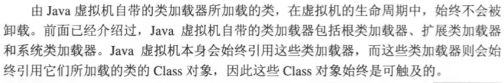

- ClassLoader，Class，Class实例之间的引用
  - 类加载器内部实现中，用一个集合来存放所加载的类；
  - 一个Class对象的`getClassLoader()`方法能获得它的类加载器
  - 一个类的实例总是引用代表这个类的Class对象，Object类中定义了`getClass()`方法；
  - 所有的java类都有一个静态属性`class`，它引用代表这个类的Class对象。
- 由用户自定义的类加载器所加载的类是可以被卸载的

> 代码实例 cn.andios.jvm.classloader.MyTest17

```java
public class MyTest17 {
    public static void main(String[] args) throws Exception {
        /**
         * result:
         *      ====================
         *      load cn.andios.jvm.classloader.MyTest1 findClass invoked & classLoaderName：loader1
         *      [Unloading class cn.andios.jvm.classloader.MyTest1 0x0000000100061028]
         *
         * 查看类卸载的虚拟机参数：-XX:+TraceClassUnloading
         *
         * 第一句是MyTest16中findClass方法打印的(如果打印了这句话，
         *  表示由我们自己的类加载器加载，如果没打印，表示由jvm的类加载器加载)，
         * 第二句即表示类卸载，
         * test1方法中的MyTest17由jvm的类加载器加载，所以不会发生类卸载
         * test2中用我们自定义的MyTest16类加载器，所以会发生类卸载
         */
        //发生类卸载
        test1();
        System.out.println("====================");
        //不会发生类卸载
        test2();
    }
    private static void test1() throws Exception {
        MyTest17 test1 = new MyTest17();
        test1 = null;
        System.gc();
    }
    private static void test2() throws Exception {
        MyTest16 myLoader = new MyTest16("myLoader");
        /**
         * 删掉target下的MyTest.class文件才会使用我们自己的类加载器，
         * 否则会使用jvm的类加载器，删除target下的MyTest.class后，
         * 需要制定myLoader.setPath，否则报FileNotFoundException
         */
        myLoader.setPath("G:\\");
        Class<?> clazz = myLoader.loadClass("cn.andios.jvm.classloader.MyTest1");

        myLoader = null;
        clazz = null;

        System.gc();
    }
}
```

### 

