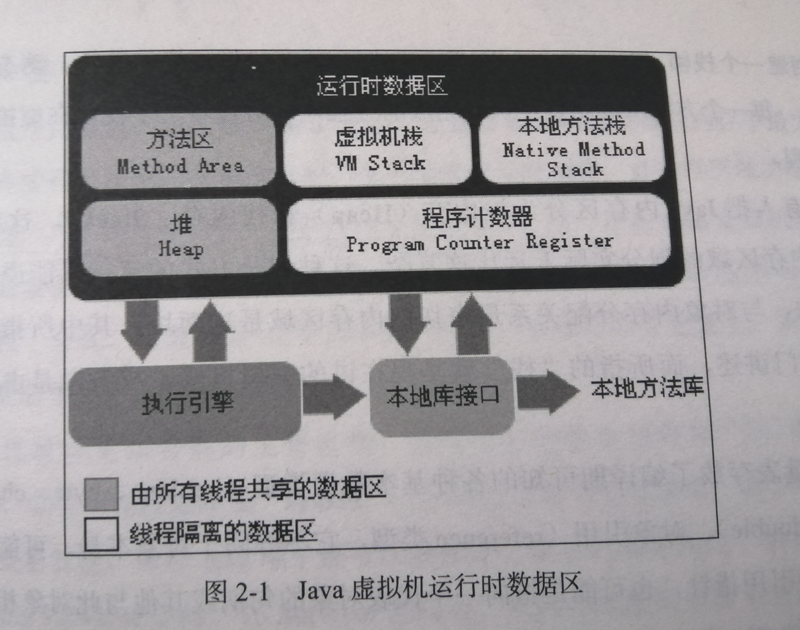
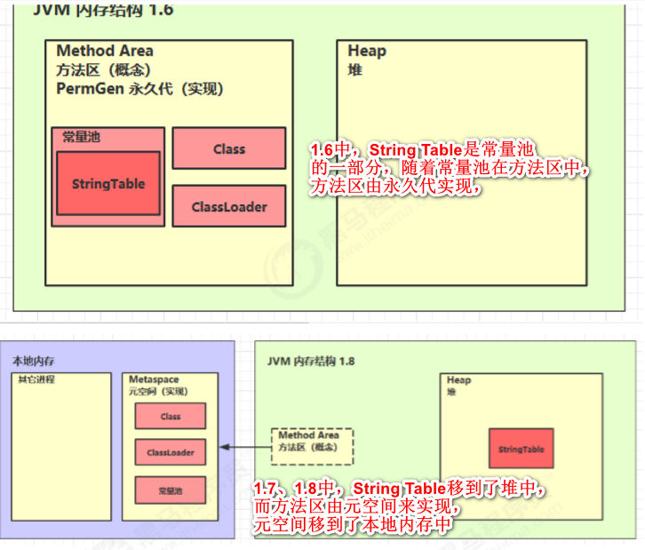
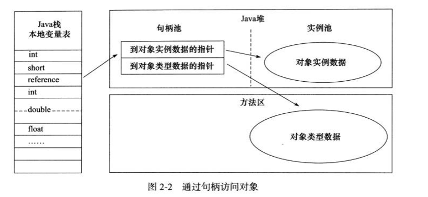
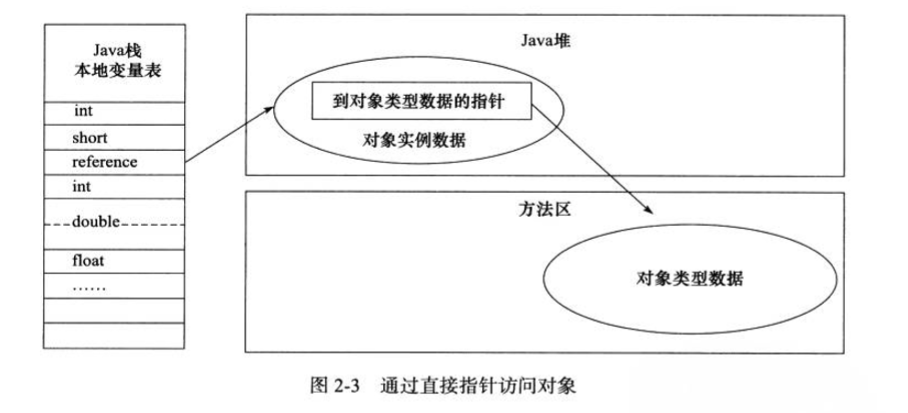

* [运行时数据区域](#%E8%BF%90%E8%A1%8C%E6%97%B6%E6%95%B0%E6%8D%AE%E5%8C%BA%E5%9F%9F)
  * [程序计数器(Program Counter Register)](#%E7%A8%8B%E5%BA%8F%E8%AE%A1%E6%95%B0%E5%99%A8program-counter-register)
  * [虚拟机栈(Stack)](#%E8%99%9A%E6%8B%9F%E6%9C%BA%E6%A0%88stack)
  * [本地方法栈](#%E6%9C%AC%E5%9C%B0%E6%96%B9%E6%B3%95%E6%A0%88)
  * [java堆(Heap)](#java%E5%A0%86heap)
  * [方法区(Method Area)](#%E6%96%B9%E6%B3%95%E5%8C%BAmethod-area)
  * [运行时常量池](#%E8%BF%90%E8%A1%8C%E6%97%B6%E5%B8%B8%E9%87%8F%E6%B1%A0)
  * [直接内存](#%E7%9B%B4%E6%8E%A5%E5%86%85%E5%AD%98)
* [对象的创建](#%E5%AF%B9%E8%B1%A1%E7%9A%84%E5%88%9B%E5%BB%BA)
* [对象的内存布局](#%E5%AF%B9%E8%B1%A1%E7%9A%84%E5%86%85%E5%AD%98%E5%B8%83%E5%B1%80)
* [对象的访问定位](#%E5%AF%B9%E8%B1%A1%E7%9A%84%E8%AE%BF%E9%97%AE%E5%AE%9A%E4%BD%8D)

### 运行时数据区域

jvm执行java程序的过程中，会把它所管理的内存区域划分为若干个不同的数据区域。



#### 程序计数器(`Program Counter Register`)

- 是一块较小的线程私有的内存空间，可以看做是**当前线程所执行的字节码的行号指示器**。如果线程正在执行java方法，那么计数器记录的是正在执行的虚拟机字节码指令的地址；如果线程正在执行native方法，那么计数器值为空(`Undefined`)；此内存区域是**唯一一个在jvm规范中没有规定任何`OutOfMemoryError`情况的区域**。

#### 虚拟机栈(`Stack`)

- 同样是线程私有，生命周期与线程相同。它描述的是java方法执行的内存模型：**每个方法在执行的同时会创建一个栈帧(`Stack Frame`)用于存储局部变量表、操作数栈、动态链接、方法出口等信息。每一个方法从调用直至执行完成的过程，就对应着一个栈帧在虚拟机栈中入栈到出栈的过程。**
- jvm规范中规定了两种异常情况：
  1. `StackOverflowError`：线程请求的深度大于虚拟机允许的深度。(例如不停的调用方法，导致栈帧不断入栈)
  2. `OutOfMemoryError`：如果虚拟机栈可以动态扩展，如果扩展时无法申请到足够的内存。
- 垃圾回收不需要回收栈内存
- 方法内的局部变量，如果没有逃离方法的作用范围(即不是作为参数传进来也未作为返回值返回)就是线程安全的
- 当总内存一定时，如果虚拟机栈(它是线程私有的)内存分配越大，那么可分配的线程数就越少，建立就更可能出现内存不足。

#### 本地方法栈

- 与虚拟机栈不同的是，虚拟机栈为虚拟机执行`java`方法提供服务，本地方法栈为虚拟机使用`native`方法提供服务。**与虚拟机栈一样，本地方法栈也会抛出`StackOverflowError`和`OutOfMemoryError`**

#### java堆(`Heap`)

- jvm所管理的内存中最大的一块，线程共享，虚拟机启动时创建。作用：存放对象实例。几乎所有的对象实例都在这里分配内存。java堆在逻辑上连续，物理上不一定连续。如果堆中没用内存完成实例分配并且无法扩展时：`OurOfMemoryError`

```java
/**
 * obj这个引用变量是方法内的变量，在虚拟机栈中；Object真正的实例对象放在Heap里面
 * 这个new语句一共消耗12字节，jvm规定引用占4字节，空对象占8字节
 * 方法结束后，obj马上就被回收，但堆上的Object对象由GC来回收
 */
public void method1(){
    Object obj = new Object();
}
```


#### 方法区(`Method Area`)

- 线程共享，作用：**存放类元数据信息**(类信息、常量、静态变量、类名)，别名`Non-Heap`(非堆)。
- 实现：
  1. jdk1.8以前用“永久代”实现方法区，能省去专门为方法区编写内存管理代码的工作，但更容易遇到内存溢出问题。参数：`-XX:MaxPermSize=8m`，如果内存溢出：`java.lang.OutOfMemoryError:PermGen space`。
  2. 1.8及以后用元空间(`meta space`)实现方法区，不再占用堆内存，不再由jvm管理，而是移出到本地内存中，由操作系统管理。参数：`-XX:MaxMetaspaceSize=8m`，如果内存溢出：`java.lang.OutOfMemoryError:Metaspace`。
- 方法区无法满足内存分配需求时：`OutOfMemoryError`。

#### 运行时常量池

- 方法区的一部分。字节码文件的**常量池**部分用于存放**编译期**生成**字面量**和**符号引用**，这部分在类加载后进入**运行时常量池**中存放。

- 运行时常量池与字节码文件的常量池区别：

  1. jvm对字节码文件的每一部分(自然包括常量池)格式都严格规定；jvm规范没有对运行时常量池做任何细节要求。

  2. 运行时常量池具备动态性。运行期生成的常量也可能放入池中。比如`String.intern()`。

     - `String.intern()`

     1. 1.8将这个字符串对象尝试放入串池，如果有则不放，**没有就放，放的就是这个对象本身**。并把串池中的对象返回。
     2. 1.6将这个字符串对象尝试放入串池，如果有则不放，**没有就把此对象复制一份，即创建了新的对象，把这个新的对象放入串池。**并把串池中的对象返回。

     ```java
     //1.8的intern()分析：
     public static void main(String [] args){
         String s = new String("a")+new String("b");
         //这里"a"，"b"为常量，放在了串池中
         //new String("a")，new String("b")在堆中，值与串池中的相等
         //s为动态拼接的结果，存在于堆中，相当于new String("ab")，串池中并没有"ab"
         String s2 = s.intern();//将s这个字符串对象尝试放入串池中，如果有就不放，没有就放，并把串池中的对象返回。这里串池中没有，所以会放，所以s2就是串池中的"ab"对象
         System.out.println(s2 == "ab");//因为原来串池中没有"ab"对象，所以调用s.intern()后s2就是串池中的"ab"对象，所以这里为true
         System.out.println(s == "ab");//因为原来串池中没有"ab"，所以调用s.intern()后会把s这个字符串对象放入串池中，所以这里为true
         //假如原来的串池中有"ab"这个对象，这里执行String s2 = s.intern()后，s2为返回的串池中的对象，s这个对象并没有放到串池中(因为串池中已经存在"ab")，所以 s2=="ab" 为true，但s == "ab" 为false
     }
     ```

     

- `String Table`

  ​	

  ​		之所以要做这个更改，是因为永久代的内存回收不频繁，`Full GC`时才会触发它的垃圾回收；而`String Table`用的非常频繁，这用会导致`String Table`的回收效率不高。

  ​		验证：1.6环境下指定永久代大小，然后不停的往`String Table`中添加对象，最终报错：`java.lang.OutOfMemoryError:PermGen space`；1.8环境下指定堆空间大小，然后不停的往`String Table`中添加对象，最终报错：`java.lang.OutOfMemoryError:Java heap space`

  - `String Table`即串池。是一个`HashTable`结构，长度固定，不能扩容。
  - 常量池(字节码文件中的那部分)中的字符串仅是符号，第一次用到时才变为对象。
  - 串池内的字符串只有一份，可用它来避免重复创建字符串对象。
  - 字符串变量的拼接原理是`StringBuilder`，可`javap -verbose xxx.class`反编译验证
  - 字符串常量的拼接原理是编译期优化(都是常量，就直接在串池中找)
  - 可使用`intern`方法，主动将串池中还没有的字符串对象放入串池。

  ```java
  //基于1.8
  public static void main(String[] args){
      String s1 = "a";//在串池中找"a"字符串对象，如果没找到，就放入串池
      String s2 = "b";//类似，在串池中找"b"字符串对象，如果没找到，就放入串池
      String s3 = "ab";//同上；至此，串池中有"a","b","ab"3个字符串对象
      String s4 = s1 + s2;//原理：new StringBuilder().append("a").append("b").toString() =》 new String("ab")，s4是存在于堆中的"ab"字符串对象
      String s5 = "a" + "b";//原理：javac在编译器的优化，两个常量拼接的结果是确定的，因此在编译期间就能确定，而s4是变量的拼接，所以需要在运行期才能确定。所以这里直接在串池中找"ab"对象，已存在，所以s5就表示串池中的"ab"对象
      String s6 = s4.intern();//s4为堆中的"ab"，而串池中已经有"ab"，所以s4不会放入串池，s6接收的是返回的串池中的"ab"，而非s4这个堆中的"ab"
      
      System.out.println(s3 == s4);//false
      System.out.println(s3 == s5);//true
      System.out.println(s3 == s6);//true
      
      String x2 = new String("c") + new String("d");//x2为堆中的"cd"字符串对象
      String x1 = "cd";//x1为串池中的"cd"对象
      x2.intern();//执行至此，串池中已经有"cd"，所以x2不会入池，所以下面的打印为false
      
      System.out.println(x1 == x2);//false
  }
  ```

  - 内存空间不足时，`String Table`中未被引用的字符串常量依旧会被回收。

    ```java
    //验证String Table中未被引用的字符串常量依旧会被回收。
    //1.jvm参数：-Xmx10m 指定堆空间大小  -XX:+PrintStringTableStatistics 打印StringTable统计信息 -XX:+PrintGCDetails -verbose:gc 打印GC信息
    //2.执行空的main方法，观察String Table统计信息
    //3.main中执行
    for(int i = 0;i < 100;i ++){
        String.valueOf(i).intern();
    }
    //观察String Table统计信息
    //4.main中执行
    for(int i = 0;i < 10000;i ++){
        String.valueOf(i).intern();
    }
    //观察String Table统计信息
    ```

  - `String Table`为`HashTable`结构，可通过`-XX:StringTableSize=10000`调整哈希桶的个数。桶的个数最小值为`1009`。**如果系统里字符串常量个数较多，需要把桶的数量尽量调大。有更好的哈希分布，减少哈希冲突。** **如果系统中存在大量重复的字符串，可以把字符串存在`String Table`中(即调用xxx.intern())，这样可以减少字符串个数，从而节约堆内存。**

#### 直接内存

- 不属于jvm运行时数据区，也不属于jvm规范中定义的内存区域。

- 属于操作系统内存，回收成本高，读写性能也高。

- jdk1.4引入了NIO，它可以通过`native`函数库直接分配堆外内存，然后通过存储在java堆中的`DirectByteBuffer`对象作为这块内存的引用进行操作，避免了在java堆和`native`堆中来回复制数据(**即jvm不能操作堆外内存，堆外内存中的数据需要复制到java堆中，现在通过`DirectByteBuffer`，分配一块直接内存，java堆和操作系统都可以访问，就不需要再复制了**)。

- 直接内存溢出

  ```java
  static  int  _100Mb = 1024 * 1024 * 100;
  public static void main(String [] args){
      List<ByteBuffer> list = new ArrayList<>();
      int i = 0;
      try{
          while(true){
              //不停的分配100Mb直接内存
              ByteBuffer byteBuffer = ByteBuffer.allocateDirect(_100Mb);
              list.add(byteBuffer);
              i ++;
          }
      }finally{
          System.out.println(i);
      }
  }
  //result: i为36,报错java.lang.OutOfMemoryError:Direct buffer memory
  ```

- 直接内存的分配与释放(通过`Unsafe`类完成)

  ```java
  static int _1GB = 1024 * 1024 * 1024;
  public static void main(String[] args) throws IoException{
      Unsafe unsafe = getUnsafe();
      //分配内存
      long base = unsafe.allocateMemory(_1GB);
      unsafe.setMemory(base,_1GB,(byte)0);
      Sytstem.in.read();
      
      //释放内存
      unsafe.freeMemory(base);
      System.in.read();
  }
  //反射获取Unsafe类的静态成员变量
  public static Unsafe getUnsafe(){
      try{
          Field f = Unsafe.class.getDeclaredField("theUnsafe");
          f.setAccessible(true);
          Unsafe unsafe = (Unsafe)f.get(null);
          return unsafe;
      }catch(NoSunchFieldException |  IllegalAccessException e){
          throw new RuntimeException(e);
      }
  }
  
  
  ```

- 直接内存源码分析

  `ByteBuffer.allocateDirect()`方法返回`DirectByteBuffer`实例，

  ```java
      DirectByteBuffer(int cap) {                   // package-private
          super(-1, 0, cap, cap);
          boolean pa = VM.isDirectMemoryPageAligned();
          int ps = Bits.pageSize();
          long size = Math.max(1L, (long)cap + (pa ? ps : 0));
          Bits.reserveMemory(size, cap);
  
          long base = 0;
          try {
              base = unsafe.allocateMemory(size);
          } catch (OutOfMemoryError x) {
              Bits.unreserveMemory(size, cap);
              throw x;
          }
          unsafe.setMemory(base, size, (byte) 0);
          if (pa && (base % ps != 0)) {
              // Round up to page boundary
              address = base + ps - (base & (ps - 1));
          } else {
              address = base;
          }
          cleaner = Cleaner.create(this, new Deallocator(base, size, cap));
          att = null;
      }
  ```

  `DirectByteBuffer`构造器中调用`unsafe.allocateMemory()`方法分配内存，同时又由`Cleaner`对象回调了`Deallocator`任务对象。`Cleaner`是一个虚引用类型，当`DirectByteBuffer`回收掉时，会触发`Cleaner`对象的`clean`方法，`clean`方法会调用`Deallocator`的`run`方法。`Deallocator`实现了`Runnable`接口，在它的`run`方法里，调用了`unsafe.freeMemory()`方法。即**直接内存的回收用到了虚引用机制。**

- `-XX:+DisableExplicitGc`

  我们在代码中调用`System.gc()`属于显示的垃圾回收，这个参数的作用就是禁用显示垃圾回收。所以当我们直接内存使用较多时，如果加了这个参数，可以用`unsafe`手动直接释放。

### 对象的创建

  1. 检查。虚拟机遇到`new`指令时，首先检查这个指令的参数是否能在常量池中定位到一个类的符号引用，并检查这个符号引用代表的类是否已被加载、解析和初始化过。如果没有，就先执行类加载过程。

  2. 分配内存。类加载完后所需内存即可确定。分配方式：

       1. 指针碰撞(`Bump the Pointer`)

          假设`java`堆绝对规整，所有用过的内存放一边，空闲的内存放一边，中间放着一个指针作为分界点指示器，分配内存就是把指针向空闲空间那边挪动一段与对象大小相等的距离。

       2. 空闲列表(`Free List`)

          如果`java`堆用过与没用过的内存相互交错，`jvm`就需要维护一个列表，记录哪些内存可用，分配时就在列表中找一块足够大的空间划分给对象实例，并更新列表记录。

     - 对象创建在`java`堆是非常频繁的的行为，指针移动需要考虑并发问题，解决方案：

       - 对分配内存空间的动作同步：

         `CAS`配上失败重试的方式保证更新操作的原子性

       - 本地线程分配缓冲(`Thread Local Allocation Buffer，TLAB`)：

         把内存分配的动作按照线程划分在不同的空间中进行。即每个线程在`java`堆中预先分配一小块内存，称为`TLAB`，哪个线程要分配内存，就在哪个线程的`TLAB`上分配，只有分配新的`TLAB`时才同步。

	 3.  将分配到的内存空间(不包括对象头)初始化。这一操作保证了对象的实例字段在`java`代码中可以不赋初始值就直接使用，程序能访问到这些字段的数据类型所对应的零值。

	 4.  设置对象头。比如对象是哪个类的实例，如何找到类的元数据信息，对象的哈希码，GC分代年龄等。

- 至此，`jvm`视角，新的对象已产生，`java`程序视角，对象创建刚刚开始。`<init>`方法还未执行，所有字段都为零。

### 对象的内存布局

- 对象在内存中存储的布局分3块：

  - 对象头(`Header`)

    - 第一部分：存储对象自身的运行时数据

      称为`Mark Word`，存储哈希码，GC分代年龄，锁状态标志，线程持有的锁等

    - 第二部分：类型指针

      即对象指向它的类元数据的指针，`jvm`通过这个指针来确定这个对象是哪个类的实例。如果对象是数组，对象头中还必须有一块用于记录数组长度的数据。

  - 实例数据(`Instance Data`)

    - 这部分是对象真正存储的有效信息，也是程序代码中所定义的各种类型的字段内容。这部分的顺序会受虚拟机分配策略参数和字段在`java`源码中定义顺序的影响。

  - 对其填充(`Padding`)

    - 这部分非必须，起占位符的作用。对象大小必须是8字节的整数倍，对象头部分正好是8字节的倍数，实例数据部分没有对其时，靠对其填充来补全。

### 对象的访问定位

- `java`程序需要通过栈上的`reference`数据来操作堆上的具体对象。`jvm`规范只规定`reference`类型为一个对象的引用，没有规定这个引用如何定位、访问堆中的对象具体位置，所以对象的访问方式取决于`jvm`实现，主流访问方式：

  1. 句柄

     

     `java`堆划出一块内存作为句柄池，`reference`中存储对象的句柄地址，句柄池中包含对象实例数据和类型数据各自地址信息。

     - 好处：`reference`中存储稳定的句柄地址，对象频繁移动只改变句柄中的实例数据指针。

  2. 直接指针

     

     `reference`中存的直接就是对象地址

     - 好处：速度快，节约了一次指针定位的时间开销。`Sun HotSpot`使用的直接指针。