[toc]

### jvisualvm

- `jvisualvm`是jdk自带工具，可执行文件位于`JAVA_HOME/bin`下，

#### 案例分析一：堆溢出 OutOfMemoryError：Java Heap Space

1. 测试代码

   ```java
   public class MyTest1 {
       public static void main(String[] args) {
           List<MyTest1> list = new ArrayList<>();
           for (;;){
               list.add(new MyTest1());
           }
       }
   }
   ```

2. 设置jvm参数

   ```java
   -Xms10m
   -Xmx10m
   -XX:+HeapDumpOnOutOfMemoryError		//生成转储文件
   ```

3. 运行报错`java.lang.OutOfMemoryError: Java heap space`，在项目根目录下生成`xxx.hprof`文件

   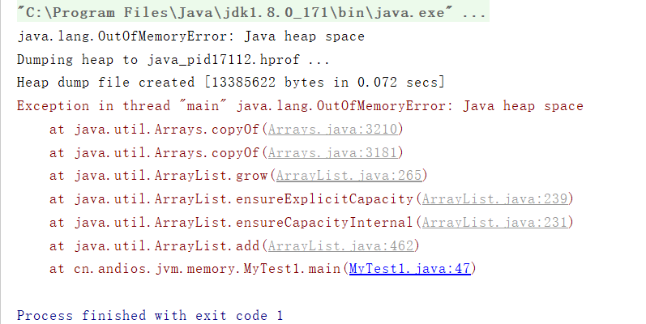

4. 打开`jvisualvm`，文件---装入，选择生成的`xxx.hprof`文件，如图可以看到`jvisualvm`对`dump`文件的一些分析：

   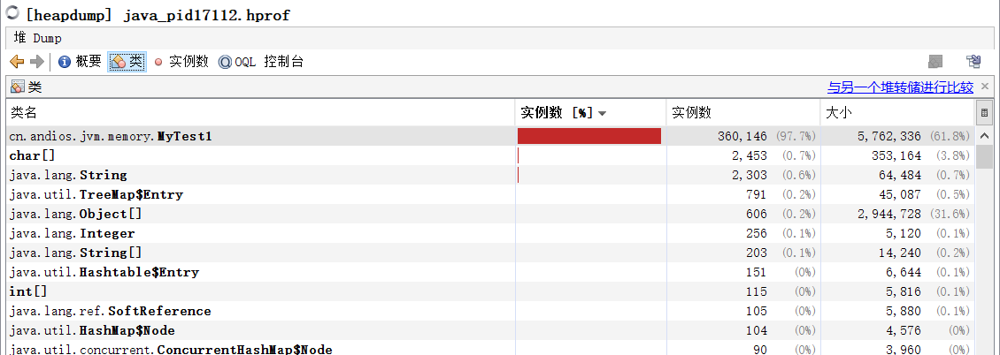

#### 案例分析二：虚拟机栈溢出 java.lang.StackOverflowError

1. 测试代码

   ```java
   public class MyTest2 {
       public static void main(String[] args) {
           //演示虚拟机栈溢出
           MyTest2 test = new MyTest2();
           try {
               test.test();
           } catch (Throwable t) {
               System.out.println(test.getLength());
               t.printStackTrace();
           }
       }
       private int length;
       public int getLength(){
           return length;
       }
       public void test(){
           length ++;
           test();
       }
   }
   
   ```

2. 设置参数

   ```
   -Xss160k
   ```

3.  运行报错：`java.lang.StackOverflowError`

4. 修改代码，在test()方法中加入

   ```java
           try {
               Thread.sleep(300);
           } catch (InterruptedException e) {
               e.printStackTrace();
           }
   ```

   避免程序退出太快，此时打开`jvisualvm`即可看到

   

   ​	双击，即可看到执行信息：

   

### jconsole

`jconsole`也是jdk自带的工具，上述案例分析二，如果用`jconsole`打开

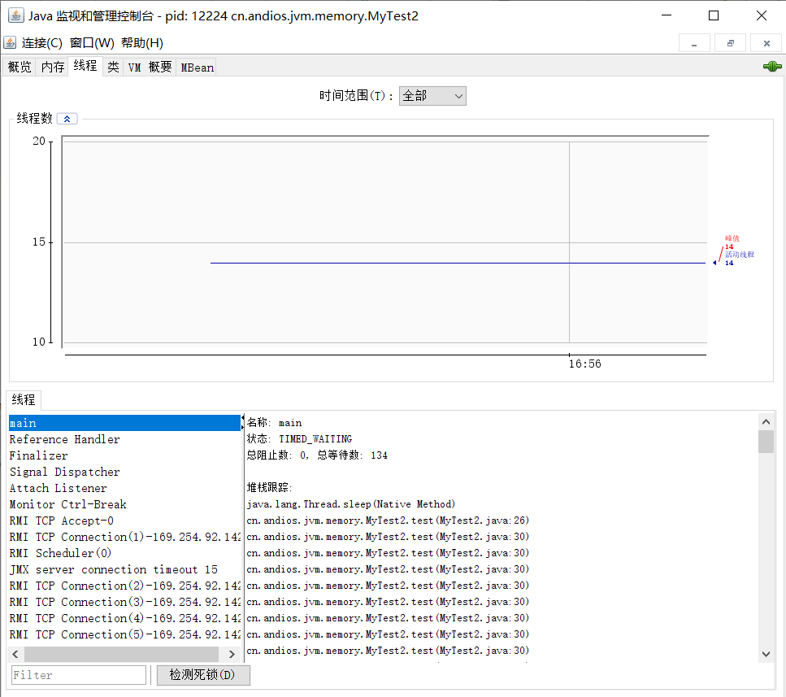

​	可以看到这里还有”检测死锁“的功能

#### 案例分析三：deadlock

1. 测试代码

   ```java
   public class MyTest3 {
       public static void main(String[] args) {
           //演示死锁
           new Thread(()->{A.method();},"Thread-A").start();
           new Thread(()->{B.method();},"Thread-B").start();
       }
   }
   class A{
       public static synchronized void method(){
           System.out.println("method form A");
           try {
               Thread.sleep(5000);
               B.method();
           } catch (InterruptedException e) {
               e.printStackTrace();
           }
       }
   }
   class B{
       public static synchronized void method(){
           System.out.println("method from B");
           try {
               Thread.sleep(5000);
               A.method();
           } catch (InterruptedException e) {
               e.printStackTrace();
           }
       }
   }
   ```

2.  运行程序，打开`jconsole`，选择正在运行的`MyTest3`，在“线程”选项卡中可以看到：

   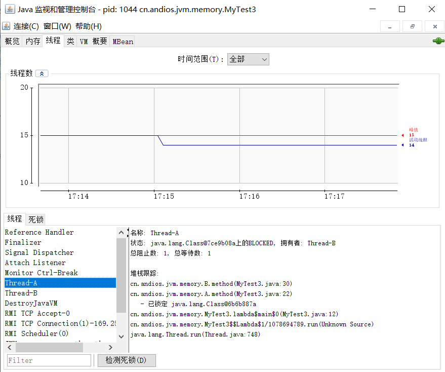

   同理可看到`Thread-B`线程的信息，点击“检测死锁”可以检测到`Thread-A`、`Thread-B`。

   如果这个例子用`jvisualvm`查看，在`jvisualvm`左侧打开`MyTest3`后：

   

   点击“线程Dump”，可以看到具体的线程信息：

   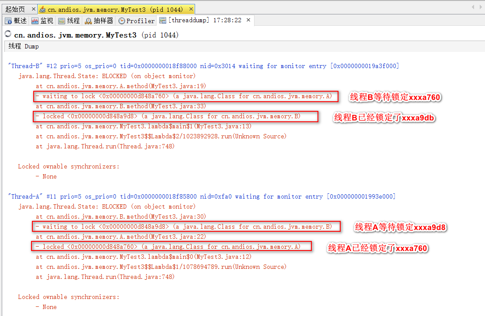

   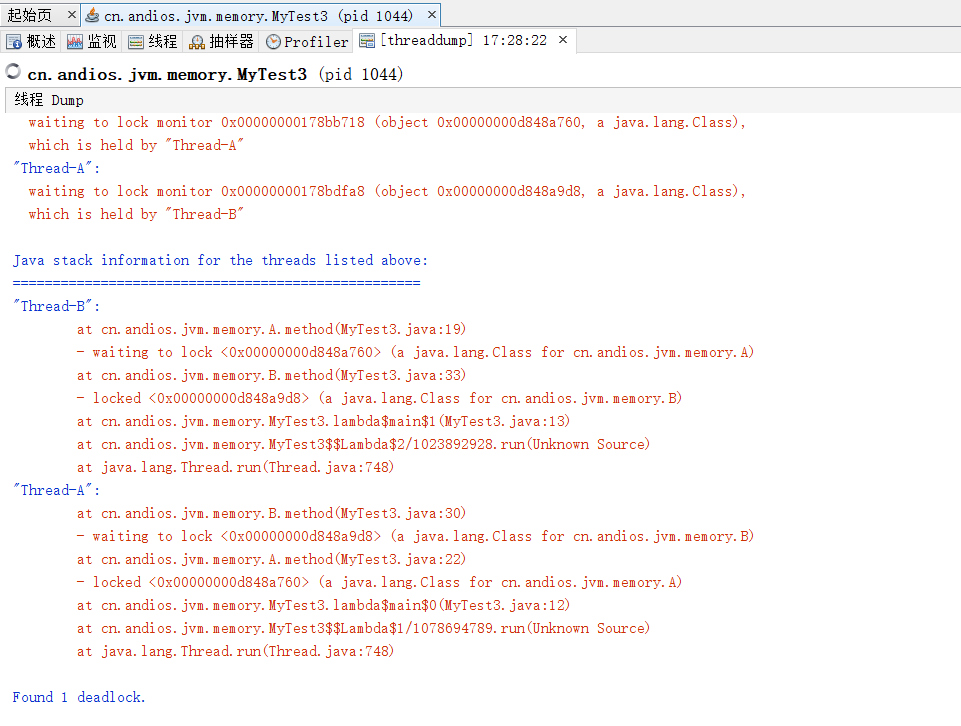

#### 案例分析四：元空间溢出 java.lang.OutOfMemoryError: Metaspace

1. 测试代码

   ```java
   public class MyTest4 {
       /**
        * 方法区产生内存溢出
        * 借助cglib完成类的动态创建，它可以在程序运行期动态生成类，这些生成类的元数据
        * 就会在元空间中，元空间随着动态生成类的增加，元信息数量也会增加。
        * 在jdk8中，元空间默认大小是21M，如果数据>=21M，会进行垃圾回收，如果回收后还不够，就会
        * 进行扩容。上限就是物理内存大小，当达到上限后，就会产生溢出。
        * 这里可以固定元空间大小，让它不进行扩容：-XX:MaxMetaspaceSize=10M
        */
       public static void main(String[] args) {
           for (;;){
               Enhancer enhancer = new Enhancer();
               enhancer.setSuperclass(MyTest4.class);
               enhancer.setUseCache(false);
               enhancer.setCallback((MethodInterceptor)(obj, method, argsl, proxy)->
                           proxy.invokeSuper(obj,argsl));
               System.out.println("hello");
               //不断创建MyTest4的子类
               enhancer.create();
           }
       }
   }
   ```

2. 设置jvm参数

   ```-XX:MaxMetaspaceSize=10M```

3. 运行程序报错：`java.lang.OutOfMemoryError: Metaspace`。将`MaxMetaspaceSize`设为`200M`，避免程序结束太快。

4. 打开`jconsole`观察可以看到类的数量一直在上升：

   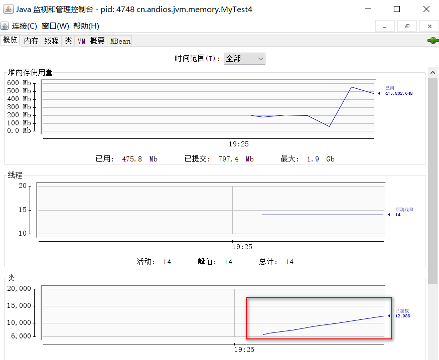

   如果在“类”选项卡中勾中“详细信息”，那么idea的控制台还好打印类加载的信息：

   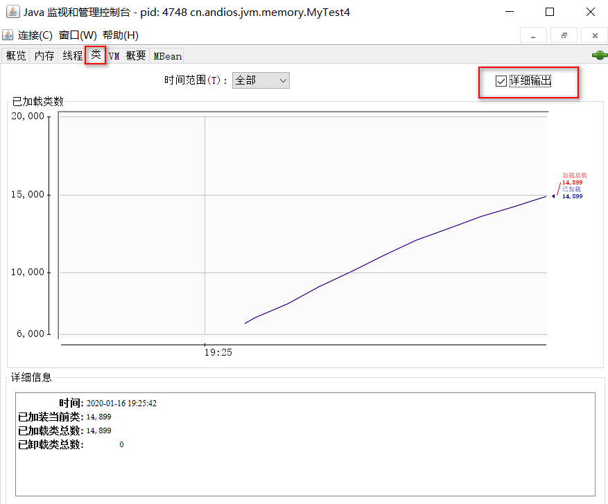

   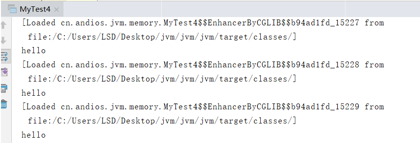

   在`jvisualvm`中同样可以观察到类的数量一直在上升，且元空间大小也在上升：

   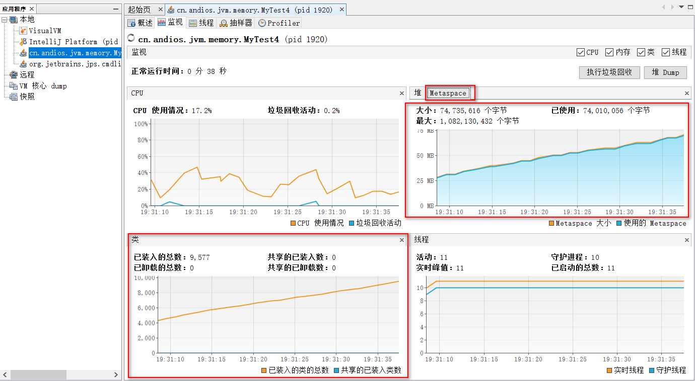

### jmap

`jmap`是jdk自带的非图形化工具，位于`JAVA_HOME/bin`目录下。直接输入`jmap`即可查看用法：

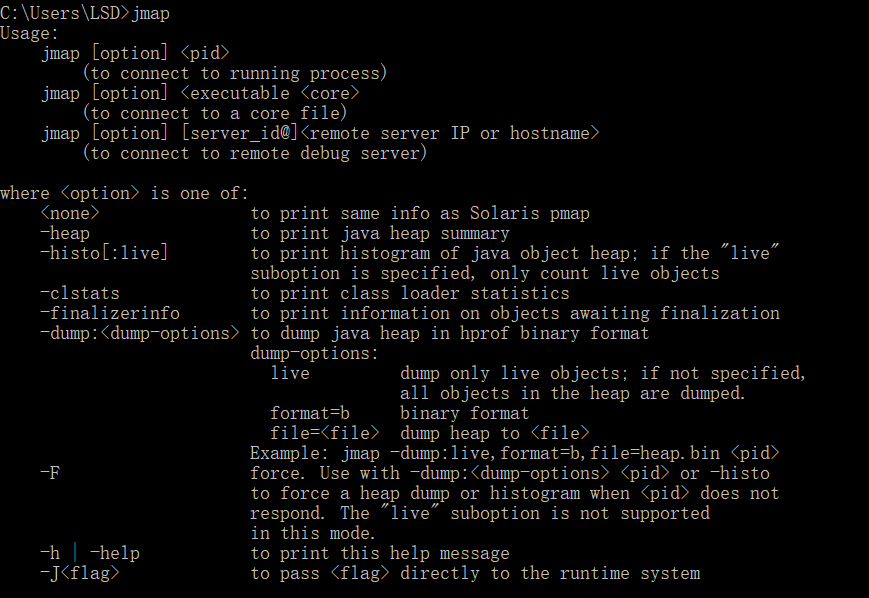

#### 案例分析五:查看类加载器信息

1. 测试代码

   ```java
   package cn.andios.jvm.memory;
   public class MyTest5{
   	public static void main(String []args){
   		while(true){
   			System.out.println("hello");
   		}
   	}
   }
   ```

   

2. 运行这个死循环程序,再执行`ps -ef|grep java`:

   

   这里的`7766`就是进程id,再用`jmap `工具执行`jmap -clstats 7766`查看类加载器相关信息:

   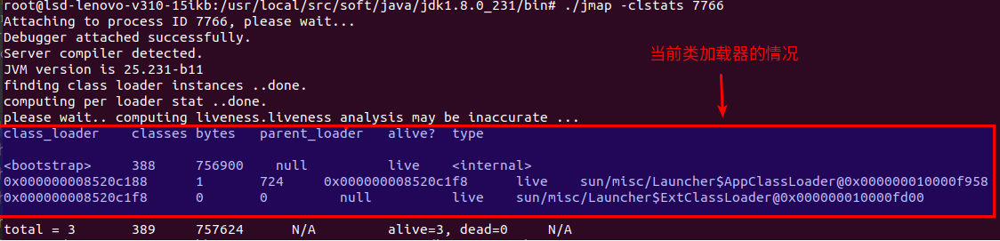

   通过`jmap -heap `命令查看堆相关信息(重新运行了一次,进程id变为8660):

   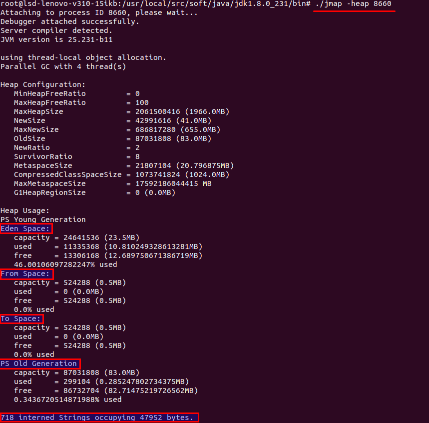

### jstat:查看gc信息

`jstat`是jdk自带的非图形化工具，位于`JAVA_HOME/bin`目录下。直接输入`jstat`即可查看用法：

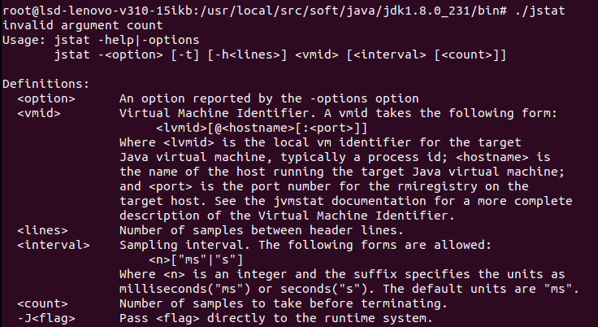

#### 案例分析六

1. 测试代码同案例分析五

2. 运行死循环代码,查看进程id,执行`jstat -gc [pid]`:

   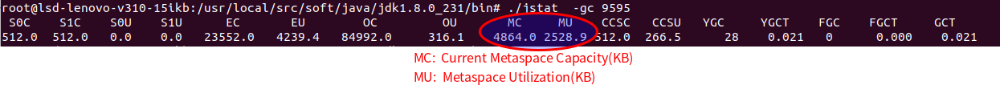

### jps

在上面的案例中,如果我们想要查看某个进程id,用`ps -ef|grep java`会打印一大堆信息,这里可以用`jps`命令`.

比如运行案例分析五中的死循环代码后,执行`jps`:

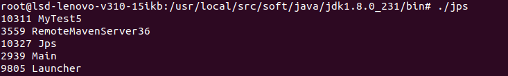

可以直接清晰的看到进程id,用`jps -l`命令还可以看到包名:

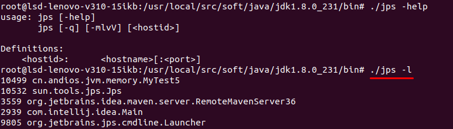

### jcmd

`jcmd`是jdk自带的非图形化工具,从jdk1.7开始增加的工具,`jcmd -help`可查看用法:

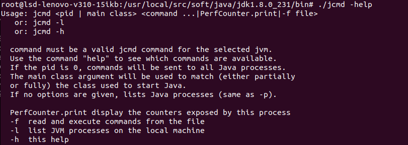

#### 案例分析七:查看jcmd命令参数

1. 运行案例分析五的死循环代码

   ```java
   package cn.andios.jvm.memory;
   public class MyTest5{
   	public static void main(String []args){
   		while(true){
   			System.out.println("hello");
   		}
   	}
   }
   ```

   

2. 用`jps -l`查看进程id

3. 用`jcmd [pid] help`查看参数选项,第一个参数为进程id,第二个参数为对于当前执行的java进行,我们可以对其执行的操作.

   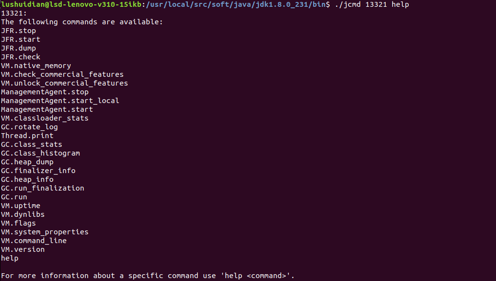

4. 对于具体的命令参数选项,比如`VM.flags`这个命令,可通过`jcmd [pid] help VM.flags `来查看:

   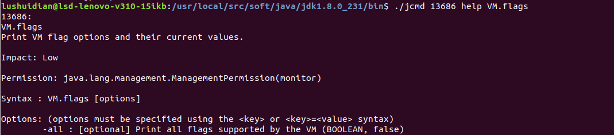

#### 案例分析八:查看jvm启动参数

1. 运行案例分析五的死循环代码

   ```java
   package cn.andios.jvm.memory;
   public class MyTest5{
   	public static void main(String []args){
   		while(true){
   			System.out.println("hello");
   		}
   	}
   }
   ```

   

2. 用`jps -l`查看进程id

3. 用`jcmd [pid] VM.flags`查看jvm运行参数:

   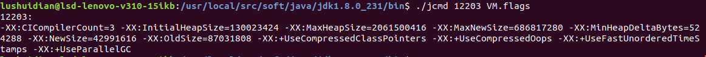

   PS:  执行`java xxx`命令运行代码和`jcmd [pid] VM.flags`查看jvm运行参数要用同一用户,不然可能会报错:

   `target process not responding or HotSpot VM not loaded`

   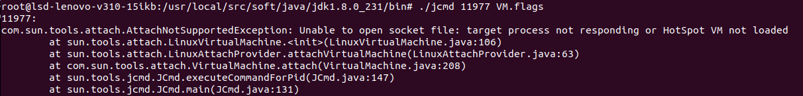

#### 案例分析九:查看jvm性能相关参数

1. 运行案例分析五的死循环代码

   ```java
   package cn.andios.jvm.memory;
   public class MyTest5{
   	public static void main(String []args){
   		while(true){
   			System.out.println("hello");
   		}
   	}
   }
   ```

   

2. 用`jps -l`查看进程id

3. 用`jcmd [pid]  PerfCounter.print`查看性能(局部):

   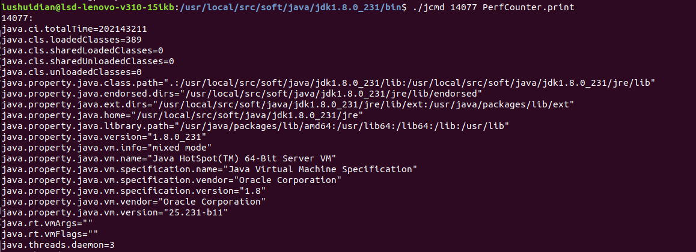

#### 案例分析十:查看jvm启动时长

1. 运行案例分析五的死循环代码

   ```java
   package cn.andios.jvm.memory;
   public class MyTest5{
   	public static void main(String []args){
   		while(true){
   			System.out.println("hello");
   		}
   	}
   }
   ```

   

2. 用`jps -l`查看进程id

3. 用`jcmd [pid] VM.uptime`查看jvm启动时长:

   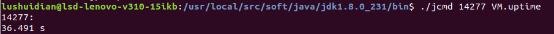

#### 案例分析十一:查看类的统计信息

1. 运行案例分析五的死循环代码

   ```java
   package cn.andios.jvm.memory;
   public class MyTest5{
   	public static void main(String []args){
   		while(true){
   			System.out.println("hello");
   		}
   	}
   }
   ```

   

2. 用`jps -l`查看进程id

3. 用`jcmd [pid] GC.class_histogram`查看系统中类的统计信息(局部):

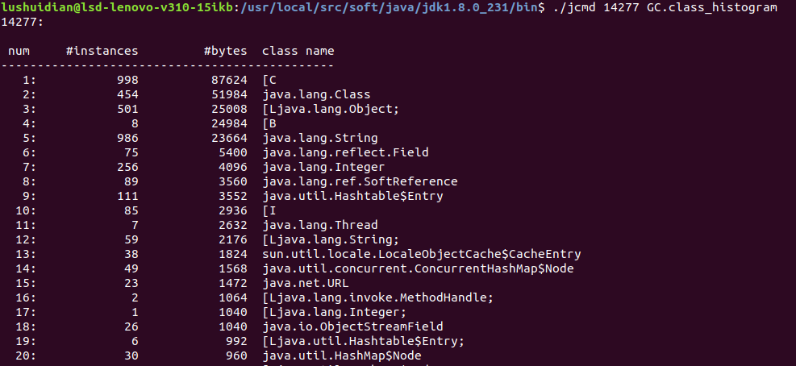

#### 案例分析十二:查看线程的堆栈信息

1. 运行案例分析五的死循环代码

   ```java
   package cn.andios.jvm.memory;
   public class MyTest5{
   	public static void main(String []args){
   		while(true){
   			System.out.println("hello");
   		}
   	}
   }
   ```

   

2. 用`jps -l`查看进程id

3. 用`jcmd [pid] Thread.print`查看系统中线程的堆栈信息(局部):

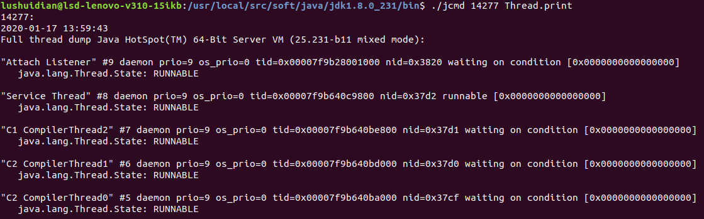

#### 案例分析十三:导出Heap dump文件

1. 运行案例分析五的死循环代码

   ```java
   package cn.andios.jvm.memory;
   public class MyTest5{
   	public static void main(String []args){
   		while(true){
   			System.out.println("hello");
   		}
   	}
   }
   ```

   

2. 用`jps -l`查看进程id

3. 用`jcmd [pid] GC.heap_dump [filename]`导出Heap dump文件:

   

4. 通过`jvisualvm`可查看这个文件.

#### 案例分析十四:查看VM的属性信息

1. 运行案例分析五的死循环代码

   ```java
   package cn.andios.jvm.memory;
   public class MyTest5{
   	public static void main(String []args){
   		while(true){
   			System.out.println("hello");
   		}
   	}
   }
   ```

   

2. 用`jps -l`查看进程id

3. 用`jcmd [pid] VM.system_properties`查看VM属性信息:

   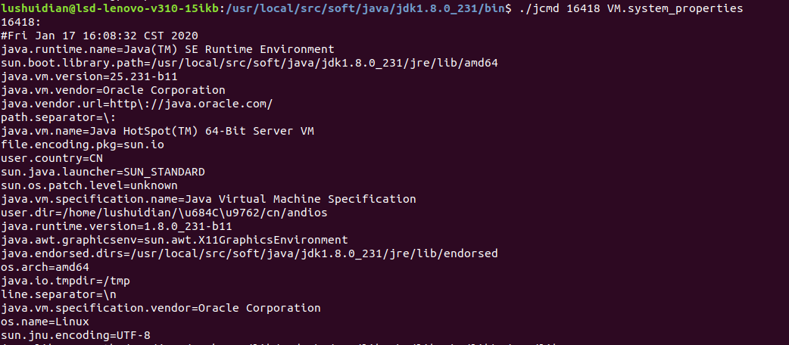

   

#### 案例分析十五:查看目标JVM进程的版本信息

1. 运行案例分析五的死循环代码

   ```java
   package cn.andios.jvm.memory;
   public class MyTest5{
   	public static void main(String []args){
   		while(true){
   			System.out.println("hello");
   		}
   	}
   }
   ```

   

2. 用`jps -l`查看进程id

3. 用`jcmd [pid] VM.version`查看VM版本信息:   

   

 ####  案例分析十六:查看JVM启动时的命令行参数信息

1. 运行案例分析五的死循环代码

   ```java
   package cn.andios.jvm.memory;
   public class MyTest5{
   	public static void main(String []args){
   		while(true){
   			System.out.println("hello");
   		}
   	}
   }
   ```

   

2. 用`jps -l`查看进程id

3. 用`jcmd [pid] VM.comand_line`查看JVM启动时的命令行参数信息:

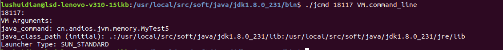

### jstack

`jstack`可以查看或导出java应用程序中线程的堆栈信息,直接输入`jstack`可查看用法:

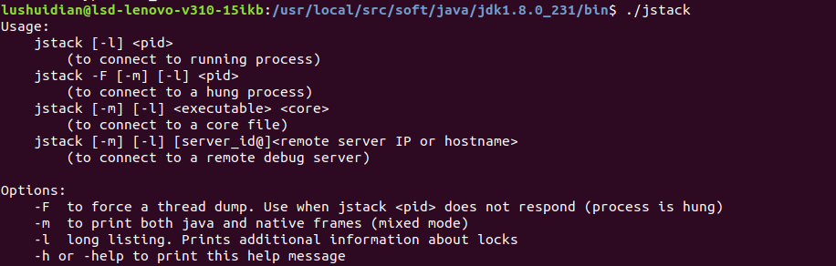

#### 案例分析十七:jstack查看线程信息

1. 运行代码(同案例分析三)

   ```java
   public class MyTest3 {
       public static void main(String[] args) {
           //演示死锁
           new Thread(()->{A.method();},"Thread-A").start();
           new Thread(()->{B.method();},"Thread-B").start();
       }
   }
   class A{
       public static synchronized void method(){
           System.out.println("method form A");
           try {
               Thread.sleep(5000);
               B.method();
           } catch (InterruptedException e) {
               e.printStackTrace();
           }
       }
   }
   class B{
       public static synchronized void method(){
           System.out.println("method from B");
           try {
               Thread.sleep(5000);
               A.method();
           } catch (InterruptedException e) {
               e.printStackTrace();
           }
       }
   }
   ```

2. 用`jps -l`查看进程id

3. 用`jstack [pid]`查看线程信息(局部):

   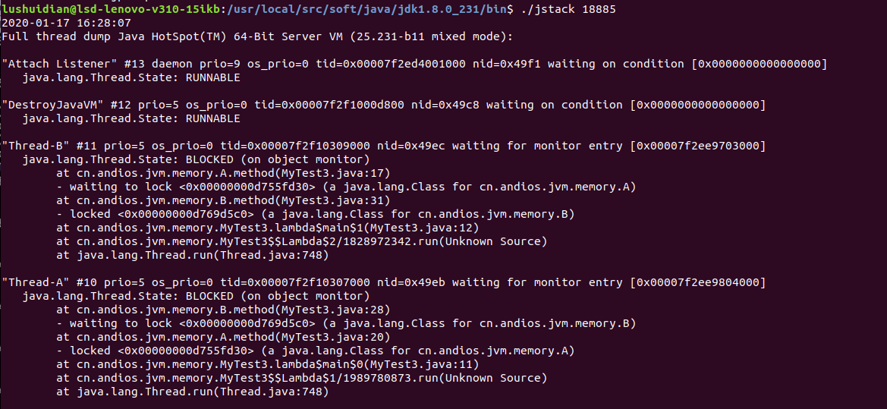

   

### JMC(Java Mission Control)

是jdk自带的工具,是个一体化的图形界面工具，支持插件扩展，也可以用来分析`xxx.jfr`文件.

#### 案例分析十八:jmc使用

1.  运行案例分析五的死循环代码

   ```java
   package cn.andios.jvm.memory;
   public class MyTest5{
   	public static void main(String []args){
   		while(true){
   			System.out.println("hello");
   		}
   	}
   }
   ```

2. 运行`./jmc`打开`jmc`工具,左侧栏中选中正在运行的`MyTest5`:

   1. MBean服务器：
   
      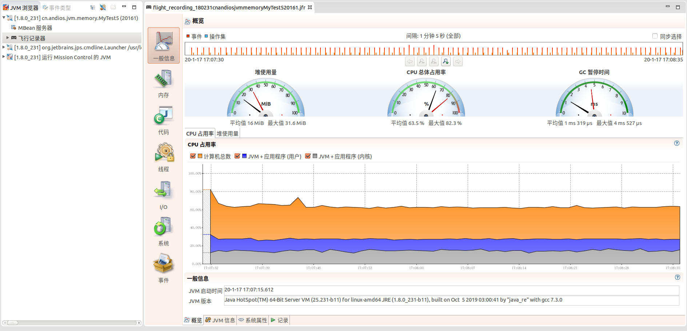
   
   2. JFR(Java Flight Recoder): 飞行记录器,可以实时获取jvm进程的数据信息
   
      

### jhat

jdk自带的命令行工具，主要进行堆转储的分析，可以使用`OQL`。运行`jhat -help`可查看用法：

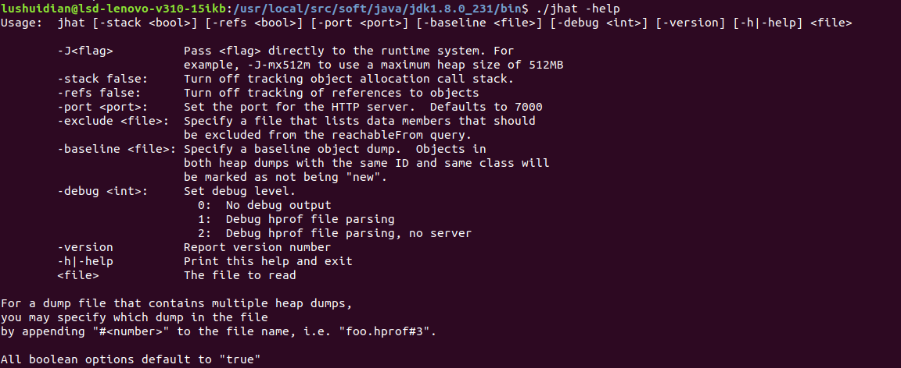

#### 案例分析十九:jhat分析.hprof文件

1. 测试代码(同案例分析一)

   ```java
   public class MyTest1 {
       public static void main(String[] args) {
           //演示堆溢出
           List<MyTest1> list = new ArrayList<>();
           for (;;){
               list.add(new MyTest1());
           }
       }
   }
   ```

2. 虚拟机参数：

   ```shell
   -Xms5m
   -Xmx5m
   -XX:+HeapDumpOnOutOfMemoryError
   ```

3. 运行代码，生成`java_pid21174.hprof`文件。用`jhat`分析文件：

   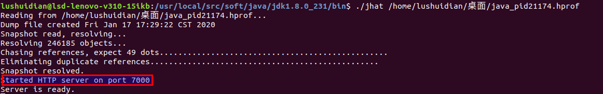

   可以看到`jhat`打开了`7000`端口。

4. 打开浏览器，访问`7000`端口：

   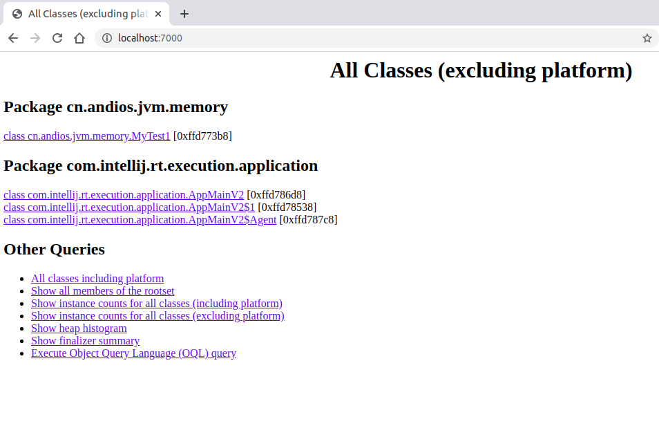

5. 其中最后一条`Execute Object Query Language(OQL) query`实例：

   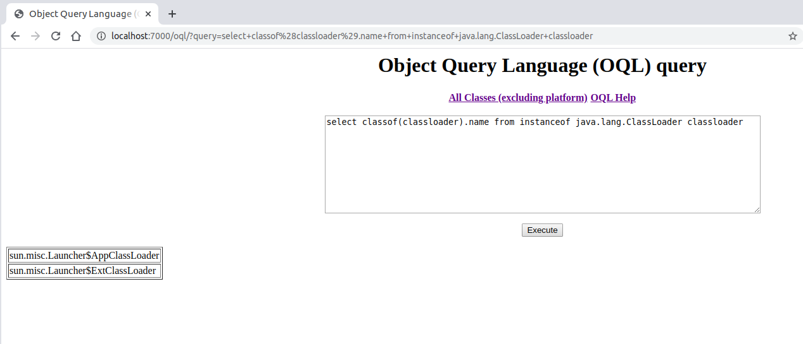

### java.lang.OutOfMemoryError

> javadoc：
>
> 由于内存不够，并且不能通过垃圾回收器获得更多可用内存时，当jvm不能给对象分配内存时抛出。

### java.lang.Runtime#gc

> javadoc：
>
> 运行垃圾回收器
>
> 调用gc方法表示jvm要花费一些努力去回收没有在使用的对象以便让它们正在占据的内存快速的重用。当gc方法调用返回时，jvm已经尽最大努力从所有被废弃的对象中回收空间。
>
> 名字gc表示`garbage collector`，jvm在需要时会自动在一个单独的线程中执行回收过程，即使这个方法没有被显示的调用。