* [判断对象是否已死](#%E5%88%A4%E6%96%AD%E5%AF%B9%E8%B1%A1%E6%98%AF%E5%90%A6%E5%B7%B2%E6%AD%BB)
  * [引用计数法 (Reference Counting)](#%E5%BC%95%E7%94%A8%E8%AE%A1%E6%95%B0%E6%B3%95-reference-counting)
  * [可达性分析算法 (Reachability Analysis)](#%E5%8F%AF%E8%BE%BE%E6%80%A7%E5%88%86%E6%9E%90%E7%AE%97%E6%B3%95-reachability-analysis)
* [引用分类](#%E5%BC%95%E7%94%A8%E5%88%86%E7%B1%BB)
  * [强引用](#%E5%BC%BA%E5%BC%95%E7%94%A8)
  * [软引用](#%E8%BD%AF%E5%BC%95%E7%94%A8)
  * [弱引用](#%E5%BC%B1%E5%BC%95%E7%94%A8)
  * [虚引用](#%E8%99%9A%E5%BC%95%E7%94%A8)
* [真正判断对象是否需要回收](#%E7%9C%9F%E6%AD%A3%E5%88%A4%E6%96%AD%E5%AF%B9%E8%B1%A1%E6%98%AF%E5%90%A6%E9%9C%80%E8%A6%81%E5%9B%9E%E6%94%B6)
* [final finally finalize区别](#final-finally-finalize%E5%8C%BA%E5%88%AB)
  * [final](#final)
  * [finally](#finally)
  * [finalize](#finalize)
* [方法区的垃圾回收](#%E6%96%B9%E6%B3%95%E5%8C%BA%E7%9A%84%E5%9E%83%E5%9C%BE%E5%9B%9E%E6%94%B6)
* [垃圾收集算法](#%E5%9E%83%E5%9C%BE%E6%94%B6%E9%9B%86%E7%AE%97%E6%B3%95)
  * [标记\-清除(Mark\-Sweep)](#%E6%A0%87%E8%AE%B0-%E6%B8%85%E9%99%A4mark-sweep)
  * [复制(Copying)](#%E5%A4%8D%E5%88%B6copying)
  * [标记整理(Mark\-Compact)](#%E6%A0%87%E8%AE%B0%E6%95%B4%E7%90%86mark-compact)
  * [分代收集(Generational Collection)](#%E5%88%86%E4%BB%A3%E6%94%B6%E9%9B%86generational-collection)
* [HotSpot垃圾收集算法的实现](#hotspot%E5%9E%83%E5%9C%BE%E6%94%B6%E9%9B%86%E7%AE%97%E6%B3%95%E7%9A%84%E5%AE%9E%E7%8E%B0)
  * [枚举根节点](#%E6%9E%9A%E4%B8%BE%E6%A0%B9%E8%8A%82%E7%82%B9)
  * [安全点 (SafePoint)](#%E5%AE%89%E5%85%A8%E7%82%B9-safepoint)
  * [安全区域 (Safe Region)](#%E5%AE%89%E5%85%A8%E5%8C%BA%E5%9F%9F-safe-region)
* [垃圾收集器](#%E5%9E%83%E5%9C%BE%E6%94%B6%E9%9B%86%E5%99%A8)
  * [Serial](#serial)
  * [ParNew](#parnew)
  * [Parallel Scavenge](#parallel-scavenge)
  * [Serial Old](#serial-old)
  * [Parallel Old](#parallel-old)
  * [CMS (Concurrent Mark Sweep)](#cms-concurrent-mark-sweep)
    * [CMS运作过程](#cms%E8%BF%90%E4%BD%9C%E8%BF%87%E7%A8%8B)
    * [CMS垃圾收集步骤](#cms%E5%9E%83%E5%9C%BE%E6%94%B6%E9%9B%86%E6%AD%A5%E9%AA%A4)
  * [G1 (Garbage\-First)](#g1-garbage-first)
* [内存分配与回收策略](#%E5%86%85%E5%AD%98%E5%88%86%E9%85%8D%E4%B8%8E%E5%9B%9E%E6%94%B6%E7%AD%96%E7%95%A5)
  * [Minor GC/Full GC](#minor-gcfull-gc)
  * [对象优先在Eden上分配](#%E5%AF%B9%E8%B1%A1%E4%BC%98%E5%85%88%E5%9C%A8eden%E4%B8%8A%E5%88%86%E9%85%8D)
  * [大对象直接进入老年代](#%E5%A4%A7%E5%AF%B9%E8%B1%A1%E7%9B%B4%E6%8E%A5%E8%BF%9B%E5%85%A5%E8%80%81%E5%B9%B4%E4%BB%A3)
  * [长期存活的对象进入老年代](#%E9%95%BF%E6%9C%9F%E5%AD%98%E6%B4%BB%E7%9A%84%E5%AF%B9%E8%B1%A1%E8%BF%9B%E5%85%A5%E8%80%81%E5%B9%B4%E4%BB%A3)
  * [空间分配担保](#%E7%A9%BA%E9%97%B4%E5%88%86%E9%85%8D%E6%8B%85%E4%BF%9D)
* [内存泄露的经典原因](#%E5%86%85%E5%AD%98%E6%B3%84%E9%9C%B2%E7%9A%84%E7%BB%8F%E5%85%B8%E5%8E%9F%E5%9B%A0)
* [GC日志](#gc%E6%97%A5%E5%BF%97)

### 判断对象是否已死

#### 引用计数法 (Reference Counting)

> 给对象添加一个引用计数器，每当有一个地方引用它时，计数器值就加1，当引用失效时，计数器值减1；任何时刻计数器值为0的对象就是不可能再被使用的对象。
>
> 优点：实现简单，判定效率高
>
> 缺点：无法解决对象间循环引用问题

#### 可达性分析算法 (Reachability Analysis)

> 通过一系列作为`GC Roots`的对象作为起始点，从这些节点开始向下搜索，搜索所走过的路径称为引用链，当一个对象到`GC Roots`没有任何引用链相连时，说明这个对象不可用。`GC Roots`对象包括：
>
> 1. 虚拟机栈中引用的对象
> 2. 本地方法栈中`native`方法引用的对象
> 3. 方法区中类静态属性引用的对象
> 4. 方法区中常量引用的对象

### 引用分类

####  强引用

> 只要强引用存在，垃圾收集器永远不会回收掉被引用的对象

#### 软引用

> 在系统将要发生内存溢出时才会回收的对象，jdk1.2之后用`SoftReference`类实现软引用

#### 弱引用

> 垃圾收集器工作时，无论内存空间是否足够，弱引用对象都会被回收。jdk1.2之后用`WeakReference`类实现弱引用

#### 虚引用

> 无法通过虚引用获取对象实例，它存在的唯一作用就是在这个对象被回收时收到一个系统通知。jdk1.2之后用`PhantomReference`类实现虚引用

### 真正判断对象是否需要回收

- 回收一个对象要经过两次标记过程：
  1. 进行可达性分析后没有与`GC Roots`相连的引用。
  2. 是否执行`finalize()`方法。
     - 如果不执行或已经执行过，那么这个对象就被回收
     - 如果重写了`finalize()`方法并且未被执行过，就将这个对象放置在`F-Queue`队列中，由低优先级的`Finalizer`线程去执行。执行这个方法的过程中如果与引用链上的对象建立关联，那么这个对象就可以避免被回收。
- **任何一个对象的`finalize()`方法都只会被系统调用一次**。

### final finally finalize区别

#### final

- 用来修饰类，方法，变量
  - 修饰类时，该类不能被其他类所继承，`final`类中所有的成员方法都会隐式的定义为`final`方法。
  - 修饰方法时，把方法锁定，以防止继承类对其进行更改。
  - 修饰变量时，这个变量表示常量，只能被赋值一次，不能再改变

#### finally

- `finally`作为异常处理的一部分，只能用在`try-catch`块中，并且会附带一个语句块，在`try`块的代码得到执行后这个语句块一般会被执行

  特殊情况：`try`中执行了`System.exit(0)`；线程在执行`try`或`catch`时被中断了。

#### finalize

- `finalize`是`java.lang.Object`类中定义的，每个对象都有这个方法。一个对象的finalize()方法只会被调用一次，在垃圾回收器执行时会调用被回收对象的`finalize()`方法，可以覆盖此方法来实现对其他资源的回收.

### 方法区的垃圾回收

- 方法区中垃圾回收性价比比较低，远低于堆

- 主要回收内容：废弃常量、无用的类
  - 判断类是否为“无用的类”的三个条件：
    1. 该类的所有实例都被回收
    2. 加载该类的`ClassLoader`被回收
    3. 该类的`java.lang.Class`对象没有被引用，无法在任何地方通过反射访问该类的方法。

- **jdk1.8之后用元空间实现方法区，jdk1.8以前用永久代实现方法区，永久代并不属于堆，虽说GC也会涉及永久代。堆分为新生代和老年代，新生代又分为一个`Eden`区和两个`Survivor`区，默认比例`8:1:1`**。

### 垃圾收集算法

#### 标记-清除(`Mark-Sweep`)

- 首先标记所有需要回收的对象，在标记完成后统一回收被标记的对象。

- 缺点

  - 标记和清除两个过程的效率不高，要扫描所有对象。
  - 标记清除后会产生大量不连续的空间碎片，导致后续需要分配较大对象时无法找到足够的连续内存而不得不触发另一次垃圾回收

  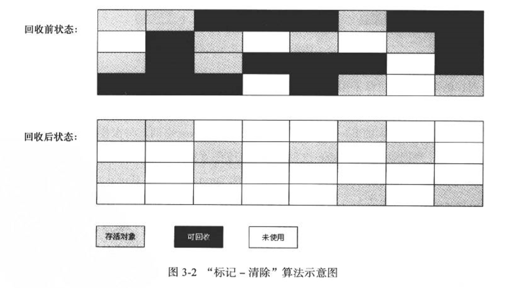

#### 复制(`Copying`)

- 将可用内存按容量划分为大小相等的两块，每次只使用其中一块，当这一块内存用完了，就将还存活着的对象复制到另一块上面，然后再把已使用过的内存空间一次清理掉。

- 现在商业jvm都用这个方式回收新生代。**将内存划分为一块较大的`Eden`空间和2块较小的`Survivor`空间，每次使用`Eden`和其中一块`Survivor`，回收时将`Eden`和`Survivor`还存活的对象一次性拷贝到另一块`Survivor`空间中，再回收这个`Eden`和用过的`Survivor`。**

- **`Oracle Hotspot`中默认`Eden`和`Survivor`大小为`8:1`，也就是每次只有`10%`的空间会浪费。**

- 优点

  - 实现简单，运行高效，不会产生内存碎片

- 缺点

  - 内存缩小为了原来的一半

  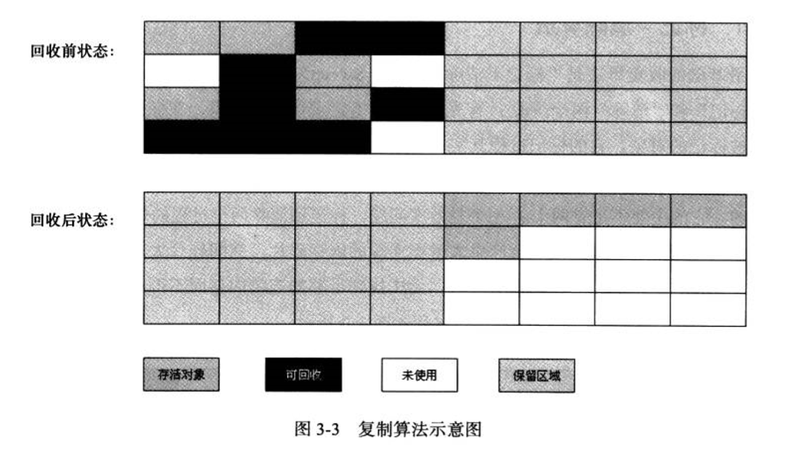

#### 标记整理(`Mark-Compact`)

- 首先标记所有需要回收的对象，让所有存活的对象都移到一端去，然后清理掉端边界以外的内存。

  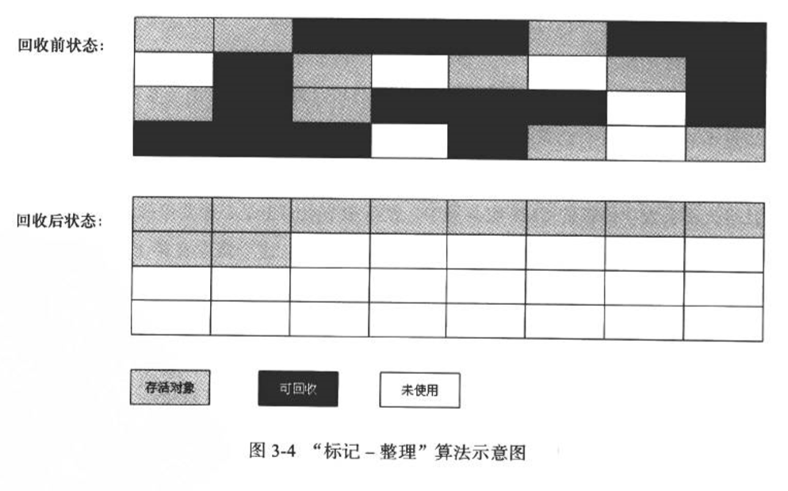

#### 分代收集(`Generational Collection`)

- 将`java`堆分为老年代和新生代。**新生代用复制算法；老年代用标记清除或标记整理。**

### `HotSpot`垃圾收集算法的实现

- `HotSpot`采用的算法为可达性分析法，而可作为`GC Roots`的节点主要在全局性的引用(如常量或类静态属性)和执行上下文(如栈帧中的本地变量表)中，如果逐个检查肯定消耗大量时间。

#### 枚举根节点

- 当执行系统停顿下来后，并不需要一个不漏的检查完所有执行上下文和全局引用的位置，`jvm`应当是有办法直接得知哪些地方存放着对象引用。在`HotSpot`的实现中使用一组称为`OopMap`的数据结构来达到目的。

#### 安全点 (`SafePoint`)

- 在`OopMap`的协助下，`HotSpot`可以快速并且准确的完成`GC Roots`枚举，但一个显示的问题随之而来：可能导致引用关系变化，或者说`OopMap`内容变化的指令非常多，如果为每一条指令都生成对应的`OopMap`，那将会需要大量的额外空间，这样`GC`的空间成本将会变得更高。

- 实际上，`HotSpot`并没有为每条指令都生成`OopMap`，而只是在“特定的位置”记录了这些信息，这些位置称为**安全点**，即程序执行时并非在所有地方都能停顿下来开始`GC`，只有在到达安全点时才能暂停。

- 安全点的选定既不能太少让`GC`等待时间太长，也不能过多以至于增大运行时的负载。所以安全点的选定以"是否具有让程序长时间执行的特征"为标准。因为每条指令执行时间非常短暂，程序不可能因为指令流程度太长而长时间运行，“长时间运行”最明显特征就是指令序列复用。

- 对于安全点，另一个需要考虑的问题是如何在`GC`发生时让所有线程(不包括`JNI`调用的线程)都跑到最近的安全点再停顿下来。

  解决方法：

  - 抢占式中断
    - 不需要线程的执行代码主动配合，在`GC`发生时，首先把所有线程全部中断，如果有线程中断的地方不在安全点上时，就恢复线程，让它“跑”到安全点上。
  - 主动式中断
    - 当`GC`需要中断线程时，不直接对线程操作，仅仅简单地设置一个标志，各个线程执行时主动去轮询这个标志，发现中断标志为真时就自己中断挂起，。轮询标志的地方与安全点重合，另外再加上创建对象需要分配内存的地方。

#### 安全区域 (`Safe Region`)

- 安全点机制保证了程序执行时，在不太长的时间内就会遇到可进入`GC`的安全点。但如果程序在“不执行”的时候呢，即程序没有被分配`CPU`时间，处于`Sleep`或`Blocked`状态，这时就无法响应`JVM`中断请求，`JVM`也不太可能等待线程重新分配`CPU`时间。这种情况就需要`Safe Region`了。
- 在线程执行到`Safe Region`中的代码时，首先标识自己已经进入了`Safe Region`，那么在这段时间里`JVM`要发起`GC`时，就不用管标识自己为`Safe Region`状态的线程了。在线程离开`Safe Region`时，它要检查系统是否已经完成了枚举根节点，如果完成了那线程就继续执行，否则他就必须等待直到收到可以安全离开`Safe Region`的信号为止。

 ### 垃圾收集器


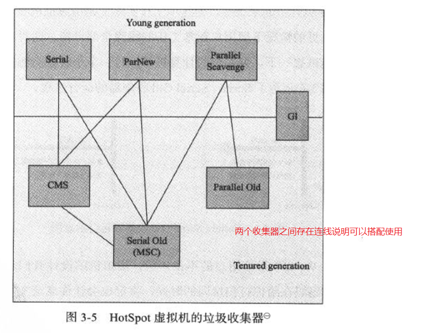

#### Serial

- 单线程收集器。它在进行垃圾收集时，必须暂停其他所有的工作线程，直到它收集结束(`STW`)。

- 适合作为`client`模式下空间较小的`jvm`的新生代收集器，这样停顿时间少。

- 优点：

  - 简单、高效；没有线程交互的开销。

  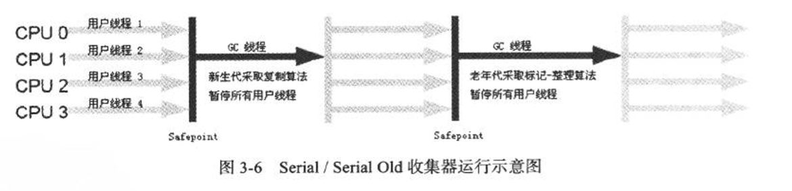

#### ParNew

- `Serial`收集器的多线程版本。`jvm`参数、收集算法、`Stop The World`、对象分配规则、回收策略等与`Serial`完全一样。

- 适合作为`server`模式下的jvm的新生代收集器。**只有`Serial`和`ParNew`能与`CMS`配合使用**。

- 单`CPU`环境中，`Serial`效果更好。

  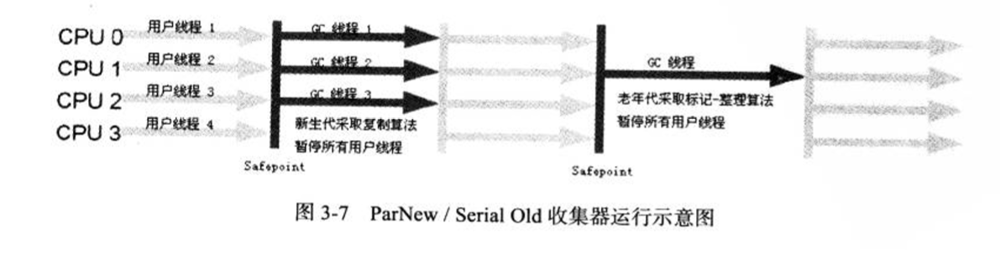

#### Parallel Scavenge

- 并行的多线程收集器，新生代收集器，采用复制算法。这个收集器的目的：**达到一个可控的吞吐量**(`Throughput`，吞吐量 = 运行用户代码时间 / (运行用户代码时间 + 垃圾收集时间))。
- 参数
  - `-XX:MaxGCPauseMillis`：最大垃圾收集停顿时间。
    - 这个参数允许的值是一个大于0的毫秒数，收集器尽可能保证内存回收花费的时间不超过设定值。
  - `-XX:GCTimeRatio`：设置吞吐量大小。
    - 这个参数允许的值是一个大于0小于100的整数，默认99。如果设为19，则GC时间就占总时间5% (1/(1 + 19))。 
  - `-XX:+UseAdaptiveSizePolicy`
    - 这个开关参数打开后，就不需要手动指定新生代大小、`Eden`与`Survivor`的比例、晋升老年代对象大小等细节参数了。`jvm`会根据运行情况动态调整这些参数以提供最大的吞吐量。这种调节方式称为`GC`自适应调节策略。这也是`ParNew`与`Parrllel Scavenge`的重要区别。

#### Serial Old

- `Serial`的老年代版本。也是一个单线程收集器。使用标记-整理算法。
- 主要意义也是在`Client`模式下使用。如果在`Server`模式下，那么有两种用途：
  1. 在jdk1.5及之前的版本中与`Paraller Scavenge`配合使用
  2. 作为`CMS`的后备预案。

#### Parallel Old

- `Paraller Scavenge`的老年代版本。使用多线程和标记-整理算法。jdk1.6才开始提供。

- 在注重吞吐量及`CPU`资源敏感的场合，可以优先考虑`Parallel Scavenge`搭配`Parallel Old`。

  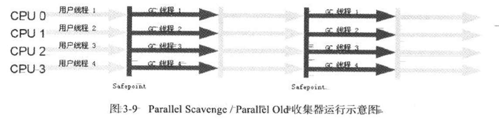

#### CMS (`Concurrent Mark Sweep`)

- 目标：获取最短停顿时间。采用标记-清除算法。jdk1.5开始提供。

- 这里并发是指可以与用户线程同时执行。(某些阶段还是会`STW`)
##### CMS运作过程
  1. 初始标记(`Initial Mark`)
    
     - 需要`Stop The World`，标记一下`GC Roots`能直接关联到的对象
     
       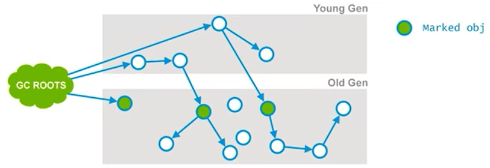
     
  2. 并发标记(`Concurrent Mark`)
    
     - 即进行`GC Roots Tracing`的过程。收集器会根据上个阶段找到的`GC Roots`遍历老年代，与用户线程并发运行。
     
       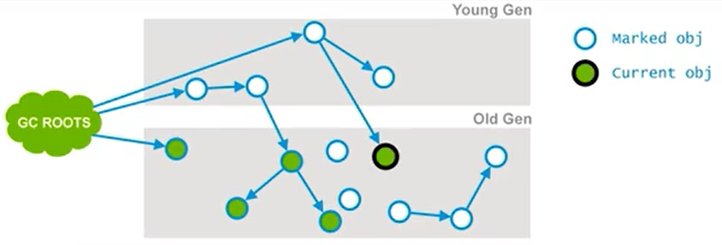
     
  3. 并发预清除 (`Concurrent Preclean`)
    
     - 这也是一个并发阶段，与用户线程并发运行。在并发运行过程中，一些对象的引用可能会发生变化，当这种情况发生时，`JVM`会将包含这个对象的区域(`Card`)标记为`Dirty`，即`Card Marking`。
     
     - 在`pre-clean`阶段，那些能够从`Dirty`对象到达的对象也会被标记。这个标记做完后，`dirty card`标记就会被清除了。
     
       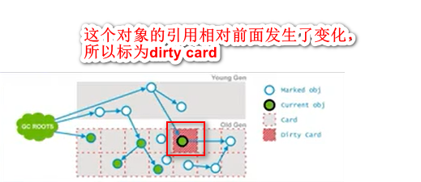
     
       ​	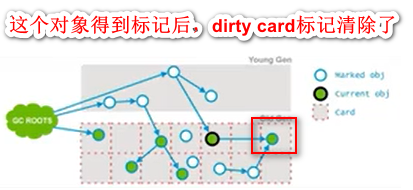
     
  4. 并发可失败的预清除(`Concurrent Abortable Preclean`)

     - 也是并发阶段，同一不会影响用户线程。这个阶段是为了尽量承担`STW`中最终标记阶段的工作。

  5. 重新标记(`remark`)

     - 需要`Stop The World`，修正并发标记期间因程序运行导致标记产生变动的那一部分对象的标记记录。经过以上5个阶段，老年代所有存活对象都被标记过了。

  6. 并发清除(`Concurrent Sweep`)

     - 清除不再使用的对象。

       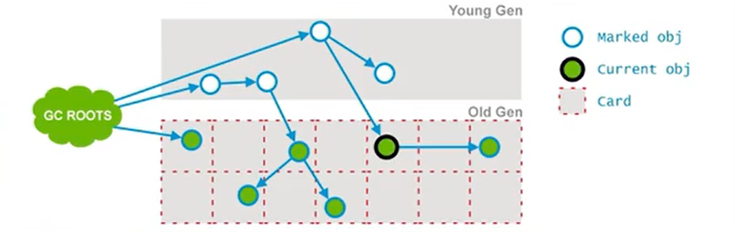

  7. 并发重置(`Concurrent Reset`)

     - 重置`CMS`内部数据结构，为下次`GC`做准备。

##### `CMS`垃圾收集步骤

1. `CMS`收集器的堆空间结构

   - 堆分为3个区域，新生代分为一个`Eden`和两个`Survivor`区域，老年代是一个连续的空间。对象回收就地完成，只有触发`Full GC`才会进行压缩。

   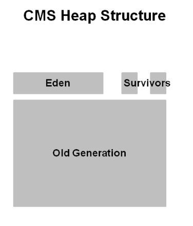

2. `CMS`中的新生代

   - 新生代是绿色，老年代蓝色，对象在老年代中是分散的。借助`CMS`老年代对象会就地回收，它们并不会移动，除非进行`Full GC`否则空间不会被压缩。

     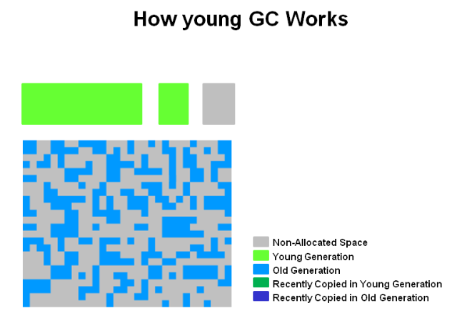

3. 新生代的收集

   - 存活的新生代对象会从一个`Eden`和一个`Survivor`空间复制到另外一个`Survivor`空间。任何一个老的对象到达年龄阈值的话就会进入老年代。

     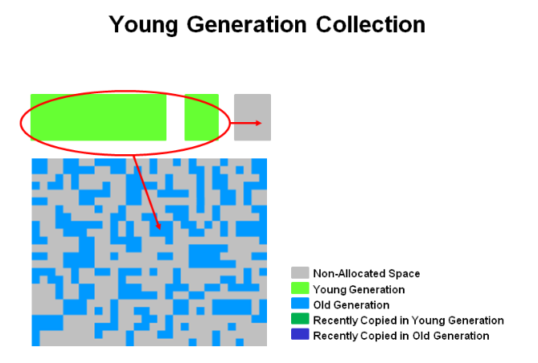

4. 新生代`GC`之后

   - 新生代`GC`之后，`Eden`和一个`Survivor`空间·就被清除掉了。

   - 新晋升的对象用深蓝色标记，绿色是依然存活的新生代对象，他们还没有晋升到老年代。

     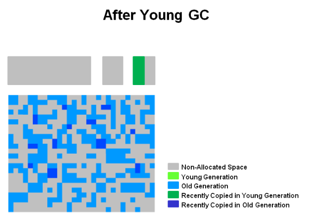

5. 老年代的垃圾收集

   - 两个`STW`事件会发生，分别是初始标记和重新标记。当老年代到达一定程度的占用率，`CMS`就会起作用。

   - 初始标记有一个短暂的暂停时间，可到达的对象会被标记出来。并发标记阶段会找到存活的对象，同时用户线程会继续执行。并发标记阶段没找到的对象会在重新标记阶段找到。

     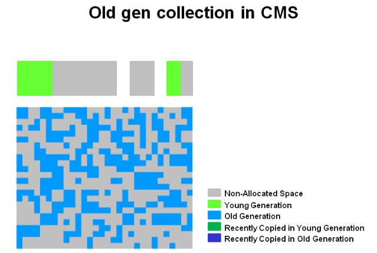

6. 老年代收集 -- 并发清除

   - 之前没有被标记的对象就就地回收。不会进行压缩。

     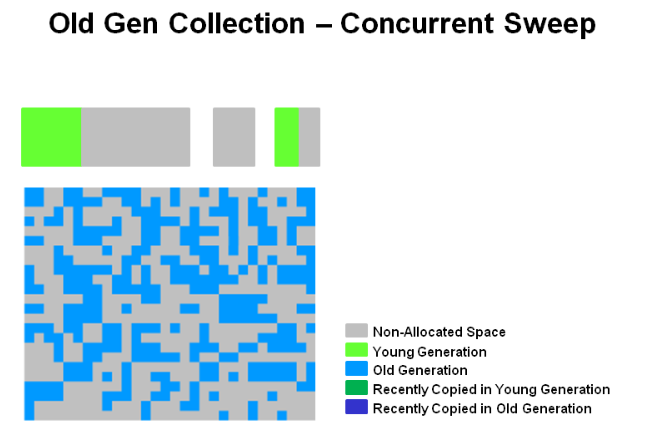

7. 老年代清除之后

   - 清除阶段之后，大量内存被释放了，但注意并没有压缩。

   - 最后，`CMS`会通过重置阶段移动并等待下一次`GC`阈值到达。

     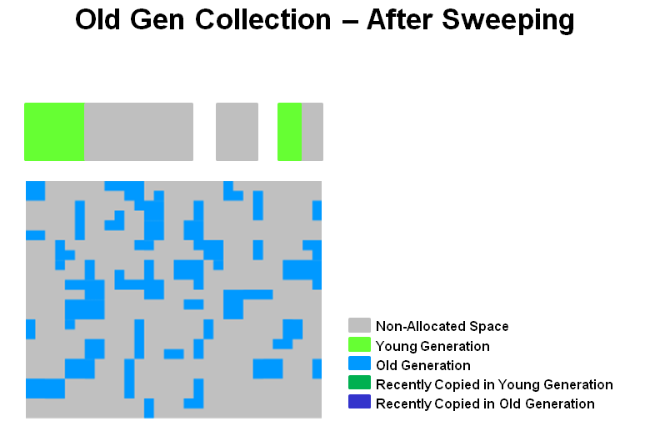 

- 优点

  1. 并发收集、低停顿

- 缺点

  1. 对`CPU`资源非常敏感。
    
     - `CMS`默认启动的线程数位`(CPU数量 + 3) / 4`，CPU数量较少时(比如2)对用户线程影响较大。
     
  2. **无法处理浮动垃圾**，**预留给用户线程的运行空间不足可能导致出现`Concurrent Mode Failure`从而导致`Full GC`。**
     - 浮动垃圾：并发清理阶段用户线程产生的新垃圾。
   - 垃圾收集阶段用户线程还需要运行，所以CMS要在老年代收集垃圾的同时预留一部分空间给其他线程运行，如果这部分预留的空间无法满足其他线程运行的需要就会导致`Concurrent Mode  Failure` 
     
  3. **采用标记-清除算法，收集结束时会有大量空间碎片产生**。可通过
  
     `-XX:+UseCMSCompactAfFullCollection`参数开启碎片空间整理，但这样停顿时间也变长了。
  
  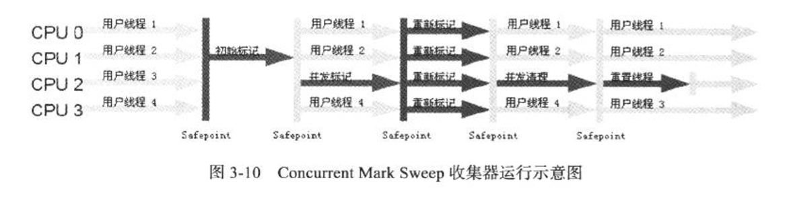

#### G1 (Garbage-First)

- jdk1.7开始正式提供商用版的G1,同时收集新生代和老年代。相比其他收集器的特点

  - 能充分利用多CPU、多核环境下的硬件优势，使用多个CPU来缩短`Stop The World`的停顿时间
  - 分代收集，`G1`中仍有分代概念。
  - 收集之后提供规整的可用内存
  - 能建立可测的停顿时间模型，使用者可明确指定m毫秒的时间片内，垃圾收集时间不超过n毫秒。

- 它将整个java堆划分为多个大小相等的独立区域(`Region`)，虽然还保留了新生代与老年代的概念，但新生代与老年代不再是物理隔离的了，它们都是一部分`Region`的集合。

- G1能建立可测的停顿时间模型原因：

  - **化整为零的思路**。G1跟踪各个`Region`里面的垃圾堆积的价值大小，在后台维护一个优先列表，每次根据允许的收集时间，优先回收价值最大的`Region`。(这也是`Garbage First`名称由来)。

- 规避全堆扫描解决方案

  - 各个`Region`中的对象可能相互引用，对对象进行可达性分析时就需要全堆扫描，如果是这样就做不到以`Region`为单位进行垃圾回收。jvm通过`Remembered Set`来规避全堆扫描。每个·`Region`都有一个与之对应的`Remembered Set`，jvm发现程序在对`reference`类型的数据进行写操作时，会产生一个`Write Barrier`暂时中断写操作，检查`reference`引用的对象是否处于不同的`region`之中，如果是，就通过`CardTable`把相关引用信息记录到被引用对象所属的`Region`的`Remembered Set`中，当进行垃圾回收时，在GC根节点的枚举范围中加入`Remembered Set`即可保证不对全堆扫描也不会有遗漏。

- G1运作步骤

  1. 初始标记
  2. 并发标记
  3. 最终标记
  4. 筛选回收

  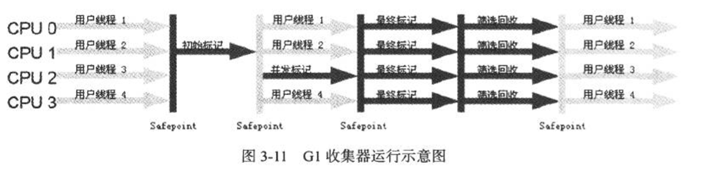

### 内存分配与回收策略

- **对象分配主要在新生代的`Eden`区上**，如果启动了本地线程分配缓冲，将按线程优先在`TLAB`上分配，**少数情况也会直接分配在老年代中**。具体细节取决于垃圾收集器和`jvm`参数。

#### Minor GC/Full GC

- `Minor GC`
  - 指发生在新生代的垃圾收集动作，`Minor GC`比较频繁，速度也比较快。
  - 新对象生成时`Eden`区满了就会发生`Minor GC`。
- `Major GC / Full  GC`：
  - `Full GC`会对整个`jvm`进行整理，包括新生代、老年代、永久代
  - 出现了`Full GC`，一般会伴随至少一次`Minor GC`(反例：`Parallel Scavenge`的收集策略里就有直接进行`Major GC`的策略选择过程)，`Major GC`的速度一般会比`Minor GC`慢10倍以上。
  - 触发时机：老年代满了、永久代满了、`System.gc();`

#### 对象优先在Eden上分配

- 大多数情况下，对象在新生代`Eden`区分配。当`Eden`区没有足够空间进行分配时，jvm将发起一次`Minor GC`

#### 大对象直接进入老年代

- 大对象指需要大量连续内存空间的java对象。比如很长的字符串以及数组。

#### 长期存活的对象进入老年代

- 如果对象在`Eden`区出生并经过第一次`Minor GC`后仍然存活，并且能被`Survivor`容纳，就移到`Survivor`中，对象在`Survivor`中每经过一次`Minor  GC`，年龄就增加1岁，年龄增加到一定程度(默认15岁)就晋升到老年代中。这个年龄阈值通过`-XX:MaxTenuringThreshold`设置。
- 如果在`Survivor`空间中相同年龄所有对象大小总和大于`Survivor`空间的`50%`，年龄大于或等于该年龄的对象就可以直接进入老年代，无需等到`-XX:MaxTenuringThreshold`指定的年龄。

#### 空间分配担保

- `jdk6 Update24`之前

  ```mermaid
  graph TD
  A[将要发生Minor GC] --> B[老年代最大可用的连续空间>?新生代所有对象总空间]
  	B --> |是| C[Minor GC确保是安全的]
  	B --> |不是| D[Minor GC有风险]
  	D --> E[查看HandlePromotionFailure是否允许担保失败]
  		E --> |不允许| F[执行Full GC]
  		E --> |允许| G[老年代最大可用的连续空间>?历次晋升到老年代对象的平均大小]
  			G --> |大于| H[执行Minor GC,尽管有风险]
  			G --> |小于| I[执行Full GC]
  ```

- `jdk 1.6 Update 24`之后
  
  - 只要老年代连续空间大于新生代对象总大小或者历次晋升的平均大小就进行`Minor GC`，否则进行`Full GC`。不受`HandlePromotionFailure`参数影响。

### 内存泄露的经典原因

- 内存泄漏指**程序未能释放已经不再使用的内存的情况。**内存泄漏次数多了就会导致内存溢出

1. 对象定义在错误的范围

   > 代码实例 

   ```java
   /**
    * 这个names是成员变量，并且只在doIt()方法中被使用
    * 所以如果Test对象的生命周期较长，那么Test对象存活期间可能会导致内存泄露
    */
   class Test{
       private String [] names;
       public void doIt(int length){
           if(names == null || names.length < length){
               names = new String[length];
           }
           print(names);
       }
   }
   //更好的写法，将names变为局部变量，一旦方法执行完，就会被回收
   class Test{
       public void doIt(int length){
           String [] names;
           if(names == null || names.length < length){
               names = new String[length];
           }
           print(names);
       }
   }
   ```

2. 异常处理不当

   ```java
   //如果doSomething()执行时发生异常，rs和conn关闭就不会得到调用，就会导致内存泄露
   Connection conn = DriverManager.getConnection(url,name,password);
   try{
       String sql = "do a query sql";
       PreparedStatement ps = conn.prepareStatement(sql);
       ResultSet rs = ps.executeQuery();
       while(rs.next()){
           doSomething();
       }
       rs.close();
       conn.close();
   }catch(Exception e){
       //...
   }
   ```

3. 集合数据管理不当

   1. 当使用基于数组的数据结构(比如`ArrayList`、`HashMap`)时，尽量减少`resize`。
      1. 比如`new ArrayList`时，尽量估算`size`，在创建时把`size`·确定
      2. 如果一个`List`只需要顺序访问，不需要随机访问，用`LinkedList`代替`ArrayList`。`LinkedList`本质是链表，不需要`resize`。

### GC日志

1. 打印日志的`jvm`参数：`-verbose:gc`   `-XX:+PrintGCDetails`

2. 案例分析

   1. `jvm`参数：

      `-verbose:gc `

      `-Xms20M `

      `-Xmx20M `

      `-Xmn10M `

      `-XX:+PrintGCDetails `

      `-XX:SurvivorRatio=8`

      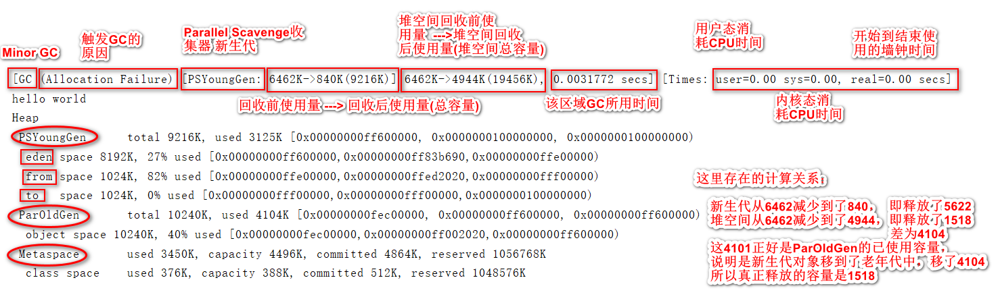

      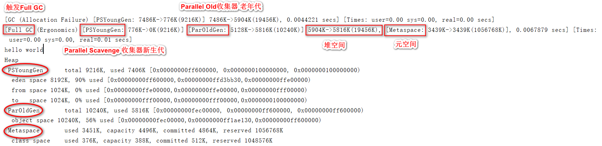

   2. `jvm`参数：

      `-verbose:gc `

      `-Xms20M `

      `-Xmx20M `

      `-Xmn10M `

      `-XX:+PrintGCDetails `

      `-XX:SurvivorRatio=8`

      -XX:PretenureSizeThreshold=4194304
      -XX:+UseSerialGC

      > 代码实例 cn.andios.jvm.gc.MyTest2

      ```java
      public class MyTest2 {
          public static void main(String[] args) {
              int size = 1024 * 1024;
              byte [] myAllocate1 = new byte [5*size];
          }
      }
      ```

      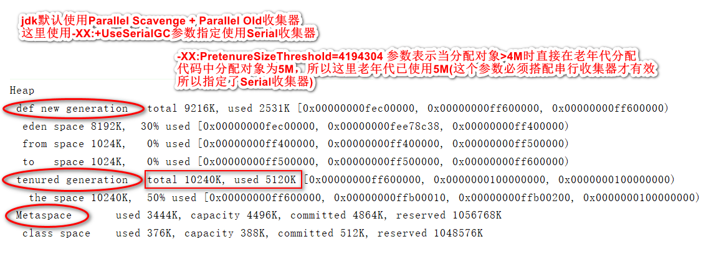

   3. 2

   4. 2

   

   

   ​	