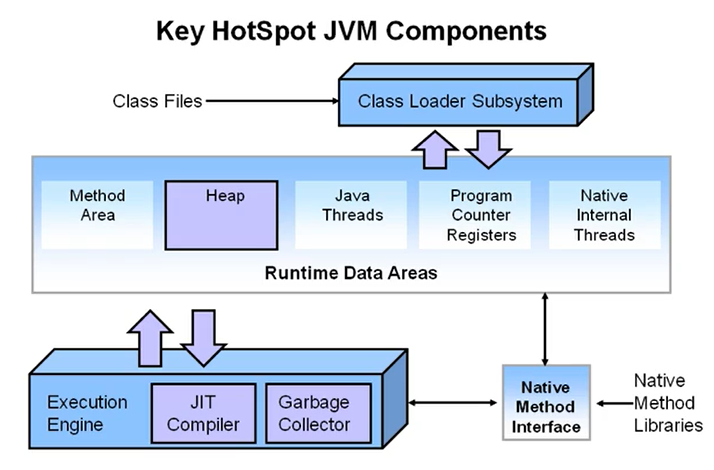
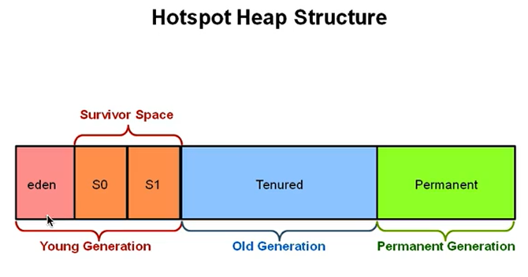
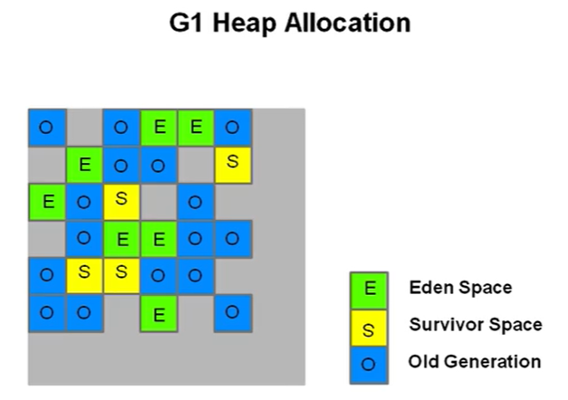
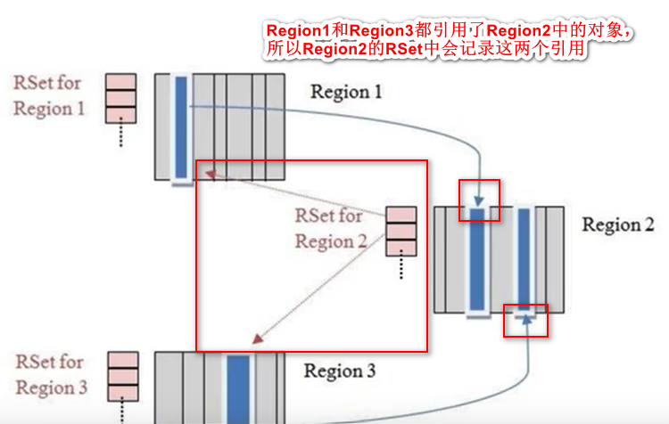

- 吞吐量
  
  - 吞吐量关注的是在一定时间内最大化一个应用的工作量，卡顿是可以接受的，因为它注重的是任务的执行能力。比如一小时内数据库可以完成多少次查询。
  
- 响应能力
  
  - 响应能力指一个程序或系统对请求是否能够及时响应。比如数据库能多快返回查询的数据。
  
- `G1`能满足短`gc`停顿的同时达到较高的吞吐量。`jdk1.7`及以上版本可以使用。

- `HotSpot`虚拟机结构：

  

- 传统的堆内存(`1.6`及之前)划分：

  

### G1 vs CMS

- 与用户线程同时工作，几乎不需要`STW`(与`CMS`类似)。
- 整理剩余空间，不产生内存碎片(`CMS`只能在`Full GC`时用`STW`整理碎片)。
- 不要求额外内存空间。(`CMS`需要预留空间存储浮动垃圾)
- `G1`使用复制算法，`CMS`使用标记清除算法。
- `G1`使用了`gc`停顿可预测的模型(`CMS`没有)。
- `G1`是一种带压缩的收集器，在回收`region`时，将存活的对象从一个分区拷贝到另一个可用分区，这个过程中进行压缩以释放内存(`CMS`没有压缩，`Prallel Old`收集器会进行全堆的压缩，这样会导致较大的停顿时间)。
- `G1`并非一个实时的收集器，与`Parallel Scavenge`一样，对`gc`停顿时间的设置并不绝对生效。 

### `G1`内存划分

- `Heap`被划分为**一个个相等的不连续的**内存区域`region`，每个`region`都有一个分代角色：`eden`、`survivor`、`old`。

- 对每个角色的数量并没有强制的限定，即每种分代内存的大小可以动态变化。

- 每个`region`可能是新生代也可能是老年代，但在同一时刻只能属于某个代。

- `G1`最大的特点就是高效的执行回收，优先去执行那些大量对象可回收的`region`。

- 依然是在新生代满了的时候，对整个新生代进行回收。新生代的对象要么回收，要么晋升。

- `G1`使用了`gc`停顿可预测的模型，开满足用户所设定的`gc`停顿时间，根据用户设定的目标时间，`G1`会自动选择哪些`region`要清除，一次清除多少`region`。

  

### G1重要概念

- 收集集合(`CSet`)：一组可被回收的分区的集合。在`CSet`中存活的数据会在`GC`过程中被移动到另一个可用分区，`CSet`中的分区可以来自`eden`、`survivor`、老年代。

- 已记忆集合(`RSet`)：`RSet`记录了其他`region`中的对象引用本`region`中对象的关系，属于`points-into`结构。`RSet`的价值在于使得收集器不需要扫描整个堆找到谁引用了当前`region`中的对象，只需要扫描`RSet`即可。

  

- `G1 GC`是在`points-out`的`card table`之上再加了一层结构来构成`points-into RSet`：每个·`region`会记录下到底哪些别的`region`有指向自己的指针，而这些指针分别在哪些`card`的范围内
- 这个`RSet`其实是一个`hash table`，`key`是别的`region`的起始地址，`value`是一个集合，里面的元素是`card table`的`index`。举例来说，如果`region A`的`RSet`里有一项的`key`就是`region B`,`value`里有`index`为`1234`的`card`，意思就是`region B`的一个`card`里有引用指向`region A`。所以对`region A`来说，该`RSet`记录的是`points-into`的关系；而`card table`中是`points-out`关系。
- `Snapshot-At-The-Beginning(STAB)`：`SATB`是`G1 GC`在并发标记阶段使用的增量式的标记算法。并发标记是并发多线程的，但并发线程在同一时刻只扫描一个分区。

