* [概述](#%E6%A6%82%E8%BF%B0)
* [G1 vs CMS](#g1-vs-cms)
  * [异](#%E5%BC%82)
  * [同](#%E5%90%8C)
* [G1适合场景](#g1%E9%80%82%E5%90%88%E5%9C%BA%E6%99%AF)
* [G1内存划分](#g1%E5%86%85%E5%AD%98%E5%88%92%E5%88%86)
* [G1重要概念](#g1%E9%87%8D%E8%A6%81%E6%A6%82%E5%BF%B5)
* [G1垃圾收集步骤](#g1%E5%9E%83%E5%9C%BE%E6%94%B6%E9%9B%86%E6%AD%A5%E9%AA%A4)
  * [G1的新生代垃圾收集](#g1%E7%9A%84%E6%96%B0%E7%94%9F%E4%BB%A3%E5%9E%83%E5%9C%BE%E6%94%B6%E9%9B%86)
  * [G1的老年代垃圾收集](#g1%E7%9A%84%E8%80%81%E5%B9%B4%E4%BB%A3%E5%9E%83%E5%9C%BE%E6%94%B6%E9%9B%86)
* [G1收集概览](#g1%E6%94%B6%E9%9B%86%E6%A6%82%E8%A7%88)
* [Humongous Region](#humongous-region)
* [G1 GC模式](#g1-gc%E6%A8%A1%E5%BC%8F)
  * [Young GC](#young-gc)
  * [Mixed GC](#mixed-gc)
  * [global concurrent marking](#global-concurrent-marking)
* [三色标记算法](#%E4%B8%89%E8%89%B2%E6%A0%87%E8%AE%B0%E7%AE%97%E6%B3%95)
  * [三色标记法漏标问题](#%E4%B8%89%E8%89%B2%E6%A0%87%E8%AE%B0%E6%B3%95%E6%BC%8F%E6%A0%87%E9%97%AE%E9%A2%98)
* [SATB  (Snapshot\-At\-The\-Beginning)](#satb--snapshot-at-the-beginning)
  * [并发GC问题一：收集时如何处理新生成的对象](#%E5%B9%B6%E5%8F%91gc%E9%97%AE%E9%A2%98%E4%B8%80%E6%94%B6%E9%9B%86%E6%97%B6%E5%A6%82%E4%BD%95%E5%A4%84%E7%90%86%E6%96%B0%E7%94%9F%E6%88%90%E7%9A%84%E5%AF%B9%E8%B1%A1)
  * [并发GC问题二：收集时对象引用发生变更](#%E5%B9%B6%E5%8F%91gc%E9%97%AE%E9%A2%98%E4%BA%8C%E6%94%B6%E9%9B%86%E6%97%B6%E5%AF%B9%E8%B1%A1%E5%BC%95%E7%94%A8%E5%8F%91%E7%94%9F%E5%8F%98%E6%9B%B4)
* [G1混合式回收](#g1%E6%B7%B7%E5%90%88%E5%BC%8F%E5%9B%9E%E6%94%B6)

### 概述

- [官方文档](https://www.oracle.com/technetwork/tutorials/tutorials-1876574.html)

- 吞吐量
  
- 吞吐量关注的是在一定时间内最大化一个应用的工作量，卡顿是可以接受的，因为它注重的是任务的执行能力。比如一小时内数据库可以完成多少次查询。
  
- 响应能力
  
  - 响应能力指一个程序或系统对请求是否能够及时响应。比如数据库能多快返回查询的数据。
  
- **`G1`能满足短`gc`停顿的同时达到较高的吞吐量**。`jdk1.7`及以上版本可以使用。

- `HotSpot`虚拟机结构：

  

- 传统的堆内存(`1.6`及之前)划分：

  

### G1 vs CMS

#### 异

- `G1`使用复制算法，内存回收后马上同时做合并空闲内存的工作，不会产生内存碎片；`CMS`使用标记清除算法，会产生内存碎片，只能在`Full GC`时用`STW`整理碎片。
- `G1`使用了`gc`停顿可预测的模型，可通过设置停顿时间来控制垃圾收集时间，避免应用雪崩现象。`CMS`没有。
- `G1`的`Eden`、`Survivor`以及老年代不再固定，内存使用效率上更灵活
- `G1`不要求额外内存空间。(`CMS`需要预留空间存储浮动垃圾)
- `G1`可以同时清理新生代和老年代，`CMS`只能清理老年代。
- `G1`是一种带压缩的收集器，在回收`region`时，将存活的对象从一个分区拷贝到另一个可用分区，这个过程中进行压缩以释放内存(`CMS`没有压缩，`Prallel Old`收集器会进行全堆的压缩，这样会导致较大的停顿时间)。
- `G1`并非一个实时的收集器，与`Parallel Scavenge`一样，对`gc`停顿时间的设置并不绝对生效。 

#### 同

- 与用户线程同时工作，几乎不需要`STW`(与`CMS`类似)。

### `G1`适合场景

- 服务端多核`CPU`、`jvm`内存占用较大的应用。
- 应用在运行过程中会产生大量内存碎片、需要经常压缩空间。
- 想要更可控、可预期的`GC`停顿周期，防止高并发下应用雪崩现象。

### `G1`内存划分

- `Heap`被划分为**一个个相等的不连续的**内存区域`region`，每个`region`都有一个分代角色：`eden`、`survivor`、`old`。

- 对每个角色的数量并没有强制的限定，即每种分代内存的大小可以动态变化。

- 每个`region`可能是新生代也可能是老年代，但在同一时刻只能属于某个代。

- `G1`最大的特点就是高效的执行回收，优先去执行那些大量对象可回收的`region`。

- 依然是在新生代满了的时候，对整个新生代进行回收。新生代的对象要么回收，要么晋升。

- `G1`使用了`gc`停顿可预测的模型，开满足用户所设定的`gc`停顿时间，根据用户设定的目标时间，`G1`会自动选择哪些`region`要清除，一次清除多少`region`。

  


### G1重要概念

- 收集集合(`CSet`)：一组可被回收的分区的集合。在`CSet`中存活的数据会在`GC`过程中被移动到另一个可用分区，`CSet`中的分区可以来自`eden`、`survivor`、老年代。

- 已记忆集合(`RSet`)：`RSet`记录了其他`region`中的对象引用本`region`中对象的关系，属于`points-into`结构。`RSet`的价值在于使得收集器不需要扫描整个堆找到谁引用了当前`region`中的对象，只需要扫描`RSet`即可。(`points-into`：即记录谁指向了我)

  

- `G1 GC`是在`points-out`的`card table`之上再加了一层结构来构成`points-into RSet`：每个·`region`会记录下到底哪些别的`region`有指向自己的指针，而这些指针分别在哪些`card`的范围内

- 这个`RSet`其实是一个`hash table`，`key`是别的`region`的起始地址，`value`是一个集合，里面的元素是`card table`的`index`。举例来说，如果`region A`的`RSet`里有一项的`key`就是`region B`,`value`里有`index`为`1234`的`card`，意思就是`region B`的一个`card`里有引用指向`region A`。所以对`region A`来说，该`RSet`记录的是`points-into`的关系；而`card table`中是`points-out`关系。

- `Snapshot-At-The-Beginning(SATB)`：`SATB`是`G1 GC`在并发标记阶段使用的增量式的标记算法。并发标记是并发多线程的，但并发线程在同一时刻只扫描一个分区。

### `G1`垃圾收集步骤   

#### `G1`的新生代垃圾收集

1. `G1`堆空间结构

   - `G1`采用一种不同的方法分配堆空间。堆是一整块内存空间，被划分为多个固定大小的`region`。`region`大小在`jvm`启动时可以指定。`jvm`可以划分`2000`个左右的`region`，它们的值从`1-32MB`。

     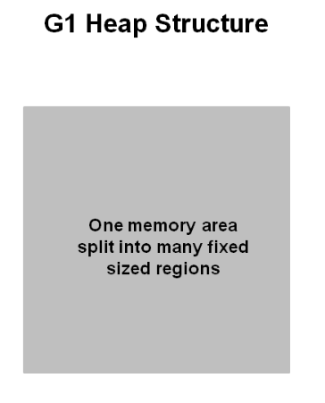

2. `G1`堆的分配

   - 实际上，这些`region`会被映射成`eden`、`survivor`和老年代的逻辑上的表示。

   - 存活的对象就会从一个`region`移动到另一个`region`上。这些`region`被设计成是并发的，不会阻止其他线程运行。

   - `region`被分为`eden`、`survivor`、老年代3个区域，此外还有第4种对象叫`Humongous region`，这个`region`中持有的对象大小超过了标准`region`的`50%`或以上，他们会被存储在一个连续的`region`集合中，最后一种是未被使用的堆空间。

     

3. `G1`中的新生代

   - 堆会被分成大约`2000`个`region`，最小的大小是`1MB`，最大的大小是`32MB`。

     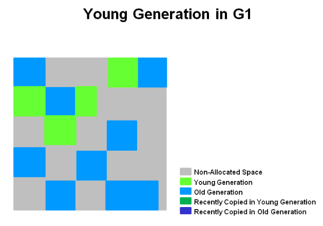

   - `region`可以不是连续的。

4. `G1`中新生代的垃圾收集

   - 存活对象会复制或移动到一个或多个`survivor region`中，如果年龄阈值满足了，一些对象就会进入老年代。

   - 这里会有一个`STW`的暂停。会计算`eden`和`survivor`的大小以便下次新生代的`GC`。这些信息也会保存起来以便计算大小，暂停时间目标也会被考虑进来。

   - 这种方式使得我们可以很容易改变`region`大小，使得它们更大或更小。

     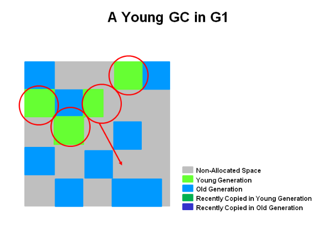

5. `G1`新生代`GC`结束

   - 存活对象会被移动到`survivor`空间中或老年代空间中。

     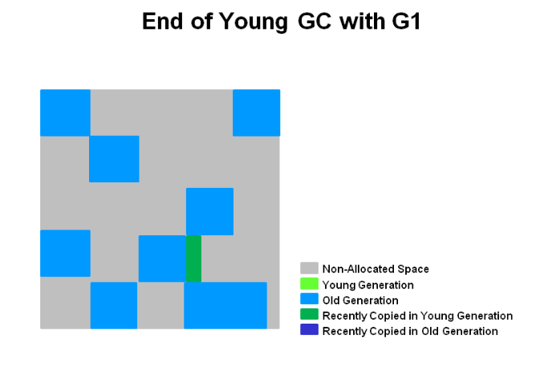

- 总结
  - 堆是一个单个的内存空间，被划分为多个`region`。
  - 新生代的内存空间是有不连续的`region`构成的。这使得我们可以根据需要调整它的大小。
  - 新生代`GC`会出现`STW`事件，所有的应用线程会暂停下来。
  - 新生代的`GC`会通过多线程方式来并行完成的。
  - 存活对象会被复制到新的`survivor`或老年代当中。

#### `G1`的老年代垃圾收集

- 和`CMS`收集器一样，针对老年代对象`G1`被设计成低停顿的收集器。

1. 初始标记(`initial mark`、`STW`)

   - 初始标记会标记由新生代所引用的对象，在日志中会被标记为`GC pause (young) (inital-mark)`

     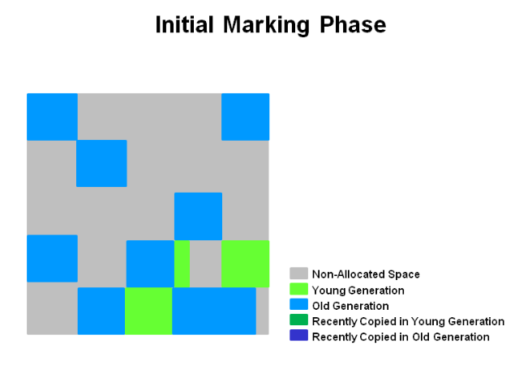

2. 根分区扫描(`Root Region Scanning`)

   - 扫描`survivor`分区中对老年代的引用，这个阶段必须在新生代可以发生`GC`之前完成。

3. 并发标记(`Concurrent Marking`)

   - 如果找到了一些空的分区(用`X`表示)，他们就会从`remark`阶段被移除，此外，`"accounting"`信息也会决定存活的计算。

     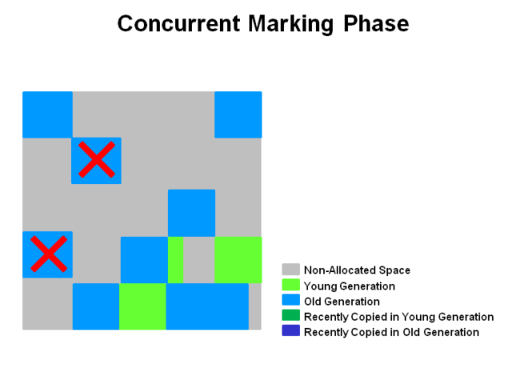

4. 重新标记(`Remark`、`STW`)

   - 空的`region`会被移除和收回。`region`的存活性会针对所有的`region`进行计算。

     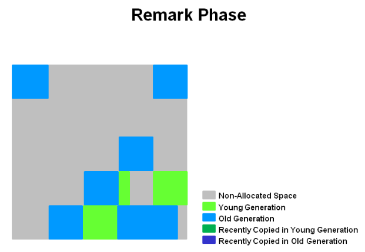

5. 并发清除(`Cleanup`、`STW`) / 复制(`Copying`、`STW`)

   - `G1`会选择哪些`region`的存活率最少，说明这些区域可回收的对象最多，回收速度也是最快的。这些`region`会和新生代同时进行收集。在日志中标记为`[GC pause (mixed)]`。因此所有的新生代和老年代是同时被收集的

     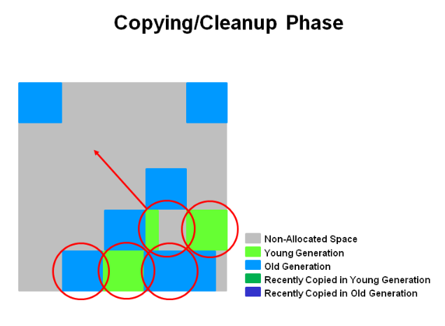

6. 复制或清理阶段之后

   - 选择的`region`已经被压缩了。

     

- 总结
  - 并发标记阶段
    - 在应用运行时的同时，对象的存活信息会被计算出来
    - 这些存活信息会用来标识哪些区域是最佳的回收区域
    - 没有`CMS`中的清除阶段
  - 重新标记阶段
    - `G1`使用`Snapshot-At-The-Beginning(STAB)`算法会比在`CMS`中使用更快。
    - 完全空的`region`会被回收
  - 复制/清理阶段
    - 新生代和老年代同时被回收
    - 老年代的`region`会基于它的存活性进行一个选择

### `G1`收集概览

- `G1`算法将堆分为若干个`region`，它仍然属于分代收集器，不过，这些`region`的一部分包含新生代，新生代的垃圾收集依然采用`STW`的方式，将存活对象拷贝到老年代或者`Survivor`空间。老年代也分成很多`region`，`G1`收集器通过将对象从一个`region`复制到另一个`region`，完成了清理工作。这就意味着，在正常的处理过程中，`G1`完成了堆的压缩(至少是部分堆的压缩)，这样也就不会有`CMS`内存碎片问题的存在了。

### `Humongous Region`

- 在`G1`中，还有一种特殊的`region`，叫`Humongous Region`。如果一个对象占用的空间达到或是超过了`region`容量的`50%`以上，`G1`收集器就认为这是一个巨型对象，这些巨型对象默认直接分配在老年代，但是如果他是一个短期存在的巨型对象，就会对垃圾收集器造成负面影响。为了解决这个问题，`G1`划分了一个`Humongous Region`，他用来专门存放巨型对象。如果一个`Humongous Region`装不下一个巨型对象，那么`G1`会寻找连续的`Humongous Region`来存储。为了能找到连续的`Humongous Region`，有时候不得不启动`Full GC`。

### `G1 GC`模式

- `G1`提供了两种`GC`模式：`Young GC`和`mixed gc`。两种都是需要`STW`的。
  - `Young GC`
    - 选定所有新生代里的`region`，通过控制新生代的`region`个数，即新生代内存大小，来控制`Young GC`的时间开销。
  - `mixed gc`
    - 选定所有新生代里的`region`，外加根据`global concurrent marking`统计得出收集收益高的若干老年代`region`，在用户指定的开销范围内竟可能选择收益高的老年代`region`。

#### `Young GC`

- `Young GC`是在`eden`区充满时触发，在回收之后所有之前属于`eden`的`region`全部变成空白，即不属于任何一个分区(`edeb`、`survivor`、老年代)。
- `Young GC`主要是对`Eden`进行`GC`，它在`Eden`空间耗尽时会被触发。在这种情况下，`Eden`空间的数据移动到`Survivor`空间中，如果`Survivor`空间不够，`Eden`空间的部分数据会直接晋升到老年代空间中。`Survivor`区间的数据移动到新的`Survivor`中，也有部分数据晋升到老年代中。最终`Eden`空间数据为空，`GC`完成工作，用户线程继续执行。
- `GC`新生代对象，`G1`引入了`RSet`的概念，作用是跟踪指向某个`heap`区内的对象引用。每次`GC`时，新生代都会被扫描，所以只需要记录老年代到新生代之间的引用即可。不需要记录新生代与新生代之间的引用。
- 如果引用的对象很多，赋值器需要对每个引用做处理，赋值器开销会很大，所以`G1`中又引入了另外一个概念叫`Card Table`。一个`Card Table`将一个分区在逻辑上划分为固定大小的连续区域，每个区域称之为`card`，卡通常较小，介于`128`到`512`字节之间。`Card Table`通常为`byte []`，由`Card`的索引(即数组下标)来标识每个分区的空间地址。
- 默认情况下，每个`Card`都未被引用。当一个地址空间被引用时，这个地址空间对应的数组索引的值也被标记为`0`，即标记为被引用，另外`RSet`也将这个数组下标记录下来。一般情况下，这个`RSet`其实是一个`Hash Table`，`Key`是别的`Region`的其实地址，`Value`是一个集合，里面的元素时`Card Table`的`index`。

#### `Mixed GC`

- `mixed gc`不是`Full GC`，它只能回收部分老年代的`region`，如果`mixed gc`实在无法跟上程序分配内存的速度，导致老年代填满了无法继续进行`mixed gc`时，就会使用`serial old GC (Full GC)`来收集整个`GC Heap`，所以本质上，`G1`不提供`Full GC`的。

- `Mixed GC`分为两步：全局并发标记( `global concurrent marking`)、拷贝存活对象(`evacuation`)。

- `mixed GC`由一些参数控制，另外也控制着哪些老年代`region`会被纳入到`CSet`中。

  - `G1HeapWastePercent`

    - 在 `global concurrent marking`结束之后，我们可以知道老年代`region`中有多少空间要被回收，在每次`Young GC`之后和再次发生`Mixed GC`之前，会检查垃圾占比是否达到此参数，只有达到了，下次才会发生`Mixed GC`。

  - `G1MixedGCLiveThresholdPercent`

    - 老年代`region`中的存活对象的占比，只有在此参数之下，才会被选入`CSet`(即存活的对象占比少于这个值就回收)。

  - `G1MixedGCCountTarget`

    - 一次 `global concurrent marking`之后，最多执行`mixed GC`的次数。

  - `G1OldCSetRegionThresholdPercent`

    - 一次`Mixed GC`中能被选入`CSet`的最多老年代`region`的数量。

    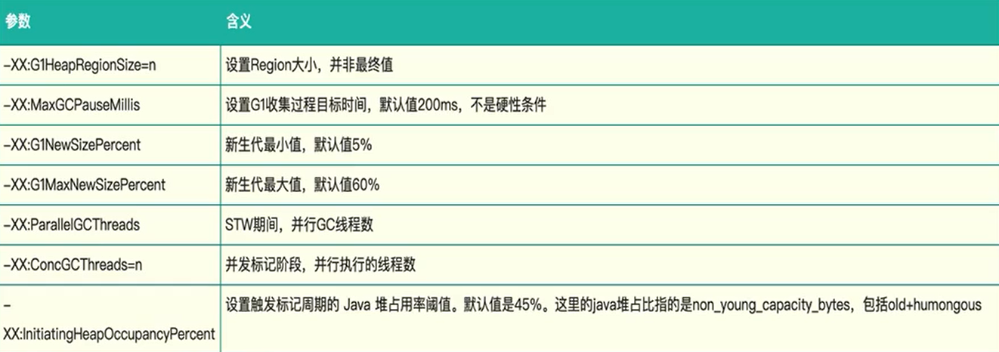

#### `global concurrent marking`

-  `global concurrent marking`的执行过程类似于`CMS`，但不同的是，在`G1 GC`中，它主要为`mixed gc`提供标记服务的，并不是一次`GC`过程的一个必须环节。
- `global concurrent marking`分为4个步骤：
  - 初始标记(`initial mark`、`STW`)
    - 它标记了从`GC Roots`开始可以直接可达的对象。
  - 并发标记(`concurrent marking`)
    - 这个阶段从`GC Roots`开始对`heap`中的对象进行标记，标记线程与应用线程并发执行，并且收集各个`region`的存活信息。
  - 重新标记(`remark`、`STW`)
    - 标记那些在并发标记阶段发生变化的对象，将被回收。
  - 清理(`cleanup`)
    - 清除空`region`(没有存活对象的`region`)，加入到`free list`。
- 第一阶段`initial mark`是共用了`Young GC`的暂停，这是因为它们可以复用`root scan`操作，所以可以说 `global concurrent marking`是伴随`Young GC`而发生的。
- 第四阶段`cleanup`只是回收了没有存活对象的`region`，所以它并不需要`STW`。

### 三色标记算法

- 它是描述追踪式回收期的一种有效的方法，利用它可以推演回收器的正确性。

- 我们将对象分为3种类型

  - 黑色：根对象，或者该对象与它的子对象都被扫描过(对象被标记了，且它的所有`field`也被标记完了)。
  - 灰色：对象本身被扫描，但还没扫描完该对象中的子对象(它的`field`还没有被标记或者标记完)
  - 白色：未被扫描的对象，扫描完所有对象之后，最终为白色的为不可达对象，即垃圾对象(对象没有被标记到)。


  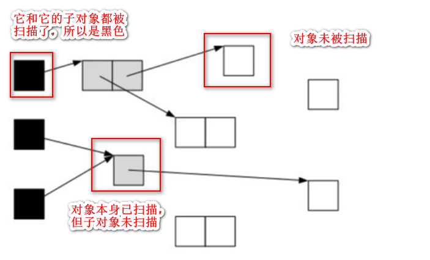
  - 继续由灰色遍历，将已扫描了子对象的对象值为黑色

    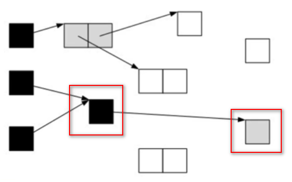

  - 遍历了所有可达对象后，所有可达对象都变成了黑色，不可达的对象即为白色，需要清理。

    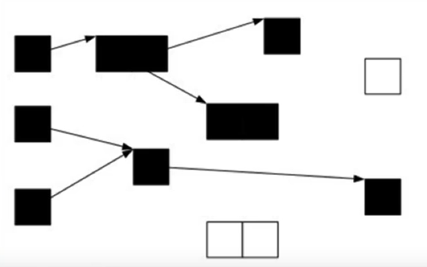

#### 三色标记法漏标问题

- 在标记过程中，用户线程也在运行，**对象的指针可能发成改变，导致应该得到标记的对象没有得到标记，也可能产生新的对象，新产生的对象可能未标记。**
  - 比如初始时

  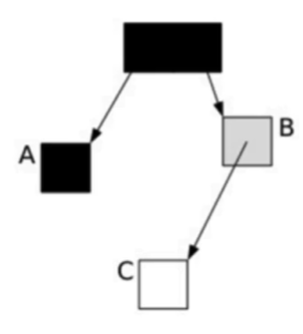

  - 如果这时执行

  ```java
  A.c = C
  B.c = null
  ```

  - 那么就变成

  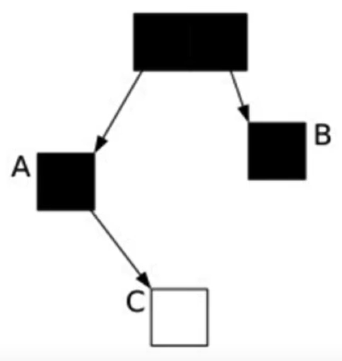
  
  - `A`原来已经被扫描完了，不会再扫描了，而`C`作为一个白色标记的对象，就会被回收，但是`A`又有引用指向`C`，这就是出现漏标。

### SATB  (`Snapshot-At-The-Beginning`)

- `SATB`有3个步骤：

  1. 在开始标记的时候生成一个快照图，标记存活对象。

  2. 在并发标记的时候所有被改变的对象入队。(**在`write barrier`里把所有旧的引用所指向的对象都变成非白的**)

  3. 可能产生浮动垃圾，将在下次被收集。

     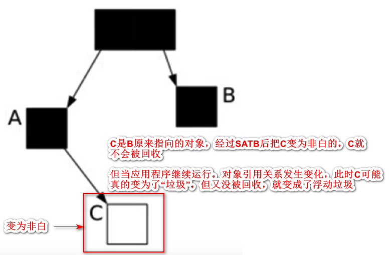

- `SATB`是`GC`开始之前对堆内存里的对象做一次快照，此时活的对象就认为是活的，从而形成一个对象图。
- 在`GC`收集的时候，新生代的对象也认为是活的对象，除此之外其他不可达的对象都认为是垃圾对象。

#### 并发GC问题一：收集时如何处理新生成的对象

- 如何找到在`GC`过程中新分配的对象呢？每个`region`记录着两个`top-at-mark-start(TAMS)`指针，分别为`prevTAMS`和`nextTAMS`。在`TAMS`以上的对象就是新分配的，因而被视为隐式`marked`(即隐含的做了标记)。通过这种方式找到了在`GC`过程中新分配的对象并认为它们是活的。

#### 并发GC问题二：收集时对象引用发生变更

- 通过`write barrier`对引用字段进行赋值做了额外处理。它把所有旧的引用所指向的对象都变成非白的。通过`write barrier`就可以了解到哪些引用对象发生了什么样的变化。

### G1混合式回收

- `G1`现在可以知道哪些老年代`region`可回收垃圾最多。当全局并发标记完成后，在某个时刻，就开始`Mixed GC`。这些垃圾回收被称作“混合式”是因为它们不仅仅进行正常的新生代垃圾收集，同时也回收部分后台扫描线程标记的分区
- 混合式`GC`也是才用的复制策略，当`GC`完成后，会重新释放空间。