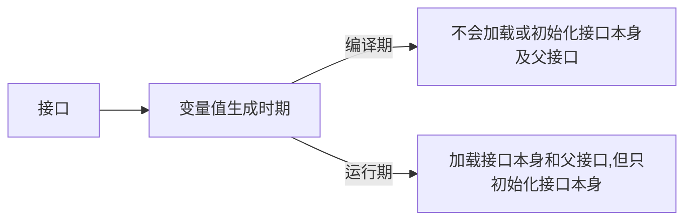
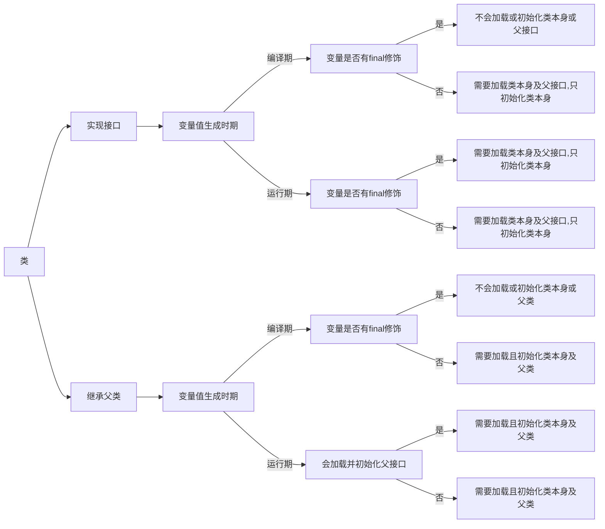

* [类加载](#%E7%B1%BB%E5%8A%A0%E8%BD%BD)
  * [类的加载\\连接\\初始化](#%E7%B1%BB%E7%9A%84%E5%8A%A0%E8%BD%BD%E8%BF%9E%E6%8E%A5%E5%88%9D%E5%A7%8B%E5%8C%96)
  * [类的加载](#%E7%B1%BB%E7%9A%84%E5%8A%A0%E8%BD%BD)
  * [类的验证](#%E7%B1%BB%E7%9A%84%E9%AA%8C%E8%AF%81)
  * [类的准备](#%E7%B1%BB%E7%9A%84%E5%87%86%E5%A4%87)
  * [类的初始化](#%E7%B1%BB%E7%9A%84%E5%88%9D%E5%A7%8B%E5%8C%96)
  * [类的初始化时机](#%E7%B1%BB%E7%9A%84%E5%88%9D%E5%A7%8B%E5%8C%96%E6%97%B6%E6%9C%BA)
  * [类加载器](#%E7%B1%BB%E5%8A%A0%E8%BD%BD%E5%99%A8)

## 类加载

java代码中,类型的加载\连接\初始化过程都是在程序运行期间完成的.

在如下几种情况下,jvm将结束生命周期

   - 执行了`System.exit()`方法
   - 程序正常执行结束
   - 程序在执行过程中遇到了异常或错误而终止
   - 由于操作系统出现错误而导致jvm进程终止

### 类的加载\连接\初始化

1. 加载:**查找并加载类的二进制数据**

   ​		**将类的.class文件中的二进制数据读入到内存,将其放在运行时数据区的方法区中,然后在内存中创建一个`java.lang.Class`对象用来封装类在方法区内的数据结构.**(规范并未说明class对象位于哪里,hotspot虚拟机将其放在了方法区中)

   加载.class文件的方式

	- 从本地系统直接加载
	- 通过网络下载.class文件
	- 从zip,jar等归档文件中加载.class文件
	- **将java源文件动态编译为.calss文件(如jsp文件被编译为servlet文件再由虚拟机加载)**

2. 连接

   - 验证:**确保被加载的类的正确性**

   - 准备:**为类的静态变量分配内存,并将其初始化为默认值**

   - 解析:**类中的符号引用转换为直接引用**

3. 初始化:**为类的静态变量赋予正确的初始值**

4. 使用

5. 卸载

java程序对类的使用分为两种使用

- 主动使用
  - 创建类的实例
  - 访问某个类或接口的静态变量,或者对该静态变量赋值
  - 调用类的静态方法
  - 反射
  - 初始化一个类的子类
  - java虚拟机启动时被标明为启动类(包含main方法的类)的类
  - jdk1.7开始的动态语言支持(`java.lang.invoke.MethodHandle`实例的解析结果`REF_getStatic,REF_putStatic,REF_invokeStatic`句柄对应的类没有初始化,则初始化)
- 被动使用
  - 除了上面7种情况,其他使用java类的方式都被看作是对类的被动使用,都不会导致类的初始化.

所有的jvm必须实现在每个类或接口被java程序"首次主动使用"时才初始化它们.

> 代码实例 cn.andios.jvm.classloader.MyTest1

```java
/**
 *  -XX:+ TraceClassLoading:用于追踪类的加载信息并打印出来
 *
 *  -XX:+<option>表示开启option
 *  -XX:-<option>表示关闭option
 *  -xx:<option>=<value>表示将option选项值设置为value
 */
public class MyTest1 {
    public static void main(String[] args) {
        System.out.println(MyChild1.str);
//        result:
//          MyParent1 static block
//          hello world
//        reason:
//          对于静态字段来说,只有直接定义了该字段的类才会被初始化,这里只是主动使用MyParent1,并没有主动使用MyChild1,
//        虽说是通过子类的名字来引用str,但str是父类定义的.所以不会初始化MyChild1

        //System.out.println(MyChild1.str2);
//        result:
//          MyParent1 static block
//          MyChild1 static block
//          hello
//        reason:
//          str2在子类中定义,相当于对子类的主动使用,所以会先初始化父类,再初始化子类

    }
}

class MyParent1{
    public static String str = "hello world";
    static {
        System.out.println("MyParent1 static block");
    }
}

class MyChild1 extends MyParent1{
    public static  String str2 = "hello";
    static {
        System.out.println("MyChild1 static block");
    }
}
```

> ```
> -XX:+ TraceClassLoading:用于追踪类的加载信息并打印出来
> ```

通过`-XX:+ TraceClassLoading`参数追踪执行`System.out.println(MyChild1.str);`时类加载情况:

```v
...
[Loaded cn.andios.jvm.classloader.MyTest1 from file:/home/lushuidian/gitfiles/jvm/jvm/target/classes/]
...
[Loaded cn.andios.jvm.classloader.MyParent1 from file:/home/lushuidian/gitfiles/jvm/jvm/target/classes/]
[Loaded cn.andios.jvm.classloader.MyChild1 from file:/home/lushuidian/gitfiles/jvm/jvm/target/classes/]
MyParent1 static block
hello world
...
```

可以看到它会先加载`MyTest1`,再加载`MyParent1`,最后加载`MyChild1`

> 代码实例 cn.andios.jvm.classloader.MyTest2

```java
package cn.andios.jvm.classloader;
/**
 * 常量在编译阶段会存入到调用这个常量的方法所在的类的常量池中,
 * 本质上,调用类并没有直接引用到定义常量的类,因此并不会触发定义常量的类初始化
 *
 * 注意:这里指的是将常量存入到MyTest2的常量池中,之后MyTest2与MyParent2就没有
 *      任何关系了,甚至,可以将MyParent2的.class文件删除
 *
 *  助记符(javap -c  xxx.class反编译命令后的结果)
 *      ldc:表示将int,float或者是String类型的常量值从常量池中推送至栈顶
 *      bipush:表示将单字节(-128-127)的常量值推送到栈顶
 *      sipush:表示将一个短整型常量值(-32768-32767)推送至栈顶
 *      iconst_1:表示将int类型1推送到栈顶(iconst_m1-iconst_5分别表示将int类型-1到5推送到栈顶,超过5就是bipush,低于-1就是bipush)
 */
public class MyTest2 {
    public static void main(String[] args) {
//        System.out.println(MyParent2.str);
//        result:
//          MyParent2 static block
//          hello world
//        System.out.println(MyParent2.str2);
//        result:
//          hello
//        reason:
//          常量在编译阶段会存入到调用这个常量的方法所在的类的常量池中,本质上,调用类并没有直接引用到定义常量的类,因此并不会触发定义常量的类初始化
//        即str2在编译阶段会存入到MyTest2的常量池中,MyTest2并没有直接引用到MyParent2这个类,所以MyParent2类不会被初始化
//

        System.out.println(MyParent2.s1);
        System.out.println(MyParent2.s2);
        System.out.println(MyParent2.s3);
    }
}

class MyParent2{
//    public static String str = "hello world";
//    public static final String str2 = "hello ";
    public static final short s1 = 127;
    public static final short s2 = 128;
    public static final short s3 = 1;
    static {
        System.out.println("MyParent2 static block");
    }
}
```

上述代码运行后,可通过`javap -c `反编译命令查看如下:


如果将s1,s2,s3,str注释掉,只保留str2,编译运行后反编译得到


这里助记符`ldc`表示将int,float或者是String类型的常量值从常量池中推送至栈顶,str2是由final修饰的字符串常量.


如果将s1,s2,s3,str2注释掉,只保留str,编译运行后反编译得到


这个的str不再是常量,所以由助记符`getstatic`来表示.


> 代码实例 cn.andios.jvm.classloader.MyTest3

```java

/**
 * 当一个常量的值并非编译期间可以确定的,那么其值就不会被放到调用类的常量池中,
 * 这时在运行程序时,会导致主动使用这个常量所在的类,显然会导致这个类被初始化
 */
public class MyTest3 {
    public static void main(String[] args) {
        System.out.println(MyParent3.str);
//        result:
//          MyParent3 static static block
//          f3c1e34d-01fd-4450-95e8-a682ea983ce9
//        reason:
//          str的值在编译期不能确定,所以不会放到MyTest3的常量池中,
//          运行程序时,就会导致MyParent3的初始化
    }
}

class MyParent3{
    public static final String str = UUID.randomUUID().toString();
    static {
        System.out.println("MyParent3 static static block");
    }
}
```


> 代码实例 cn.andios.jvm.classloader.MyTest4

```java
/**
 * 对于数组实例来说,其类型是由jvm在运行期动态生成的,
 * 动态生成的类型,其父类型就是Object
 *
 * 对于数组来说,javadoc经常将构成数组的元素成为component,实际上就是将数组降低一个维度后的类型
 *
 * 通过 javap-c xxx.class 反编译,可以看到两个助记符
 *      anewarray:表示创建一个引用类型(类\接口\数组)的数组,并将其值压入栈顶
 *      newarray:表示创建一个指定的原始类型(int\float\char)的数组,并将其值压入栈顶
 */
public class MyTest4 {
    public static void main(String[] args) {
        //MyParent4 myParent4 = new MyParent4();
//        result:
//          MyParent4  static block
//        reason:
//          表示对类MyParent4的主动使用

        MyParent4 [] myParents1 = new MyParent4[5];
//        result:
//          (没有输出)
//        reason:
//          不表示对MyParent4的主动使用,
        System.out.println(myParents1.getClass());//class [Lcn.andios.jvm.classloader.MyParent4;
        System.out.println(myParents1.getClass().getSuperclass());//class java.lang.Object

        MyParent4 [][] myParents2 = new MyParent4[5][5];
//        result:
//          (没有输出)
//        reason:
//          不表示对MyParent4的主动使用,
        System.out.println(myParents2.getClass());//class [[Lcn.andios.jvm.classloader.MyParent4;
        System.out.println(myParents2.getClass().getSuperclass());//class java.lang.Object

        int [] arr = new int[5];
        System.out.println(arr.getClass());//class [I
        System.out.println(arr.getClass().getSuperclass());//class java.lang.Object
    }
}
class MyParent4{
    static {
        System.out.println("MyParent4  static block");
    }
}
```


>代码实例 cn.andios.jvm.classloader.MyTest5

```java
/**
 * 当一个接口在初始化时,并不要求其父接口都完成了初始化
 *      (接口中变量都由final修饰,都是常量,但类中的变量不一定都由final修饰,如果没有被final
 *      修饰,就不会被纳入到常量池中,那么这个类被初始化时就会导致它的父类被初始化.)
 * 只有在真正使用到父接口的时候(如引用接口中所定义的常量时),才会初始化
 */
public class MyTest5 {
    public static void main(String[] args) {
        /**
         * a,b
         *
         * result:6
         * 编译后,删掉MyParent5.class,再运行,正常打印
         */
        System.out.println(MyChild5.b);

        /**
         * a,c
         *
         * result:一个随机值
         * 编译后,删除MyParent5.class,再运行,报错
         * reason:c的值是在运行期动态生成的
         */
        System.out.println(MyChild5.c);

        /**
         * d,e
         * result:2
         * case1:编译后,删除MyParent5.class,再运行,正常打印
         * case2:将MyParent5,MyChild5改为class,其他不变,编译后,
         *      删除MyParent5.class,再运行,报错
         * reason:对于接口来说,d,e都是常量(都由final修饰),会被纳入到常量池,
         *      初始化时不会导致父类被初始化;
         *         改为class后,不是常量,不会被纳入到常量池,被使用时就会导致父类初始化,
         *         所以删除MyParent.class后再运行就报错
         *
         */
        System.out.println(MyChild5.e);
    }
}

interface MyParent5{
    int a = 1;
    
    int d = new Random().nextInt(3);
}

interface MyChild5 extends MyParent5{
    int b = 2;
    int c = new Random().nextInt(2);

    int e = 2;
}
```


> 代码实例 cn.andios.jvm.classloader.MyTest6

```java
public class MyTest6 {

    public static void main(String[] args) {
        Singleton singleton = Singleton.getInstance();
        /**
         * result:
         *      counter1:1
         *      counter2:1
         *      counter3:1
         *
         *      main-counter1:1
         *      main-counter2:1
         *      main-counter3:0
         *  这里main方法中调用Singleton的静态方法getInstance(),
         *  是对Singleton的主动使用,所以Singleton类会被初始化,在初始化之前会经过
         *  准备阶段,为变量赋默认值,counter1,counter2,counter3默认值都是0,singleton
         *  默认值是null
         *
         *  紧接着调用getInstance会导致这个类被初始化(从上到下),为各个变量赋初值,
         *  counter1没有赋值就为0,counter2赋初值为0,singleton变量的赋值就会执行构造方法,
         *  构造方法中,counter1,counter2会使用初始化之后的值,counter3会使用准备阶段之后的值,都是0,
         *  所以++之后都为1,所以打印结果都是1
         *  接着往下执行,完成对counter3的初始化,将counter3赋为0,所以main中打印counter3为0.而不是1
         *
         */
        System.out.println("main-counter1:"+ Singleton.counter1);
        System.out.println("main-counter2:"+ Singleton.counter2);
        System.out.println("main-counter3:"+ Singleton.counter3);

    }


}
class  Singleton{
    public static int counter1;

    public static int counter2 = 0;

    private static Singleton singleton = new Singleton();

    private Singleton(){
        counter1 ++;
        counter2 ++;
        counter3 ++;
        System.out.println("counter1:"+counter1);
        System.out.println("counter2:"+counter2);
        System.out.println("counter3:"+counter3);
    }
    public static int counter3 = 0;

    public static  Singleton getInstance(){
        return  singleton;
    }
}
```

### 类的加载

- 类的加载的最终产品是位于内存中的Class对象

- Class对象封装了类在方法区内的数据结构,并且向java程序员提供了访问方法区内的数据结构的接口.

- 有两种类型的类加载器

  - java虚拟机自带的加载器
    - `bootstrap classloader`
    - `extension classloader`
    - `app classloader`
  - 用户自定义的类加载器
    - `java.lang.ClassLoader`的子类
    - 用户可以定制类的加载方式

- 类加载器并不需要等到某个类被"首次主动使用"时再加载它.

  比如在"代码实例 cn.andios.jvm.classloader.MyTest1"中,用`-XX:+ TraceClassLoading`参数追踪执行`System.out.println(MyChild1.str);`类加载情况时,明明只初始化`MyParent1`,但`MyChild1`也被加载了.
  
- JVM规范允许类加载器在预料某个类将要被使用时就预先加载它，如果在预先加载的过程中遇到了.class文件缺失或存在错误，类加载器必须在**程序首次主动使用**该类时才报告错误。

- 如果这个类一直没有被程序主动使用，那么类加载器就不会报告错误。

### 类的验证

- 类被加载后，就进入到连接阶段。连接就是将已经读入到内存中的类的二进制数据合并到虚拟机的运行时环境中去。

### 类的准备


### 类的初始化


- 类的初始化步骤
  1. 假如这个类还没有被加载或连接，那就先进行加载和连接
  2. 假如类存在直接父类，并且这个父类还没有被初始化，就先初始化直接父类
  3. 假如类中存在初始化语句，就依次执行这些初始化语句

### 类的初始化时机

- 七种主动使用

1. 创建类的实例
2. 访问某个类或接口的静态变量，或者对该静态变量赋值
3. 调用类的静态方法
4. 反射(如`Class.forName("com.test.Test")`)
5. 初始化一个类的子类
6. jvm启动时被标明为启动类的类
7. jdk1.7开始提供的动态语言支持：`java.lang.invoke.MethodHandle`实例的解析结果`REF_getStatic,REF_putStatic,REF_invokeStatic`句柄对应的类没有初始化，则初始化。


`cn.andios.jvm.classloader.MyTest5_3`总结：

> 对于接口，接口中的变量都由final修饰，**当变量值在编译期可以确定时**(这里测试案例是在main方法中调用接口的变量)，程序编译后变量的值会放到main方法所在类的常量池中，main方法所在类并没有直接引用这个接口，所以**不会加载或初始化接口或其父接口,当变量值需要在运行器才能确定时，父接口和接口本身都要被加载，但只初始化接口本身**


> 对于类，变量不一定有final修饰，**当变量值在编译期就能确定且由final修饰时，不会初始化类本身或其父类/接口，如果不能在编译期确定或没有被final修饰，就会导致类本身和父类/父接口被加载并且导致类本身被初始化，如果是继承父类，还会导致父类被初始化，如果是实现接口，不会导致接口被初始化**







> 代码实例 cn.andios.jvm.classloader.MyTest5_3

```java
public class MyTest5_3 {
    public static void main(String[] args) {
        /**
         * case:接口继承接口，变量值在编译期生成
         *
         * 加载：  MyTest5_3
         *
         * 编译后删除MyParent5_3_Interface，MyChild5_3_Interface_1两个class文件依旧可以运行
         *
         * reason：a的值在编译期确定，直接放到了MyTest5_3的常量池中，
         *      所以MyChild5_3_Interface_1不需要被加载，
         *      MyParent5_3_Interface更不需要被加载
         */
        //System.out.println(MyChild5_3_Interface_1.a);


        /**
         * case:接口继承接口，变量值在运行期生成
         *
         * 加载：MyTest5_3  MyParent5_3_Interface  
         *      MyChild5_3_Interface_2   MyParent5_3_Interface$1
         */
        //System.out.println(MyChild5_3_Interface_2.a);


        /**
         * case:类实现接口，变量值在编译期生成 ,有final
         *
         * 加载：MyTest5_3
         */
        //System.out.println(MyChild5_3_Class_Impl_1.a);

        /**
         * case:类实现接口，变量值在运行期生成，有final
         *
         * 加载：MyTest5_3    MyParent5_3_Interface    
         *      MyChild5_3_Class_Impl_2   MyParent5_3_Interface$1
         */
        //System.out.println(MyChild5_3_Class_Impl_2.a);

        /**
         * case:类实现接口，变量值在编译期生成，无final
         *
         * 加载：MyTest5_3    MyParent5_3_Interface    
         *      MyChild5_3_Class_Impl_3    MyParent5_3_Interface$1
         */
        //System.out.println(MyChild5_3_Class_Impl_3.a);


        /**
         * case:类实现接口，变量值在运行期生成，无final
         *
         * 加载：MyTest5_3  MyParent5_3_Interface  
         *      MyChild5_3_Class_Impl_4  MyParent5_3_Interface$1
         */
        //System.out.println(MyChild5_3_Class_Impl_4.a);

        /**
         * case:类继承父类，变量值在编译期生成，有final
         *
         * 加载：MyTest5_3
         */
        //System.out.println(MyChild5_3_Class_Extends_1.a);

        /**
         * case:类继承父类，变量值在运行期生成，有final
         *
         * 加载：MyTest5_3   MyParent5_3_Class   
         *      MyChild5_3_Class_Extends_2  MyParent5_3_Class$1
         */
        //System.out.println(MyChild5_3_Class_Extends_2.a);

        /**
         * case:类继承父类，变量值在编译期生成，无final
         *
         * 加载：MyTest5_3    MyParent5_3_Class   
         *      MyChild5_3_Class_Extends_3   MyParent5_3_Class$1
         */
        //System.out.println(MyChild5_3_Class_Extends_3.a);


        /**
         * case:类继承父类，变量值在运行期生成，无final
         * 加载：MyTest5_3  MyParent5_3_Class  
         *      MyChild5_3_Class_Extends_4  MyParent5_3_Class$1
         */
        System.out.println(MyChild5_3_Class_Extends_4.a);
    }
}
/**
 * 判断是否初始化：代码块是否执行
 * 判断是否被加载：-XX:+TraceClassLoading
 */
interface MyParent5_3_Interface{
    public static Thread thread = new Thread(){
        {
            System.out.println("MyParent5_3_Interface invoked...");
        }
    };
}
/**
 * 判断是否初始化：代码块是否执行
 * 判断是否被加载：-XX:+TraceClassLoading
 */
class MyParent5_3_Class{
    public static Thread thread = new Thread(){
        {
            System.out.println("MyParent5_3_Class invoked...");
        }
    };
}
/** 接口继承接口，变量值在编译期生成 */
interface MyChild5_3_Interface_1 extends MyParent5_3_Interface{
    int a = 5;
}
/** 接口继承接口，变量值在运行期生成 */
interface MyChild5_3_Interface_2 extends MyParent5_3_Interface{
    int a = new Random().nextInt(1);
}

/** 类实现接口，变量值在编译期生成 ,有final*/
class MyChild5_3_Class_Impl_1 implements MyParent5_3_Interface{
    public static final int a = 5;
}
/** 类实现接口，变量值在运行期生成，有final*/
class MyChild5_3_Class_Impl_2 implements MyParent5_3_Interface{
    public static final int a = new Random().nextInt(1);
}
/** 类实现接口，变量值在编译期生成，无final */
class MyChild5_3_Class_Impl_3 implements MyParent5_3_Interface{
    public static  int a = 5;
}
/** 类实现接口，变量值在运行期生成，无final*/
class MyChild5_3_Class_Impl_4 implements MyParent5_3_Interface{
    public static  int a = new Random().nextInt(1);
}

/** 类继承父类，变量值在编译期生成，有final */
class MyChild5_3_Class_Extends_1 extends MyParent5_3_Class{
    public static final int a = 5;
}
/** 类继承父类，变量值在运行期生成，有final */
class MyChild5_3_Class_Extends_2 extends MyParent5_3_Class{
    public static final int a = new Random().nextInt(1);
}
/** 类继承父类，变量值在编译期生成，无final */
class MyChild5_3_Class_Extends_3 extends MyParent5_3_Class{
    public static  int a = 5;
}
/** 类继承父类，变量值在运行期生成，无final */
class MyChild5_3_Class_Extends_4 extends MyParent5_3_Class{
    public static  int a = new Random().nextInt(1);
}
```


- 只有当程序访问的静态变量或静态方法在确实在当前类或当前接口中定义时，才可以认为是对类或接口的主动使用
- 调用ClassLoader类的loadClass方法加载一个类，并不是对类的主动使用，不会导致类的初始化

### 类加载器


- 除了以上虚拟机自带的加载器外，用户还可以定制自己的类加载器。java提供了抽象类`java.lang.ClassLoader`,所有用户自定义的类加载器都应该继承`ClassLoader`类。